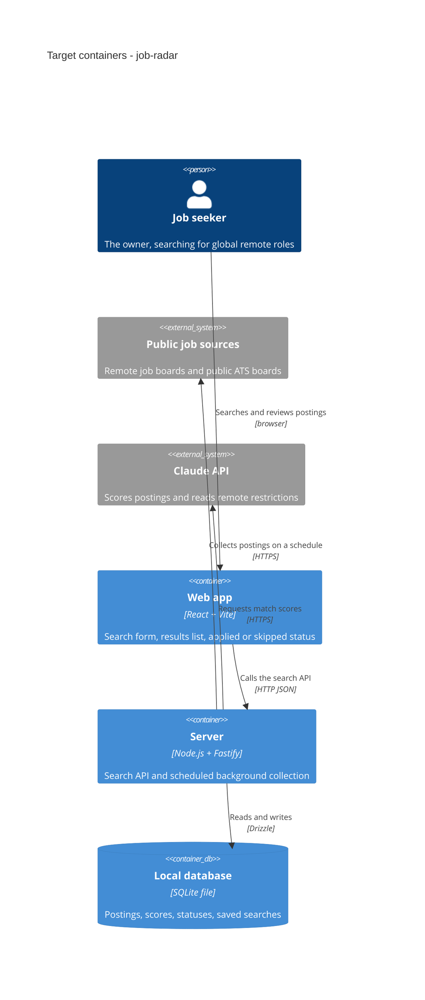

# Architecture map — job-radar

> The **target foundation** (greenfield-bootstrap): what `scaffold` is about to materialize, and the
> rule set every feature follows. Produced by `survey`; refresh with `survey` once the skeleton
> exists so the map describes real code. No hand-maintained architecture doc exists.

## Stack

- Language / runtime: TypeScript on Node.js 22+ for both apps (`docs/adr/0001-typescript-monorepo-react-fastify.md`)
- Frameworks: Fastify (server — HTTP API + in-process background collection), React + Vite (web)
- Package manager: pnpm workspaces (via corepack)
- Data: SQLite file through Drizzle ORM; migrations with drizzle-kit (`docs/adr/0003-sqlite-with-drizzle.md`)
- AI: Claude through the official Anthropic SDK; the model is chosen in the match-score feature
- Build / test / lint: `pnpm build` · `pnpm test` (Vitest) · `pnpm lint` (Biome)

## C4 — system as it is

Target baseline — what the skeleton plus the roadmap steps grow into.

## Module inventory

Target layout (created by scaffold; feature modules appear as their roadmap steps are built).

| Module | Path | Layers | Wired at | Responsibility |
|---|---|---|---|---|
| server core | `apps/server/src/core/` (new) | infra | `apps/server/src/app.ts` (new) | Fastify app, config, DB client, error envelope, ID helper |
| collector | `apps/server/src/modules/collector/` (new) | domain/app/infra | `apps/server/src/app.ts` (new) | Scheduled collection from job sources (roadmap steps 2, 9) |
| search | `apps/server/src/modules/search/` (new) | domain/app/ports | `apps/server/src/app.ts` (new) | On-request search API (step 3) |
| matching | `apps/server/src/modules/matching/` (new) | domain/app/infra | `apps/server/src/app.ts` (new) | Match score + "why it fits" (step 4) |
| remote-filter | `apps/server/src/modules/remote-filter/` (new) | domain/app | `apps/server/src/app.ts` (new) | Two-mode remote classification (step 5) |
| tracking | `apps/server/src/modules/tracking/` (new) | domain/app/ports | `apps/server/src/app.ts` (new) | Applied / skipped status (step 6) |
| alerts | `apps/server/src/modules/alerts/` (new) | domain/app/infra | `apps/server/src/app.ts` (new) | Saved searches + notifications (step 7) |
| web | `apps/web/src/` (new) | ui | `apps/web/src/main.tsx` (new) | The browser UI |

## Conventions (cited — the rules a new feature must match)

Greenfield: each convention cites the ADR that fixes it; scaffold creates the first code example.

- **Module wiring / registration:** each module exports a Fastify plugin; `app.ts` registers them — `docs/adr/0002-feature-modules-mirror-roadmap.md`
- **Module layering:** `domain` (pure types + rules, no I/O) → `app` (use cases) → `infra` (DB, HTTP clients) / `ports` (HTTP routes); modules talk through each other's `app` exports only, never reach into another module's `infra` — `docs/adr/0002-feature-modules-mirror-roadmap.md`
- **Error handling:** one JSON envelope `{ "error": { "code", "message" } }` produced by a single Fastify error handler in `core/` — `docs/adr/0002-feature-modules-mirror-roadmap.md`
- **IDs:** UUIDv7 generated in the app (time-sortable, fits "newest first") — `docs/adr/0003-sqlite-with-drizzle.md`
- **Persistence / DB access:** Drizzle schema per module (`<module>/infra/schema.ts`), queries only inside `infra/`; the DB is plain storage, rules live in `domain/` — `docs/adr/0003-sqlite-with-drizzle.md`
- **Migrations:** drizzle-kit generates SQL into `apps/server/drizzle/`, forward-only; rollback = restore the SQLite file backup taken before migrating — `docs/adr/0003-sqlite-with-drizzle.md`
- **Tests:** Vitest; unit tests next to the code (`*.test.ts`), integration tests in `apps/server/test/` against a real temporary SQLite file; web tests with Testing Library — `docs/adr/0001-typescript-monorepo-react-fastify.md`
- **Inter-module communication:** direct in-process calls to another module's `app` functions — `docs/adr/0002-feature-modules-mirror-roadmap.md`
- **UI / styling:** React + Vite; styling approach and component kit not decided yet — run `/sdd:design-system` before the first UI feature

## Datastores

| Store | Engine | Accessed via | Notes |
|---|---|---|---|
| Local database | SQLite (single file, `apps/server/data/`) | Drizzle ORM | Gitignored data file; Drizzle keeps a later move to Postgres open |

## Frontend / UI foundation

- **Component library / design system:** none yet — to be fixed by `/sdd:design-system`
- **Design tokens:** not decided
- **Styling approach:** not decided
- **Shared primitives:** none yet — `apps/web/src/components/` (new)
- **State / data-fetching:** not decided
- **Closest UI precedent:** the scaffold's `App.tsx` placeholder (new)

## Where things live / closest precedents

- A new server capability → a module under `apps/server/src/modules/<name>/` registered in `apps/server/src/app.ts`, modelled on the scaffold's health module (new).
- A new job source → an adapter inside `apps/server/src/modules/collector/infra/`, one file per source.
- A new screen / UI component → `apps/web/src/`, composed from the design system once `/sdd:design-system` fixes it.

## Constraints & known tech-debt

- Node.js 22+ required; the local machine currently has Node 20.10 (end-of-life) — upgrade before scaffold.
- pnpm is not installed; enable it through corepack (`corepack enable`).
- Background collection runs only while the server runs — acceptable for a personal laptop tool; moving to an always-on host is a later decision.
- Source terms: Himalayas, Remotive, Jobicy and Remote OK require a link back and naming the source; resubmitting their postings elsewhere is not allowed.
- drizzle-kit does not generate down migrations — rollback is a restore of the database file.

## Reconciliation with the authored architecture doc

No authored architecture doc; this map is the current reference.
