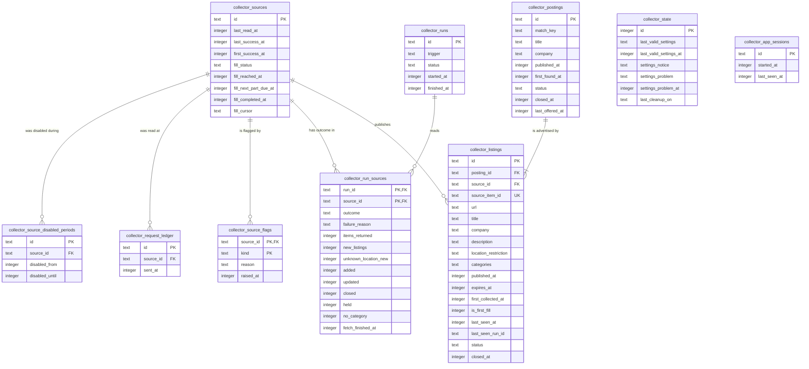

# Data model — remote-boards-collector

Derived from spec §5, sad.md §5 (Local database container) and the persist notes of sad.md §6 Flows 1–10. Conventions come from project ADR `docs/adr/0003-sqlite-with-drizzle.md` and sad.md §8; this is the first module that owns tables, so the choices below were confirmed with the owner and set the pattern for later modules:

- SQLite through Drizzle; tables live in `apps/server/src/modules/collector/infra/schema.ts`.
- Table and column names in snake_case with the module prefix `collector_`; Drizzle properties in camelCase.
- IDs: UUIDv7 text generated in the app (`newId()`), except `collector_sources.id`, a source code from the adapter registry, and the singleton `collector_state.id = 1`.
- Times: integer UTC epoch milliseconds (sad.md §8). Calendar dates in the owner's time zone are `YYYY-MM-DD` text.
- Status-like values are TEXT checked by TypeScript enums and domain rules — no `CHECK` constraints, no DB `DEFAULT`s, no triggers. FKs, `UNIQUE` and one partial unique index are used.
- No blanket `created_at` / `updated_at`: a time column exists only where a rule reads it.
- Hard delete: retention removes rows (AC-10).
- Owner marks are not stored here — the collector asks the `MarkedPostings` port (ADR-0006).

## ER diagram

## Entities

### Aggregate: Source

#### `collector_sources`

| Column | Type | Constraints | Notes |
|---|---|---|---|
| `id` | text | PK | Source code: `jobicy`, `himalayas`, `remotive`, `weworkremotely`. Rows are upserted from the adapter registry at start-up — no seed migration, a new source needs only code. Matches the settings-file keys. |
| `last_read_at` | integer | | Last read recorded in the ledger; due-ness = interval passed since it (AC-02, ADR-0003). Kept here because ledger rows are pruned after 24 h. |
| `last_success_at` | integer | | Last fetch that finished — complete, capped or partial (Flow 5 decision); catch-up (AC-18), interrupted runs (AC-20), source health (AC-12). |
| `first_success_at` | integer | | Start of collected history; AC-25 needs 7 days of it. |
| `fill_status` | text | NOT NULL | `pending` · `continuing` · `limited` · `complete` (AC-19, Flow 8). `limited`: the regular schedule leaves no spare read (review 2026-10-02 B12). |
| `fill_reached_at` | integer | | Oldest publication time the first fill has reached. |
| `fill_next_part_due_at` | integer | | Shown in source health while the fill continues. |
| `fill_completed_at` | integer | | |
| `fill_cursor` | text | | The source's paging cursor where the next fill part resumes (staged `05_add_fill_cursor`, review B12). |

**Aggregate root:** root. Settings (enabled, categories) live in the settings file and `collector_state`, not here; intervals and limits live in the adapter code.
**Access patterns:** by `id` only (four rows).

#### `collector_source_disabled_periods`

| Column | Type | Constraints | Notes |
|---|---|---|---|
| `id` | text | PK, UUIDv7 | |
| `source_id` | text | NOT NULL, FK → `collector_sources(id)` ON DELETE CASCADE | |
| `disabled_from` | integer | NOT NULL | When a settings read first saw the source disabled (Flow 4). |
| `disabled_until` | integer | | NULL while still disabled. |

**Aggregate root:** `collector_sources`.
**Access patterns:** open period of a source (close it on re-enable); a posting's sources' periods for the AC-10 / AC-26 retention clock (Flow 9) → `collector_source_disabled_periods_source_idx`.

#### `collector_request_ledger`

| Column | Type | Constraints | Notes |
|---|---|---|---|
| `id` | text | PK, UUIDv7 | |
| `source_id` | text | NOT NULL, FK → `collector_sources(id)` ON DELETE CASCADE | |
| `sent_at` | integer | NOT NULL | Written before the request is sent, so a crash still counts the read (ADR-0003, AC-20). Pages, fill reads and failed requests all count. |

**Aggregate root:** `collector_sources`.
**Access patterns:** reads per source in the rolling 60-minute and 24-hour windows (Flows 4, 5, 8) → `collector_request_ledger_source_sent_idx`. Rows older than 24 h are pruned by the daily clean-up (scan; the table holds at most a day of reads).

#### `collector_source_flags`

| Column | Type | Constraints | Notes |
|---|---|---|---|
| `source_id` | text | PK (1/2), FK → `collector_sources(id)` ON DELETE CASCADE | |
| `kind` | text | PK (2/2) | `failing` · `silent` · `held_back` · `unknown_location` · `category_unmatched`. Overdue is computed when source health is read and is not stored (Flow 7 decision). |
| `reason` | text | NOT NULL | Plain-language reason, names the number for `held_back` / `unknown_location` (AC-14, AC-25). |
| `raised_at` | integer | NOT NULL | |

**Aggregate root:** `collector_sources`.
**Access patterns:** all flags (main-screen marker, Flow 10) — full read of a table with at most 4 × 5 rows; flags of one source — PK prefix.

### Aggregate: Run

#### `collector_runs`

| Column | Type | Constraints | Notes |
|---|---|---|---|
| `id` | text | PK, UUIDv7 | Time-ordered, so id order = start order. |
| `trigger` | text | NOT NULL | `schedule` · `catch_up` · `collect_now`. |
| `status` | text | NOT NULL | `running` · `finished` · `incomplete` (AC-20). |
| `started_at` | integer | NOT NULL | |
| `finished_at` | integer | | |

**Aggregate root:** root.
**Access patterns:** "is a run in progress" (Flows 2, 3, 4) → `collector_runs_one_running_uq`, which also makes a second running run impossible (CONTEXT invariant "at most one collection run is in progress"). "Has any run finished" (Flow 10) — `EXISTS`, stops at the first row. Runs older than 60 days pruned daily (scan; ≈ 2k rows).

#### `collector_run_sources`

| Column | Type | Constraints | Notes |
|---|---|---|---|
| `run_id` | text | PK (1/2), FK → `collector_runs(id)` ON DELETE CASCADE | |
| `source_id` | text | PK (2/2), FK → `collector_sources(id)` ON DELETE CASCADE | One row per source on the run's due list, created when the run opens (Flow 4). |
| `outcome` | text | NOT NULL | `pending` · `complete` · `capped` · `partial` · `failed` (ADR-0004). `pending` left by an interrupted run. |
| `failure_reason` | text | | Plain-language reason (AC-03). |
| `items_returned` | integer | | Items in the response, not only new ones — zero twice in a row = silent (AC-13). |
| `new_listings` | integer | NOT NULL | AC-25 denominator. |
| `unknown_location_new` | integer | NOT NULL | AC-25 numerator. |
| `added` · `updated` · `closed` · `held` | integer | NOT NULL | AC-12 counts per posting outcome, credited per the AC-12 note. |
| `no_category` | integer | NOT NULL | Listings not collected for having no category (AC-23). |
| `fetch_finished_at` | integer | | Set when the fetch finished; with `outcome` decides last success after an interruption (AC-20). |

**Aggregate root:** `collector_runs`.
**Access patterns:** the source's latest outcomes, newest first — two in a row for failing / silent, 7 days for the AC-25 average, the last run for AC-12 counts (Flows 7, 10) → `collector_run_sources_source_run_idx` (UUIDv7 `run_id` sorts by time). Outcomes of one run (finalize, Flow 2 progress polling) → PK prefix.

### Aggregate: Posting

#### `collector_postings`

| Column | Type | Constraints | Notes |
|---|---|---|---|
| `id` | text | PK, UUIDv7 | Stable across merge, close and reopen — marks, scores and alerts key on it (ADR-0005, ADR-0006). |
| `match_key` | text | NOT NULL | Normalized company + title, legal suffixes and generic "remote" wording removed (AC-04). |
| `title` · `company` | text | NOT NULL | From the posting's first listing (AC-04 note). |
| `published_at` | integer | | Earliest publication time among its listings; NULL if none states one. |
| `first_found_at` | integer | NOT NULL | Never changes on merge (AC-06). |
| `status` | text | NOT NULL | `open` · `closed`. Held-back closures keep it `open` (AC-14). |
| `closed_at` | integer | | AC-10 clock for closed postings. |
| `last_offered_at` | integer | NOT NULL | Last time an enabled source offered it; AC-10 clock for open postings. |

**Aggregate root:** root.
**Access patterns:** merge candidates by match key (Flow 6) → `collector_postings_match_key_idx`. Retention candidates (Flow 9) — deliberately no index: one query a day over ≤ 40k rows (sad.md §7), while `last_offered_at` is rewritten on every fetch that sees the posting, so an index would cost a write per listing per run.

#### `collector_listings`

| Column | Type | Constraints | Notes |
|---|---|---|---|
| `id` | text | PK, UUIDv7 | |
| `posting_id` | text | NOT NULL, FK → `collector_postings(id)` ON DELETE CASCADE | Retention removes a posting with its listings. Set once when the listing is attached — a merge is never re-decided (AC-21); a same-source re-post replaces the old listing row with the new item on the same posting (Flow 6). |
| `source_id` | text | NOT NULL, FK → `collector_sources(id)` | |
| `source_item_id` | text | NOT NULL, UNIQUE with `source_id` | The source's own item id. |
| `url` | text | NOT NULL | Link back to the source — attribution required by source terms. |
| `title` · `company` · `description` | text | NOT NULL | Plain text; HTML converted at ingest (sad.md §8, spec §6.1). |
| `location_restriction` | text | | Exactly as the source states it; NULL = unknown, never "anywhere" (AC-21, AC-22). Latest statement replaces the stored one, no history. |
| `categories` | text | NOT NULL | JSON array of the source's categories; AC-24 "matched nothing in 7 days" for sources without a published list. |
| `published_at` | integer | | As the source states it, in UTC; NULL counted separately in freshness. |
| `expires_at` | integer | | Direct close signal (Himalayas `expiryDate`, ADR-0004). |
| `first_collected_at` | integer | NOT NULL | Freshness = `first_collected_at − published_at` (spec §6). |
| `is_first_fill` | integer | NOT NULL | Boolean (Drizzle `mode: "boolean"`); excluded from the freshness sample (AC-19). |
| `last_seen_at` | integer | NOT NULL | |
| `last_seen_run_id` | text | NOT NULL | No FK on purpose: runs are pruned after 60 days, listings live longer. Absent from a complete fetch = `last_seen_run_id` ≠ this run (ADR-0004). |
| `status` | text | NOT NULL | `open` · `closed`. |
| `closed_at` | integer | | |

**Aggregate root:** `collector_postings`.
**Access patterns:** find by source + item id (Flows 5, 6) → `collector_listings_source_item_uq`; open listings of a source not seen in this run (Flow 7) → same index, `source_id` prefix; listings of a posting (merge, close rule, retention) → `collector_listings_posting_idx`.

### Module state

#### `collector_state`

| Column | Type | Constraints | Notes |
|---|---|---|---|
| `id` | integer | PK | Always `1` — written by the app, not enforced by a `CHECK` (convention above). |
| `last_valid_settings` | text | | JSON copy of the last valid settings file; collection falls back to it (AC-27). |
| `last_valid_settings_at` | integer | | |
| `settings_notice` | text | | `defaults_in_use` — source health only, no marker. |
| `settings_problem` | text | | Plain-language reason the file is unreadable; raises the main-screen marker. Upserted on each due-check while the file stays broken (Flow 4). |
| `settings_problem_at` | integer | | |
| `last_cleanup_on` | text | | `YYYY-MM-DD` in the owner's time zone — idempotency of the daily clean-up (Flow 9). |

**Aggregate root:** root (singleton).

#### `collector_app_sessions`

| Column | Type | Constraints | Notes |
|---|---|---|---|
| `id` | text | PK, UUIDv7 | One row per server start. |
| `started_at` | integer | NOT NULL | |
| `last_seen_at` | integer | NOT NULL | Heartbeat written by the one-minute due-check. Overdue (AC-13) counts only time inside sessions, so a sleeping laptop is never "overdue". |

**Aggregate root:** root.
**Access patterns:** sessions overlapping "since the source's last read" (Flow 10) — scan of a small table; sessions older than 60 days pruned by the daily clean-up.

## Indexes

| Index | Columns | Query it serves |
|---|---|---|
| `collector_source_disabled_periods_source_idx` | `source_id` | Open disabled period of a source (Flow 4); a posting's sources' periods for the retention clock (Flow 9, AC-10/AC-26); FK index |
| `collector_request_ledger_source_sent_idx` | `source_id, sent_at` | Reads per source inside the rolling window (Flows 4, 5, 8) — covering; FK index |
| `collector_runs_one_running_uq` | `status` WHERE `status = 'running'` (unique, partial) | "Is a run in progress" (Flows 2, 3, 4); enforces at most one running run |
| `collector_run_sources_source_run_idx` | `source_id, run_id` | Latest outcomes of a source newest first — flags (Flow 7), last-run counts (Flow 10); FK index for `source_id` |
| `collector_postings_match_key_idx` | `match_key` | Merge candidates (Flow 6) |
| `collector_listings_source_item_uq` | `source_id, source_item_id` (unique) | Known item lookup (Flows 5, 6); open listings of a source absent from this run (Flow 7); FK index for `source_id` |
| `collector_listings_posting_idx` | `posting_id` | Listings of a posting — merge, close rule, cascade delete (Flows 6, 7, 9); FK index |

Primary keys already serve: `collector_source_flags` by source (PK prefix), `collector_run_sources` by run (PK prefix, also the `run_id` FK index).

## Test fixtures

Not in migrations. Builders follow the repo's test layout (`apps/server/test/helpers/`, beside `temp-db.ts`); no fixture helpers exist yet, so these set the pattern:

- `buildPosting(overrides)` / `buildListing(overrides)` — a posting with listings for merge, close and retention tests; company `Example Co`, URLs `https://jobs.example.test/<id>`.
- `buildRun(overrides)` / `buildRunSource(overrides)` — run history for the AC-13 / AC-14 / AC-25 flag rules.
- `seedSources(db)` — the four source rows as the start-up upsert writes them.
- `fakeMarkedPostings(markedIds)` — the `MarkedPostings` port fake (ADR-0006).
- Recorded source responses under `apps/server/test/fixtures/sources/<source>/` (complete, capped, failed, expired items) for the adapter and domain tests (sad.md §10 QG-2); anonymised to `example.test` companies and links.
