# Software Architecture Document — remote-boards-collector

<!-- 12 Arc42 sections. Empty section → <!-- N/A: <one-line reason> -->. -->
<!-- C4 Context (L1) lives inline in §3. C4 Container (L2) lives inline in §5. -->
<!-- Numbers in §10 come VERBATIM from spec.md §6 NFR — no inventing, no rounding. -->

## 1. Introduction and goals

**Intent.** The collector makes job-radar the place where new remote tech postings appear, so the owner stops opening job boards by hand. It reads every enabled source on that source's own allowed schedule, merges the same role seen on several sources into one posting that names and links every source, closes a posting only on a reliable signal, and keeps each source's location restriction exactly as stated. The owner sees it work through one new web screen — source health, with collect-now and the run in progress — and a problem marker on the main screen. Roadmap steps 3–7 (search, match score, remote filter, applied/skipped marks, alerts) all read what this feature collects.

**Top-3 quality goals (1-liners; full scenarios in §10):**

1. **Freshness within source terms** — new listings in job-radar ≤ 5 h p90 from publication for hourly-allowed sources (Jobicy publishes with a 3 h delay), and never a request above any source's published limit.
2. **Collection integrity over time** — no false closures (a failed or partial fetch never closes a posting), one posting per role, and the owner's marks never lost.
3. **No silent failure** — a failing or silent source is flagged within 2 of its own intervals and the problem shows on the app's main screen.

**Stakeholders.**

| Role | Interest | Sign-off owner? |
|---|---|---|
| Owner | Gets every relevant new posting without opening boards; watches source health and starts collect-now | No |
| Visitor | Must not reach the app at all (AC-17) — listed only to be kept out | No |
| Downstream modules (search, matching, remote-filter, tracking, alerts) | Read postings, listings and location restrictions collected here | No |
| Tech Lead | SAD approval | Yes |
| Security Lead | Security review required by spec §6.1 (untrusted external content ingested every run) — §8 security rows | Yes |

<!-- Decision overrides (¶4) — populated by the critic resolution loop, empty otherwise. -->

## 2. Constraints

**Technical.**
- TypeScript (`typescript ^7.0.2` in `apps/*/package.json`; `docs/architecture-map.md` still says 5) on Node.js 22+ (`.nvmrc`), pnpm workspaces via corepack — project ADR `docs/adr/0001-typescript-monorepo-react-fastify.md`
- Server: Fastify 5.12 (`apps/server`); web: React 19 + Vite 8 + Tailwind v4 (`apps/web`)
- Datastore: SQLite file through better-sqlite3 13 + Drizzle ORM 0.45; migrations by drizzle-kit 0.31, forward-only, rollback = restore the file backup — project ADR `docs/adr/0003-sqlite-with-drizzle.md`
- Architecture convention: feature modules `apps/server/src/modules/<name>/{domain,app,infra,ports}`, each a Fastify plugin registered in `apps/server/src/app.ts`; modules talk only through each other's `app` exports — project ADR `docs/adr/0002-feature-modules-mirror-roadmap.md`
- Tests: Vitest (unit next to code, integration in `apps/server/test/` against a temporary SQLite file); lint: Biome

**Organisational.**
- Effort budget: ~2 person-weeks, 1–2 sprints (spec §1 RICE/feasibility)
- Deadline: none hard — the owner is in an active job search, so sooner is better
- Team: the owner (solo) working with Claude; one machine, one user

**Conventions.**
- `docs/architecture-map.md` §Conventions — module wiring, layering, error envelope `{ "error": { "code", "message" } }` from `apps/server/src/core/errors.ts`, UUIDv7 IDs from `apps/server/src/core/id.ts`, Drizzle schema per module in `<module>/infra/schema.ts`
- UI: semantic tokens only from `apps/web/src/styles/tokens.css`, mobile-first, interaction conventions in `docs/design-system.md`
- Canonical domain terms: `CONTEXT.md` §Glossary (posting, listing, source, collection run, source health, closed posting, updated posting, location restriction)

**Regulatory / external.**
- Source terms: every listing keeps its source's name and link back (Himalayas, Remotive, Jobicy, We Work Remotely all require attribution); republishing, exporting or resubmitting postings is forbidden.
- Published request limits (spec §6): Jobicy ≤ 1 per hour; Remotive ≤ 4 per day and ≤ 2 per minute; Himalayas ≤ 4 per day until spec §8 Q3 sets its verified rate; We Work Remotely 0 (disabled) until spec §8 Q1 sets its verified limit. One read = one request, pages and failures included; rolling 60-minute / 24-hour windows.
- Source behaviour re-verified 2026-10-02 from each source's API documentation:
  - **Jobicy** — returns only listings published in the last 7 days, with a 3-hour publication delay; ≤ 200 listings per request; no closed signal.
  - **Himalayas** — ≤ 20 records per request, cursor pagination; data refreshed daily ("polling more than once per day provides no benefit"); every job carries `expiryDate` and `guid`.
  - **Remotive** — returns all active listings (filterable by category), delayed 24 hours; > 2 requests a minute are blocked.
- Privacy: no personal data collected; public postings plus the owner's own marks; nothing leaves the machine except requests to sources (spec §6.1).

## 3. Context and scope

The owner runs job-radar on their own laptop to find global remote tech roles. This feature adds the inbound edge of the system: job-radar reads public remote job boards on each board's allowed schedule, keeps one posting per role, and tells the owner — on a source-health screen and a main-screen marker — when a board misbehaves. Every byte that arrives from a board is untrusted input; the only human allowed in is the owner on the same machine.

<!-- brownfield: scaffold skeleton only (commit 2a6215c) — Fastify app with a reference `health` module, Drizzle + SQLite with an empty initial migration, temp-DB test helper, React placeholder `App.tsx`, Vite proxy `/api` → 127.0.0.1:3000; map `docs/architecture-map.md` (mode greenfield-bootstrap) describes the target. No collector code exists. -->

**External systems (in / out):**

| Actor or system | Type | Interaction |
|---|---|---|
| Owner | Person | Opens the web app on their own machine: source health, collect-now, the main-screen problem marker; edits the local settings file outside the app |
| Visitor | Person (external) | Anyone else on the network, the owner's phone included — cannot connect at all (AC-17) |
| Jobicy | System (external) | Read at most once an hour over HTTPS (JSON); last 7 days only; freshness source |
| Himalayas | System (external) | Read at most 4 times a day over HTTPS (JSON, 20 records per request); completeness + location data; `expiryDate` per job |
| Remotive | System (external) | Read at most 4 times a day over HTTPS (JSON); all active listings per category, 24 h delayed |
| We Work Remotely | System (external) | Disabled — 0 reads until spec §8 Q1 verifies its terms and limits |
| Local settings file | Data input (owner's file system) | Enabled sources + tech categories per source; read by job-radar at the start of every run, never written except to create it with defaults (AC-27) |

Trust boundary: the job-radar process on the owner's machine. Source responses cross it as untrusted content (size-capped, schema-checked, stored as plain text — §8); the browser crosses it only over the loopback interface.

**C4 Context (L1):**

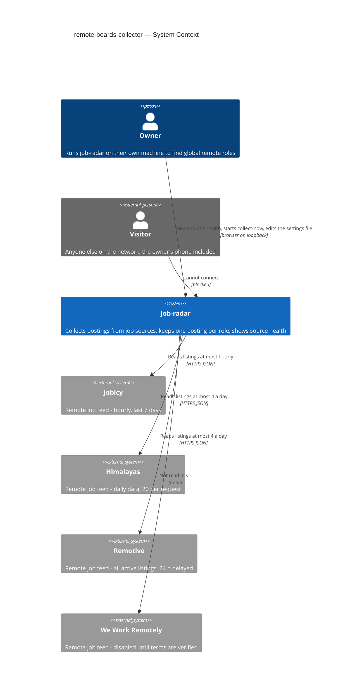

## 4. Solution strategy

**Target surfaces:** `[backend-service, web-frontend]` — [ADR-0001](adr/0001-ship-collector-as-server-module-plus-web-source-health.md). The collector is a new feature module inside the existing Fastify server, and its scheduled collection runs in that same process; the web app gains the source-health screen (SCR-02) and the main-screen problem marker (SCR-01). No separate worker process in v1.

**UI architecture (web-frontend):** single-page app (fixed by project ADR `docs/adr/0001-typescript-monorepo-react-fastify.md`), server data through TanStack Query, run progress by polling — every 2 s while a run is in progress, otherwise on window focus and every 60 s — and React Router for the two screens, so the problem marker links to a real URL — [ADR-0002](adr/0002-fetch-ui-data-with-tanstack-query-and-poll-run-progress.md). Screens reuse `docs/design-system.md` (tokens, interaction conventions); screen-level states belong to `screens.md`.

**Top strategic choices (the seeds for ADRs):**

1. **Due-check tick over persisted state** — a one-minute tick inside the server (plus one right after start) computes which enabled sources are due from what SQLite holds: a request ledger (every request to a source is recorded *before* it is sent) and each source's last successful read. A `collection_run` row in status `running` is the "at most one run" lock; a `running` row found at start-up is marked incomplete (AC-20). Sleep, restarts and crashes therefore never let a source be read above its limit (QG-1) and catch-up needs no special path (AC-18) — [ADR-0003](adr/0003-drive-collection-from-a-one-minute-due-check-over-persisted-state.md).
2. **One source-adapter contract that reports fetch completeness and closing signals** — every source is an adapter behind the same interface: it fetches within a read budget the scheduler grants it and returns normalized listings plus a completeness verdict (`complete` / `capped` / `partial` / `failed`) and any direct closing signals. Only the collector's domain rules decide what a verdict means, so a failed or partial fetch can never close a posting (QG-2, AC-08), and the later ATS and LinkedIn steps (roadmap 9, 10) plug into the same contract. Per-source closing signals (answers spec §8 Q2): Remotive — read with one unfiltered request per run (categories filtered locally, so a run costs exactly one read) and closed when absent from that complete fetch; Himalayas — `expiryDate` passed; Jobicy — absent from an untruncated response while still inside its 7-day window minus a 12-hour margin; We Work Remotely — none (ages out only) — [ADR-0004](adr/0004-normalize-sources-through-one-adapter-contract-with-per-source-close-signals.md).
3. **Postings and listings stored separately, merged at collection time** — a `listing` row per source copy (unique per source + source item id) belongs to exactly one `posting`. At ingest a pure domain function computes the match key (normalized company + title, AC-04 rules incl. the explicit generic-"remote" word list) and attaches the listing to a not-removed posting (open, or closed and then reopened — AC-11) with that key whose latest listing publication time is within 7 days of the new listing's, unless both state a location restriction and the statements differ (AC-05), else creates a new posting; a same-source re-post replaces that source's old item. The decision is stored and never re-decided (AC-21), so the posting id is stable for the owner's marks, scores and alerts (steps 4–7) — [ADR-0005](adr/0005-store-postings-and-listings-separately-and-merge-at-collection-time.md).

Each tactical decision in later sections traces to one of these seeds. Tactical decisions that *contradict* a strategic choice are red flags — surface them in §11.

## 5. Building block view

The collector follows the repo's feature-module layering (project ADR `docs/adr/0002-feature-modules-mirror-roadmap.md`): `domain` holds pure rules with no I/O — match key and merge, closure decisions (AC-07/08/09/14), due-ness and rate windows, health flags (AC-13/14/25), retention (AC-10); `app` holds the use cases that orchestrate a run; `infra` holds the Drizzle schema and queries, the source adapters (one file per source, per the map) and the settings-file reader; `ports` holds the Fastify routes for source health and collect-now. The scheduler is an `app`-layer loop started by the module's plugin and stopped on server close. Rules stay in `domain` so every AC that is a rule (merging, closing, flags, limits) is unit-testable with a fake clock and recorded source fixtures, without network or database.

**Internal decomposition:**

```
apps/server/src/modules/collector/
├── domain/        posting + listing rules: match key, merge, close decision, 30% hold-back,
│                  rate windows + due-ness, health flags, retention, location restriction (as stated | unknown)
├── app/           runCollection, scheduler tick, collectNow, startUpRecovery, dailyCleanUp,
│                  getSourceHealth, queries other modules import (postings, listings)
├── infra/
│   ├── schema.ts  Drizzle tables (shapes owned by the data-model stage)
│   ├── repo.ts    queries — the only place SQL lives
│   ├── settings.ts  reads/creates the local settings file, keeps the last valid copy
│   ├── http.ts    shared fetch: timeout, size cap, User-Agent, ledger write before send
│   └── sources/   jobicy.ts · himalayas.ts · remotive.ts · weworkremotely.ts (disabled)
├── ports/         routes: source health, collect-now, run status
└── index.ts       Fastify plugin: registers routes, starts/stops the scheduler

apps/web/src/
├── main.tsx        + QueryClientProvider + router
├── routes/         main screen (SCR-01, problem marker) · source health (SCR-02)
├── features/source-health/   queries (TanStack Query), source rows, run progress, collect-now
└── components/     shared primitives per docs/design-system.md
```

**Owner marks stay outside the collector.** Applied/skipped marks arrive with roadmap step 6 (tracking module). The collector never stores or reads mark columns itself; it asks a `MarkedPostings` port ("which of these posting ids carry a mark?") before retention deletes anything (AC-10) and keeps the posting id stable across merge, close and reopen (AC-06, AC-07, AC-11). Until step 6 ships, the port's default answers "none" and tests use a fake that carries marks — [ADR-0006](adr/0006-keep-owner-marks-behind-a-port-the-collector-consults-before-removal.md).

**Settings file.** `apps/server/data/settings.json` (beside the database, gitignored): enabled flag per source and tech categories per source. Re-read at the start of every run (no file watcher), validated against a schema; a valid copy is stored in the database as the last valid settings, so an unreadable file — even after a restart — keeps collection on the last valid copy (AC-27). A missing file is created with built-in defaults (every source except We Work Remotely enabled).

**C4 Container (L2):**

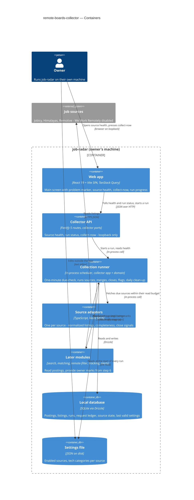

## 6. Runtime view

Participants are the §5 containers. Messages are semantic — endpoint shapes arrive at the `api` stage. design seeds the three critical flows below; the `sequences` stage covers every remaining §5 AC.

**Run phases.** A collection run has two phases. *Ingest* — per due source, in turn: record the read in the ledger, fetch, then in one transaction store or update its listings, merge them into postings, record the source's outcome and, when the fetch finished, its last success; this is kept even if the run is later interrupted (AC-20). *Finalize* — after every due source is done: apply the listing closures each source's verdict allows (ADR-0004), hold back a source's closures when they exceed 30% of its open postings (AC-14), close postings whose every listing is closed (AC-07, AC-09), compute health flags (AC-13, AC-25) and mark the run finished. An interrupted run never reaches finalize, so nothing is closed on its basis.

**Critical flow 1: scheduled collection run (happy path + one source failing)**

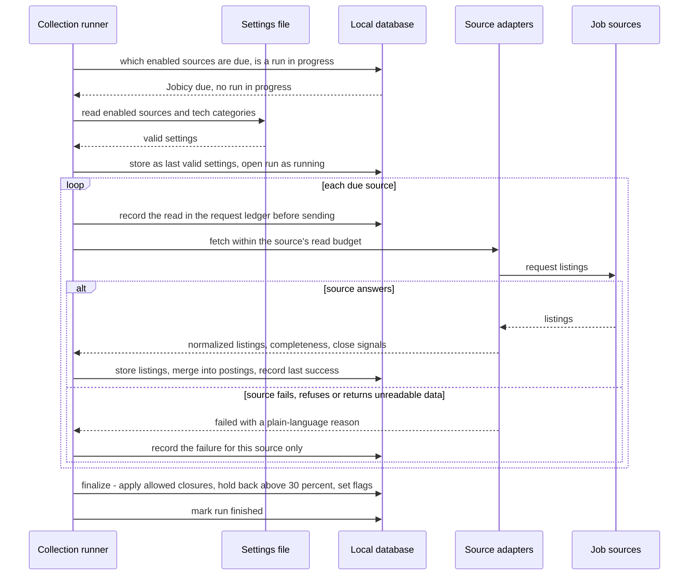

**Critical flow 2: collect-now from source health**

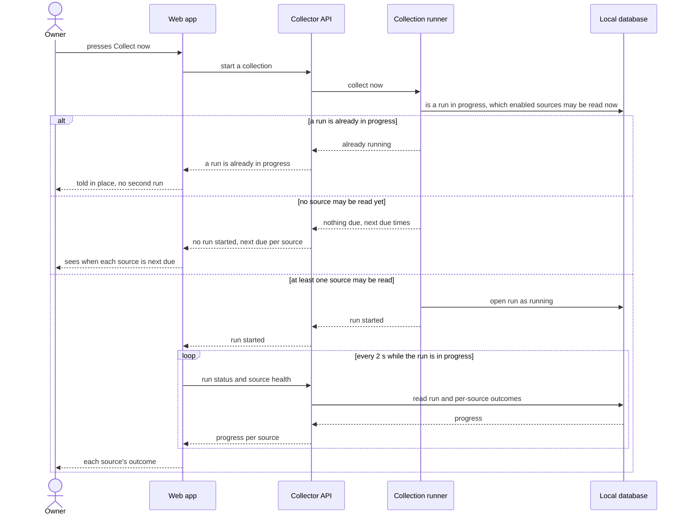

**Critical flow 3: start-up after a pause or an interrupted run**

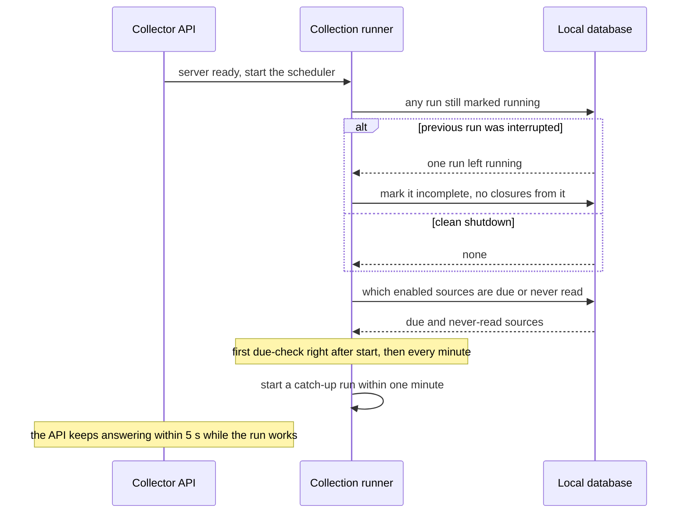

### Flow 4: run start - settings and which sources to read (US-08, US-01)

Covers AC-02, AC-26, AC-27. Runs on every one-minute due-check, on catch-up at start and on collect-now; the settings file is a local read, cheap enough to re-read on every check, so a valid edit applies from the next run without a restart.

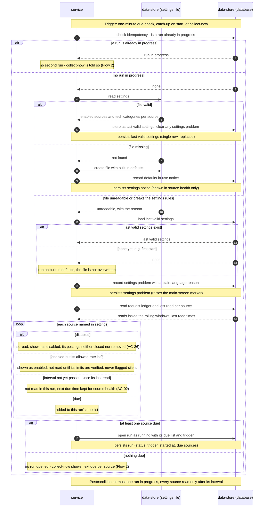

### Flow 5: ingest one due source (US-01, US-07, US-08)

Covers AC-01, AC-03, AC-21, AC-22, AC-23 and the partial-fetch rule (spec §6); one iteration of Flow 1's loop in detail. The read is idempotent by the request ledger: it is recorded before it is sent, so a crash or sleep never lets a source be read twice inside its window (ADR-0003). There is no message bus — a failed fetch is not re-queued; it is stored as the source's outcome and two in a row raise a flag (AC-13).

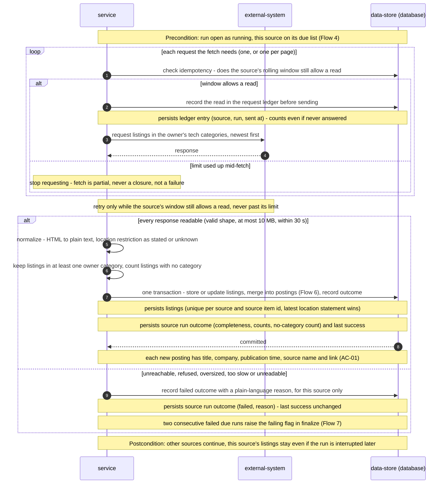

### Flow 6: merge a listing into postings (US-02, US-03)

Covers AC-04, AC-05, AC-06, AC-11 and the no-re-decide half of AC-21 (ADR-0005). Runs inside Flow 5's transaction, once per normalized listing; the match key and the merge decision are pure domain rules, the store only answers lookups.

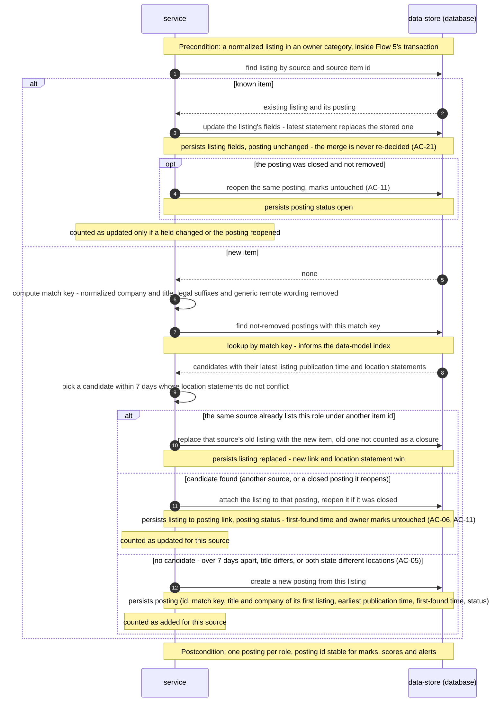

### Flow 7: finalize a run - closures, hold-back, health flags (US-03, US-04)

Covers AC-07, AC-08, AC-09, AC-12, AC-13, AC-14, AC-24, AC-25 and the closing half of AC-26 (ADR-0004). Runs once, after every due source has finished Flow 5; an interrupted run never gets here (Flow 3). The overdue flag is the one rule that can rise without any run, so it is evaluated when source health is read (Flow 10), not here.

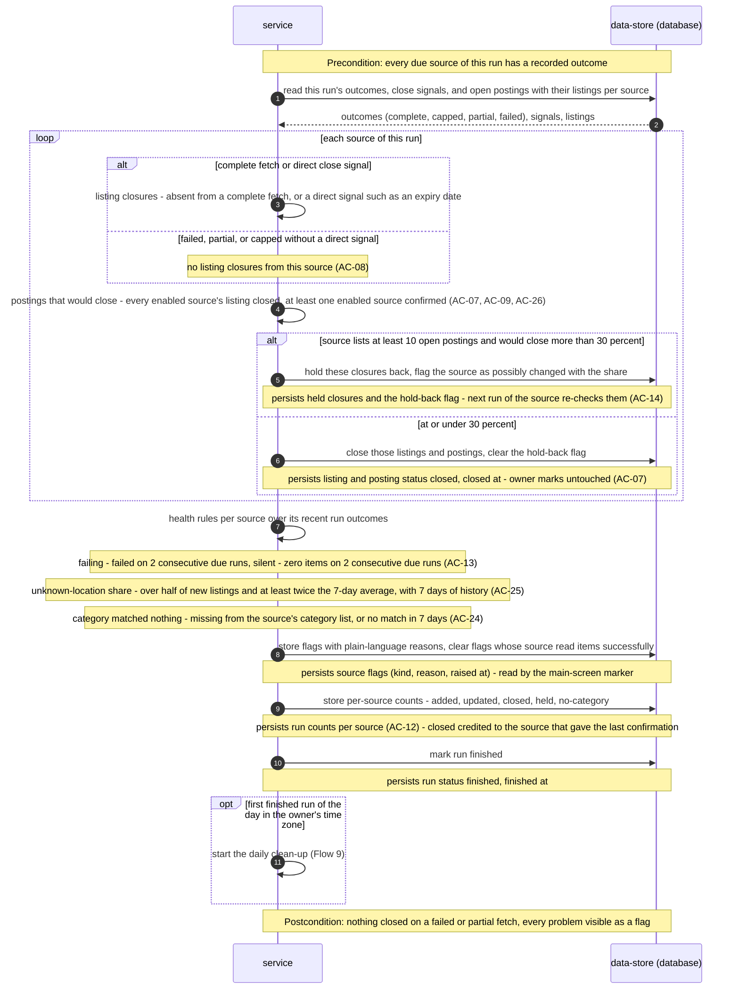

### Flow 8: first fill of a never-read source (US-06)

Covers AC-19. Applies on the app's first start and whenever a source is enabled for the first time. Regular reads always come first; the fill only spends what is left of the source's rolling window, so a slower source fills over several runs (spec §6, ADR-0003). Fill pages go through Flow 5 and Flow 6 like any listing, but they never close anything and their listings are excluded from the freshness sample.

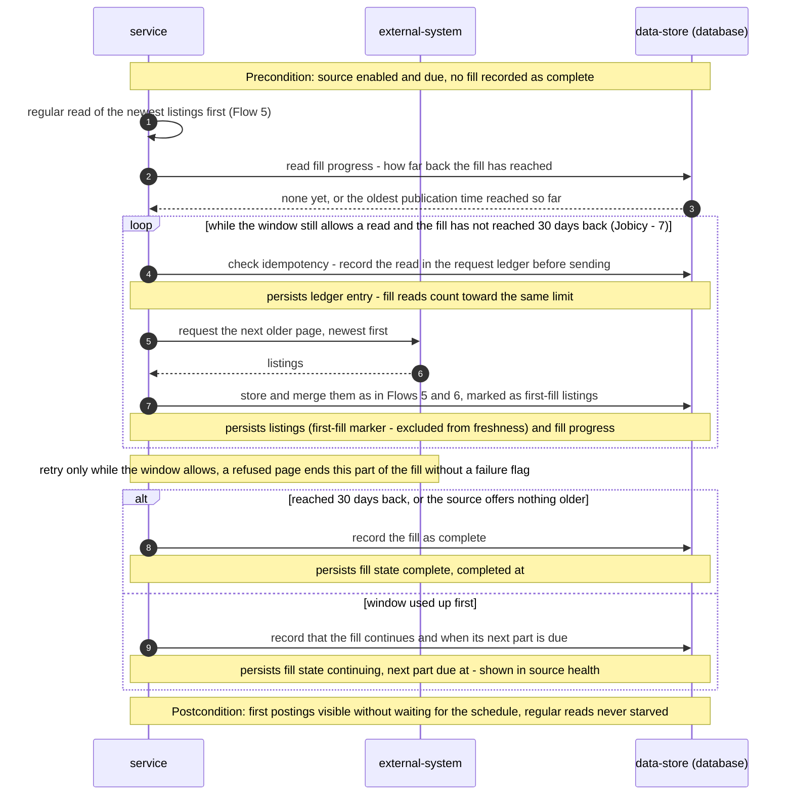

### Flow 9: daily clean-up (US-03)

Covers AC-10 and the retention-clock half of AC-26 (ADR-0006). Started by Flow 7 after the day's first run that finished without being interrupted, even if a source in it failed. Owner marks live outside the collector, so the collector asks the marks port before removing anything; until roadmap step 6 the port answers "none".

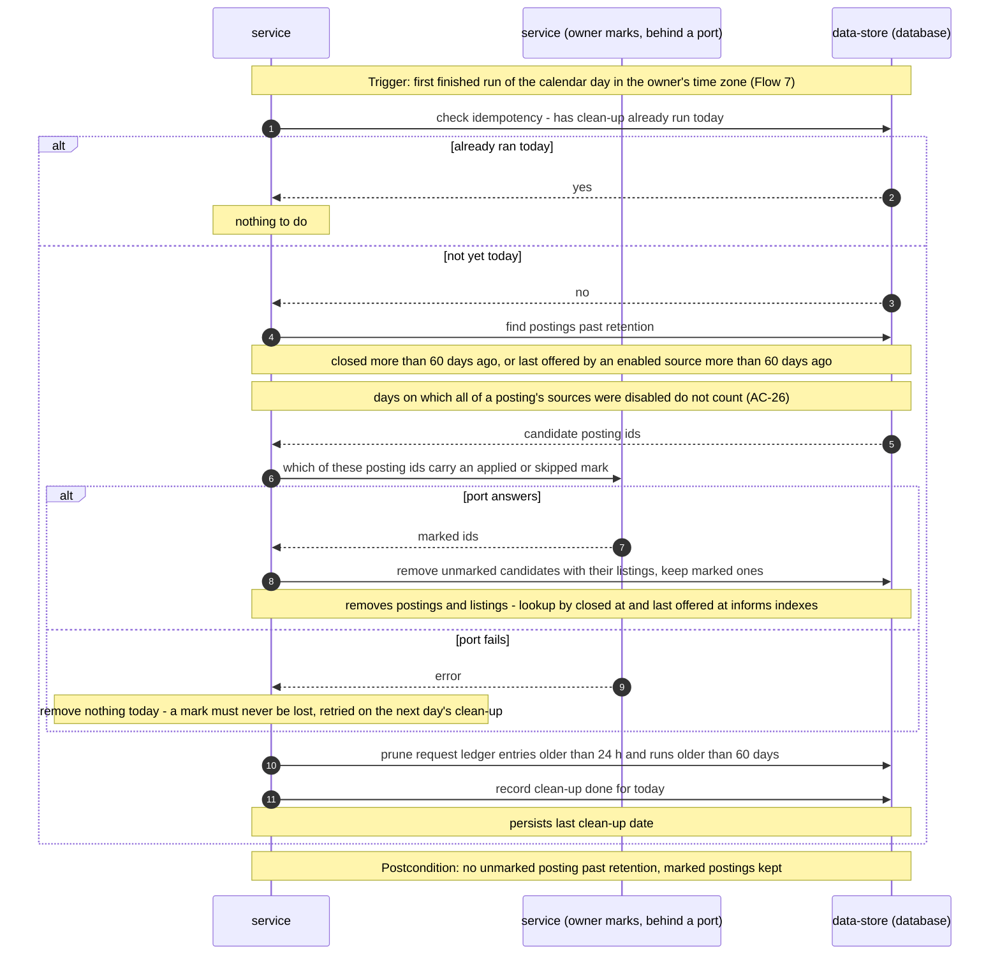

### Flow 10: owner sees problems and source health (US-04, US-08)

Covers AC-12, the main-screen marker of AC-13, how AC-14, AC-24, AC-25, AC-26 and AC-27 show up, and the overdue rule of AC-13. UI-driven along ux-flows Flow US-04 and Flow US-08 (SCR-01 to SCR-02); the run-in-progress polling on SCR-02 is Flow 2. Reads only — nothing here changes collection state.

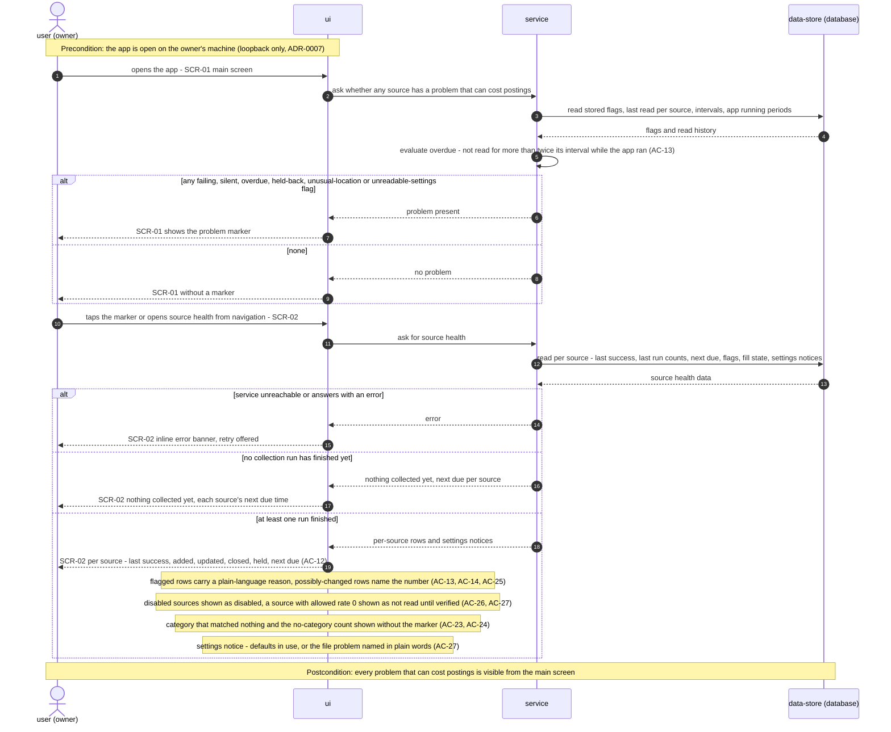

### Coverage

| User story | Flows |
|---|---|
| US-01 Collect new postings automatically | 1, 4, 5 |
| US-02 See each role once | 6 |
| US-03 Keep closed postings out of my way | 6 (reopen), 7, 9 |
| US-04 Know when a source misbehaves | 7, 10 |
| US-05 Collect now on demand | 2 |
| US-06 Catch up after a pause | 3, 8 |
| US-07 Keep where-to-work-from exactly as stated | 5, 6 |
| US-08 Choose what gets collected | 4, 5, 10 |

| AC | Shown by |
|---|---|
| AC-01 | Flow 5 readable branch (overview in Flow 1) |
| AC-02 | Flow 4 interval-not-passed branch, Flow 2 nothing-due branch |
| AC-03 | Flow 5 failed branch (overview in Flow 1) |
| AC-04 | Flow 6 candidate-found and same-source re-post branches |
| AC-05 | Flow 6 no-candidate branch |
| AC-06 | Flow 6 candidate-found branch - first-found time and marks untouched |
| AC-07 | Flow 7 closure rule and at-or-under-30-percent branch |
| AC-08 | Flow 7 failed, partial or capped branch |
| AC-09 | Flow 7 closure rule - every enabled source's listing closed |
| AC-10 | Flow 9 |
| AC-11 | Flow 6 known-item reopen and candidate-found reopen |
| AC-12 | Flow 7 per-source counts, Flow 10 at-least-one-run branch |
| AC-13 | Flow 7 failing and silent rules, Flow 10 overdue rule and main-screen marker |
| AC-14 | Flow 7 hold-back branch, Flow 10 possibly-changed rows |
| AC-15 | Flow 2 |
| AC-16 | Flow 2 already-running branch, Flow 4 run-in-progress branch |
| AC-17 | N/A: not a runtime flow - the server binds loopback only and rejects foreign `Host` headers (ADR-0007, §7, §8), so a visitor's connection never reaches any flow |
| AC-18 | Flow 3 |
| AC-19 | Flow 8 |
| AC-20 | Flow 3 interrupted branch, Flow 5 ledger-before-send and per-source transaction |
| AC-21 | Flow 5 latest statement wins, Flow 6 known-item branch - merge never re-decided |
| AC-22 | Flow 5 normalize - unknown when nothing is stated |
| AC-23 | Flow 5 category filter and no-category count, Flow 10 |
| AC-24 | Flow 7 category rule, Flow 10 |
| AC-25 | Flow 7 unknown-location rule, Flow 10 |
| AC-26 | Flow 4 disabled branch, Flow 7 closure rule, Flow 9 retention clock, Flow 10 |
| AC-27 | Flow 4 settings branches, Flow 10 settings notice |

### Notes for later stages

- **Participants.** Flows 4–10 use the generic runtime vocabulary, written without angle brackets because Mermaid strips `<...>` text as markup. They map onto the §5 containers named in Flows 1–3: `service` = Collection runner / Collector API, `data-store (database)` = Local database, `data-store (settings file)` = Settings file, `external-system` = Job sources reached through the Source adapters, `ui` = Web app, `service (owner marks, behind a port)` = Later modules through `MarkedPostings`. No participant outside §5 was needed.
- **Order divergence with Flow 1.** Flow 1 asks which sources are due before reading the settings file; Flow 4 reads the file first on every due-check so a newly enabled source becomes due without waiting for another run. Flow 4 is the authoritative order.
- **Decisions taken in this pass (below the ADR threshold):** a partial fetch counts as a successful read for last success, overdue and catch-up (Flow 5); overdue is evaluated when source health is read, so it needs a record of when the app was running (Flow 7, Flow 10); a refused first-fill page ends that part of the fill without a failing flag (Flow 8); if the marks port fails, clean-up removes nothing that day (Flow 9).
- **For `tasks` / domain tests:** when two not-removed postings both qualify as merge candidates (Flow 6), the tie-break rule is not drawn - fix it in the merge domain tests.
- **Persist and lookup hints for `data-model`:** listing unique by (source, source item id); posting looked up by match key among not-removed postings; request ledger read by source within rolling 60-minute and 24-hour windows; run looked up by status running; per-source run outcomes read by source over recent runs for flags; postings read by closed at and by last offered at for retention; single-row records for last valid settings, settings notice or problem, and last clean-up date; per-source fill state; first-fill marker on listings; app running periods for the overdue rule.

## 7. Deployment view

One Node.js process on the owner's laptop, listening only on `127.0.0.1:3000` (ADR-0007). It runs the Fastify API, the in-process collection runner (ADR-0001, ADR-0003) and — in normal use (`pnpm build` then `pnpm start`) — also serves the built SPA from `apps/web/dist` through `@fastify/static`, with any non-`/api` path falling back to `index.html` so client-side routes work: one origin, one process, no CORS. In development the Vite dev server (`localhost:5173`) serves the web app and proxies `/api` to the server, as the scaffold already does — with `changeOrigin: true` set on that proxy in `apps/web/vite.config.ts`, so forwarded requests carry `Host: 127.0.0.1:3000` and pass the Host check (ADR-0007). No replicas, no always-on host — collection happens only while the app runs (spec §3).

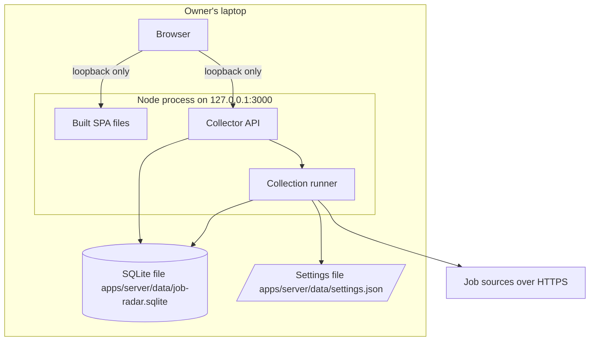

**Monitoring:** no external monitoring — source health *is* the monitoring surface.
- Metrics (stored per run in the database, shown in source health): run start/finish and outcome per source; added / updated / closed counts; freshness per listing = first collection time − the source's publication time, summarised per source, excluding the first fill, listings published while the app was not running and listings with no publication time (spec §6); added / updated / closed / held counted per posting outcome (spec AC-12 note); reads per source per rolling window.
- Alerts: the health flags themselves (AC-13, AC-14, AC-25) and the main-screen problem marker; nothing pages anyone.
- Logs: Fastify's pino logger, structured, child fields `module=collector`, `runId`, `source`; no external tracing.

**Scaling thresholds:**
- Expected volume: a few hundred new tech listings a day across enabled sources → roughly 20–40k listings inside the 60-day retention; one SQLite file with indexes on the match key and per-source item id is comfortable well past 10× that.
- Ledger rows older than 24 h and run rows older than 60 days are pruned by the daily clean-up.
- Moving to an always-on host or a second process is the trigger to revisit ADR-0001 and ADR-0007, not data volume.
- Before every migration the database file is backed up (project ADR `docs/adr/0003-sqlite-with-drizzle.md`).

## 8. Crosscutting concepts

| Concept | Convention | Where defined |
|---|---|---|
| Logging | Fastify's pino logger, structured JSON; collector logs use child fields `module=collector`, `runId`, `source`; never log full descriptions or response bodies | `apps/server/src/main.ts` (logger on) + here |
| Access control | No accounts. Server binds loopback only and refuses to start otherwise; requests whose `Host` is not `127.0.0.1`/`localhost` on the configured port are rejected (DNS rebinding); state-changing requests require a JSON body and are rejected when `Sec-Fetch-Site` says `cross-site`; no CORS headers are emitted (CSRF) | [ADR-0007](adr/0007-allow-only-loopback-same-origin-requests-without-accounts.md), `apps/server/src/core/` |
| Error handling | HTTP errors use the single envelope `{ "error": { "code", "message" } }`; a source failure is *data*, not an exception — the adapter returns `failed` with a reason code, the domain maps it to a plain-language reason stored on the source's run outcome (AC-03); unexpected errors inside one source's ingest fail that source only | `apps/server/src/core/errors.ts` + here |
| ID strategy | UUIDv7 generated in the app; listing identity is additionally unique per (source, source item id) | `apps/server/src/core/id.ts`, ADR-0005 |
| Untrusted source content | Each adapter validates the response shape against a schema; responses above 10 MB or slower than 30 s are rejected as `failed` (spec §6.1 oversized/malformed); HTML in titles and descriptions is converted to plain text at ingest and stored only as text; the web app renders it as text, never as markup (`dangerouslySetInnerHTML` is not used) | here |
| Outbound HTTP | Node's built-in `fetch`; User-Agent `job-radar (personal use)`; every request is written to the request ledger before it is sent; a source is read only once its interval has passed; a retry happens only if the source's window still allows it, and a limit used up mid-fetch makes that fetch `partial` — never a closure, never an AC-13 failure (spec §6) | `collector/infra/http.ts`, ADR-0003 |
| Time | Stored as UTC epoch milliseconds; source publication times kept as the source states them, converted to UTC; the clock is injected so rate windows, due-ness, flags and retention are tested with a fake clock | here |
| Responsiveness during collection | Normalization (HTML-to-text, match keys) runs in chunks that yield to the event loop; each source's ingest is one short transaction — keeps the app answering ≤ 5 s during catch-up and the first fill (spec §6) | here |
| Settings | `apps/server/data/settings.json`, re-read at the start of every run, schema-validated; last valid copy stored in the database (AC-27) | §5 |
| UI data access | TanStack Query for every server read; polling only for run progress | [ADR-0002](adr/0002-fetch-ui-data-with-tanstack-query-and-poll-run-progress.md) |
| UI styling | Semantic tokens only, mobile-first, interaction conventions (inline error banner, skeleton rows, disabled button with spinner) | `docs/design-system.md` |
| Internationalisation | N/A — single language (English) UI | — |
| Events | N/A — modules call each other's `app` exports in-process (project ADR-0002); no event bus | — |

## 9. Architecture decisions

| # | Title | Status | Section |
|---|---|---|---|
| [0001](adr/0001-ship-collector-as-server-module-plus-web-source-health.md) | Ship the collector as a server module plus a web source-health screen | Accepted | §4 |
| [0002](adr/0002-fetch-ui-data-with-tanstack-query-and-poll-run-progress.md) | Fetch UI data with TanStack Query and poll run progress | Accepted | §4 |
| [0003](adr/0003-drive-collection-from-a-one-minute-due-check-over-persisted-state.md) | Drive collection from a one-minute due-check over persisted state | Accepted | §4 |
| [0004](adr/0004-normalize-sources-through-one-adapter-contract-with-per-source-close-signals.md) | Normalize sources through one adapter contract with per-source close signals | Accepted | §4 |
| [0005](adr/0005-store-postings-and-listings-separately-and-merge-at-collection-time.md) | Store postings and listings separately and merge at collection time | Accepted | §4 |
| [0006](adr/0006-keep-owner-marks-behind-a-port-the-collector-consults-before-removal.md) | Keep owner marks behind a port the collector consults before removal | Accepted | §5 |
| [0007](adr/0007-allow-only-loopback-same-origin-requests-without-accounts.md) | Allow only loopback, same-origin requests, without accounts | Accepted | §8 |

ADR files live under `docs/features/remote-boards-collector/adr/NNNN-<title>.md`. Project-wide decisions this feature builds on: `docs/adr/0001-typescript-monorepo-react-fastify.md`, `docs/adr/0002-feature-modules-mirror-roadmap.md`, `docs/adr/0003-sqlite-with-drizzle.md`.

Decided inline (below the ADR threshold): settings as `apps/server/data/settings.json` re-read every run (§5); two-phase run — ingest per source, closures only in finalize (§6); Fastify serves the built SPA (§7).

## 10. Quality requirements

Each §1 goal expanded into a full scenario; numbers are quoted from spec §6 NFR and §7 KPIs.

**QG-1. Freshness within source terms**
- **When:** a source makes a new tech listing available while the app runs, and scheduled runs, catch-up runs, restarts and repeated collect-now presses all happen over days.
- **Then:** "≤ 5 h from the source's publication time to the listing being in job-radar, p90, while the app runs" for hourly-allowed sources; "Remotive ≤ 30 h, Himalayas ≤ 30 h" for slower sources; and reads stay "never above each source's published limit (Jobicy ≤ 1 per hour; Remotive ≤ 4 per day and ≤ 2 per minute; Himalayas ≤ 4 per day …; We Work Remotely 0 …)" over rolling 60-minute / 24-hour windows, pages and failed requests included. The sample excludes the first 30-day fill, listings published while the app was not running and listings with no publication time (spec §6).
- **How verify:** unit tests of due-ness and rate windows driven by a fake clock over 7 simulated days with restarts, interrupted runs and collect-now every minute, asserting reads per rolling window per source never exceed the limit; integration test against a local fake source server counting requests; freshness metric "per-listing difference between the source's publication time and its first collection time, reported per source" shown in source health and checked against the KPI "p90 ≤ 5 h from publication time for hourly-allowed sources while the app runs (§6 Freshness, same sample), within 14 days of shipping".

**QG-2. Collection integrity over time**
- **When:** a source fetch fails, is cut short, is capped, or a run is interrupted; or a source would close many postings at once; or the same role arrives from several sources.
- **Then:** "a failed or partial fetch never closes a posting" (AC-08); a posting closes only when every enabled source listing it confirms, and at least one does (AC-07, AC-09, AC-26); when "a source lists at least 10 open postings, and a single run of it would actually close … more than 30% of them" the closures are held back (AC-14); listings matching AC-04 become one posting and AC-05 cases stay separate; owner marks survive merge, close, reopen and clean-up (AC-06, AC-07, AC-10, AC-11).
- **How verify:** domain unit tests per AC-04/05/07/08/09/11/14 fed by recorded responses from each source (complete, capped, failed, expired items); integration test that stops a run between two sources and restarts the app, asserting no closures and the AC-20 last-success rules; marks fake for the `MarkedPostings` port (ADR-0006); KPI "0 of 20 spot-checked closed postings found still open at their source, in the first 30 days".

**QG-3. No silent failure**
- **When:** a source fails on two consecutive due runs, returns zero items on two consecutive due runs, is not read for more than twice its interval while the app runs, has its closures held back, or shows an unusual unknown-location share.
- **Then:** "a failing or silent source flagged within 2 of its own intervals"; the flag carries a plain-language reason in source health, the main screen shows a problem marker, and the flag clears after the next successful read that returns items (AC-13, AC-14, AC-25).
- **How verify:** fake-clock unit tests for each flag rule; component test that SCR-01 shows the marker when any source is flagged and links to SCR-02; KPI "0 source outages lasting more than 2 of that source's intervals without a flag in source health, in the first 30 days".

**QG-4. Responsive while collecting**
- **When:** the app starts with a catch-up due or the first 30-day fill running.
- **Then:** "the app responds to the owner ≤ 5 s after start, even while catch-up or the first fill runs".
- **How verify:** "start-up smoke test in CI", run with a fake source serving 30 days of listings.

**QG-5. Run duration**
- **When:** a regular run, and the first fill of each source.
- **Then:** "≤ 5 min p95 for a regular run; first fill ≤ 30 min for hourly-allowed sources; slower sources show their first postings within 24 h and their fill continues over later runs inside their allowed rate, as far back as AC-19 allows".
- **How verify:** "run start/finish times recorded per run; first-fill completion time per source", visible in source health.

**QG-6. Retention bound**
- **When:** the daily clean-up runs after the day's first successful collection run.
- **Then:** unmarked postings more than 60 days past closing or past the last offer from an enabled source are removed; "count of such unmarked postings = 0 after clean-up"; marked postings stay.
- **How verify:** fake-clock unit test of the retention rule including disabled-only days (AC-10, AC-26); integration test of the clean-up against a temporary database.

## 11. Risks and technical debt

| Risk / debt | Severity | Mitigation | Owner |
|---|---|---|---|
| ~~Open architectural decision: how freshness is measured for Jobicy~~ — **resolved 2026-10-02 by `clarify`**: measured from publication time, target ≤ 5 h p90 for hourly-allowed sources (spec §6, §7); residual risk: Jobicy lengthening its publication delay would breach the target without any change on our side | Low | Freshness per source is visible in source health; revisit the target if Jobicy's delay changes | Volodymyr Kozlov |
| Himalayas yields at most 80 listings a day (≤ 20 per request × ≤ 4 reads a day), which may miss tech postings and threaten the ≥ 95% completeness KPI | High | Use Himalayas' filtered search (tech categories, newest first) so every read counts; measure the per-source baseline in the first 7 days (spec §7); spec §8 Q3 to verify the real allowed rate | Volodymyr Kozlov |
| Himalayas' first 30-day fill cannot complete within 24 h at ≤ 80 listings a day; spec §6 "within 24 h for slower sources, whose fill continues over later runs" is now spec'd as "first postings within 24 h, the fill continues inside the allowed rate" (spec AC-19, §6, clarified 2026-10-02) — regular reads come first, so the full 30 days may never be reached | Medium | Newest-first reads, so recent postings come first; spec §8 Q3 may raise Himalayas' rate | Volodymyr Kozlov |
| Remotive is read with one unfiltered request per run; the full active-listings response (HTML descriptions included) may approach the 10 MB response cap (§8) | Medium | Measure the real response size in the first adapter task; raise the cap for Remotive or fall back to one category request per run if needed | Tech Lead |
| A Jobicy listing older than its 7-day window can no longer confirm a closure, so a posting that holds one closes only by the 60-day age-out (ADR-0004) | Medium | Accepted for v1; revisit if the false-closure / stale-posting spot checks (spec §7) show many stale merged postings | Volodymyr Kozlov |
| A wrong merge is permanent — there is no un-merge in v1 (ADR-0005) | Medium | Merge only on exact equality of the normalized key within 7 days; unit tests built from AC-04 / AC-05 examples; add un-merge if spot checks find false merges | Tech Lead |
| A source changes its response shape, categories or window | Medium | Schema validation turns a shape change into a flagged failure (AC-03); category drift is reported (AC-24); the 30% hold-back stops mass false closures (AC-14) | Tech Lead |
| Collection shares the event loop with the API (ADR-0001) | Low | Chunked normalization that yields; short per-source transactions; the ≤ 5 s start-up smoke test | Tech Lead |
| Owner-mark protection is proven only with a test fake until roadmap step 6 (ADR-0006) | Low | Re-verify AC-06/07/10/11 against real marks when step 6 ships (spec §5 note) | Volodymyr Kozlov |
| Spec §8 Q1 (We Work Remotely limits and location data) and Q3 (Himalayas' real rate) were due before `sdd:design` and are **deferred** to before `/sdd:tasks`: Himalayas' docs state only that polling more than once a day brings no benefit (no numeric limit) and the WWR terms page returned 403 on 2026-10-02; defaults are in force — WWR disabled, Himalayas ≤ 4 reads a day | Medium | Verify both and update spec + settings defaults; the adapter contract and settings file absorb either answer without design change | Volodymyr Kozlov — before `/sdd:tasks` |
| `docs/architecture-map.md` is behind the code and this design (says TypeScript 5, repo has `^7.0.2`; "State / data-fetching: not decided" is now ADR-0002) | Low | Re-run `/sdd:survey` after this feature lands | Volodymyr Kozlov |
| Development restarts (`tsx watch`) and crashes consume reads, because a read is counted when recorded, before it is sent | Low | Deliberately conservative (ADR-0003, AC-20); a dev setting can disable the scheduler while working on unrelated code | Tech Lead |

**Accepted debt (acceptable in v1, plan to fix later):**
- No un-merge of postings (ADR-0005).
- No history of location statements — the latest statement replaces the stored one (AC-21).
- No authentication for access from other devices — loopback only (ADR-0007, spec §3).
- Mark preservation verified through a port fake until roadmap step 6 (ADR-0006).

## 12. Glossary

Canonical domain terms come from `CONTEXT.md` §Glossary (repo root); this table repeats the ones the SAD uses and adds the design terms this document introduces.

| Term | Meaning |
|---|---|
| Owner | The one person who runs job-radar on their own machine; the only human role in v1 (CONTEXT). |
| Visitor | Anyone who can reach the owner's machine over a network but is not the owner (CONTEXT). |
| Source | An external job board or feed job-radar reads postings from — Jobicy, Himalayas, Remotive, We Work Remotely (CONTEXT). |
| Listing | One source's copy of a posting, with that source's link, text and publication time (CONTEXT). |
| Posting | One open role at one company as the owner sees it; may hold listings from several sources (CONTEXT). |
| Closed posting | A posting every enabled source listing it has confirmed as no longer open; at least one must confirm (CONTEXT). |
| Updated posting | A known posting whose title, text, location restriction or link changed, that gained a listing, or that reopened (CONTEXT). |
| Location restriction | What a source states about where a candidate may work from, kept exactly as stated; `unknown` when it states nothing (CONTEXT). |
| Collection run | One pass over every enabled source that is due, with a per-source outcome (CONTEXT). |
| Source health | The owner-visible state of one source: last success, last run's counts, next due, flags (CONTEXT). |
| Request ledger *(design term)* | Persisted record of every request made to a source, written before it is sent; the basis for rolling-window limits (ADR-0003). |
| Read budget *(design term)* | How many requests a source may still make in this run without exceeding its rolling windows (ADR-0003). |
| Completeness verdict *(design term)* | An adapter's statement about a fetch: `complete`, `capped`, `partial` or `failed`; only `complete` fetches and direct signals may close listings (ADR-0004). |
| Close signal *(design term)* | The per-source evidence that a listing is no longer open — absence from a complete fetch, a passed `expiryDate`, or none (ADR-0004). |
| Match key *(design term)* | Normalized company + title used to merge a listing into an existing posting (ADR-0005, AC-04). |
| Ingest / finalize *(design terms)* | The two phases of a collection run: per-source storing and merging, then closures and flags only when the run completes (§6). |

Design terms marked *(design term)* are not in `CONTEXT.md` yet — run `/sdd:glossary remote-boards-collector` if they should become canonical.
