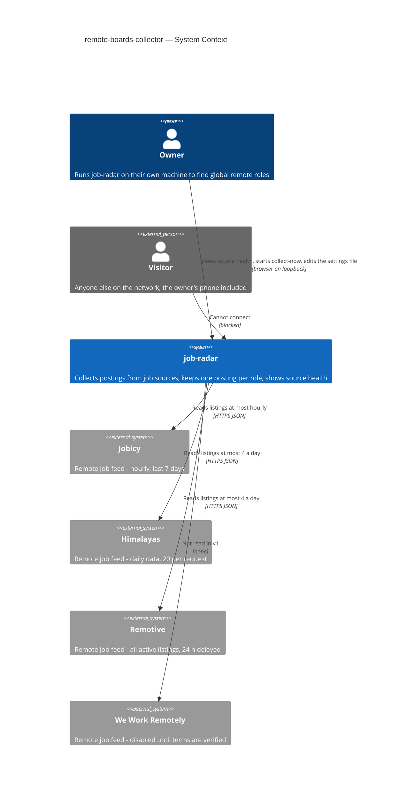
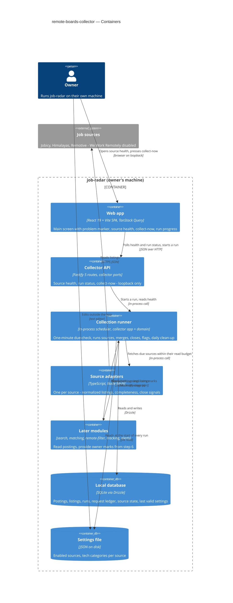
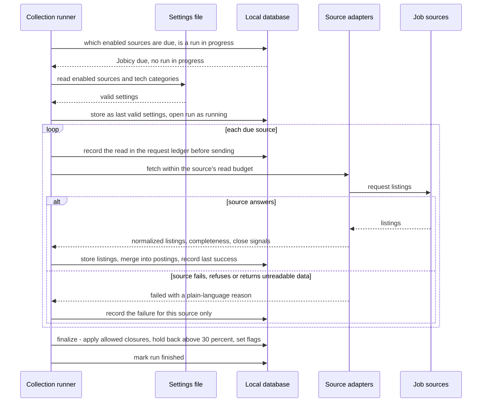
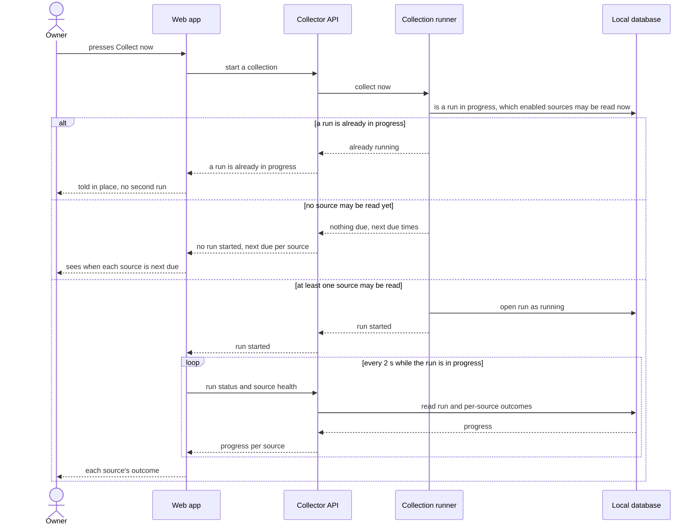
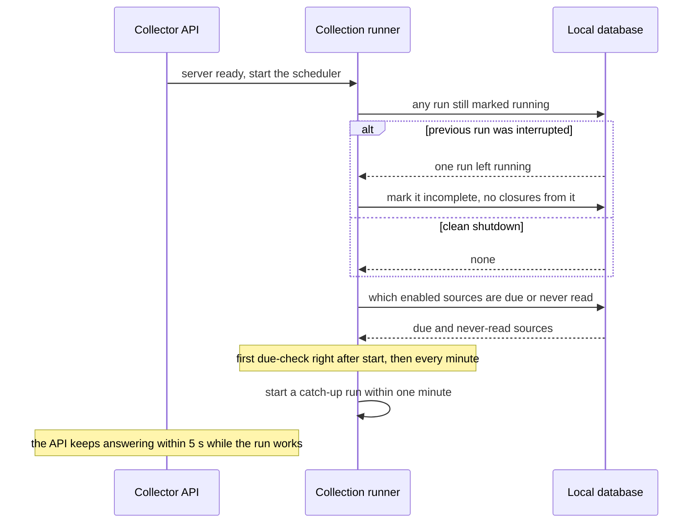

# Software Architecture Document — remote-boards-collector

<!-- 12 Arc42 sections. Empty section → <!-- N/A: <one-line reason> -->. -->
<!-- C4 Context (L1) lives inline in §3. C4 Container (L2) lives inline in §5. -->
<!-- Numbers in §10 come VERBATIM from spec.md §6 NFR — no inventing, no rounding. -->

## 1. Introduction and goals

**Intent.** The collector makes job-radar the place where new remote tech postings appear, so the owner stops opening job boards by hand. It reads every enabled source on that source's own allowed schedule, merges the same role seen on several sources into one posting that names and links every source, closes a posting only on a reliable signal, and keeps each source's location restriction exactly as stated. The owner sees it work through one new web screen — source health, with collect-now and the run in progress — and a problem marker on the main screen. Roadmap steps 3–7 (search, match score, remote filter, applied/skipped marks, alerts) all read what this feature collects.

**Top-3 quality goals (1-liners; full scenarios in §10):**

1. **Freshness within source terms** — new postings in job-radar ≤ 2 h p90 for hourly-allowed sources, and never a request above any source's published limit.
2. **Collection integrity over time** — no false closures (a failed or partial fetch never closes a posting), one posting per role, and the owner's marks never lost.
3. **No silent failure** — a failing or silent source is flagged within 2 of its own intervals and the problem shows on the app's main screen.

**Stakeholders.**

| Role | Interest | Sign-off owner? |
|---|---|---|
| Owner | Gets every relevant new posting without opening boards; watches source health and starts collect-now | No |
| Visitor | Must not reach the app at all (AC-17) — listed only to be kept out | No |
| Downstream modules (search, matching, remote-filter, tracking, alerts) | Read postings, listings and location restrictions collected here | No |
| Tech Lead | SAD approval | Yes |
| Security Lead | Security review required by spec §6.1 (untrusted external content ingested every run) — §8 security rows | Yes |

<!-- Decision overrides (¶4) — populated by the critic resolution loop, empty otherwise. -->

## 2. Constraints

**Technical.**
- TypeScript (`typescript ^7.0.2` in `apps/*/package.json`; `docs/architecture-map.md` still says 5) on Node.js 22+ (`.nvmrc`), pnpm workspaces via corepack — project ADR `docs/adr/0001-typescript-monorepo-react-fastify.md`
- Server: Fastify 5.12 (`apps/server`); web: React 19 + Vite 8 + Tailwind v4 (`apps/web`)
- Datastore: SQLite file through better-sqlite3 13 + Drizzle ORM 0.45; migrations by drizzle-kit 0.31, forward-only, rollback = restore the file backup — project ADR `docs/adr/0003-sqlite-with-drizzle.md`
- Architecture convention: feature modules `apps/server/src/modules/<name>/{domain,app,infra,ports}`, each a Fastify plugin registered in `apps/server/src/app.ts`; modules talk only through each other's `app` exports — project ADR `docs/adr/0002-feature-modules-mirror-roadmap.md`
- Tests: Vitest (unit next to code, integration in `apps/server/test/` against a temporary SQLite file); lint: Biome

**Organisational.**
- Effort budget: ~2 person-weeks, 1–2 sprints (spec §1 RICE/feasibility)
- Deadline: none hard — the owner is in an active job search, so sooner is better
- Team: the owner (solo) working with Claude; one machine, one user

**Conventions.**
- `docs/architecture-map.md` §Conventions — module wiring, layering, error envelope `{ "error": { "code", "message" } }` from `apps/server/src/core/errors.ts`, UUIDv7 IDs from `apps/server/src/core/id.ts`, Drizzle schema per module in `<module>/infra/schema.ts`
- UI: semantic tokens only from `apps/web/src/styles/tokens.css`, mobile-first, interaction conventions in `docs/design-system.md`
- Canonical domain terms: `CONTEXT.md` §Glossary (posting, listing, source, collection run, source health, closed posting, updated posting, location restriction)

**Regulatory / external.**
- Source terms: every listing keeps its source's name and link back (Himalayas, Remotive, Jobicy, We Work Remotely all require attribution); republishing, exporting or resubmitting postings is forbidden.
- Published request limits (spec §6): Jobicy ≤ 1 per hour; Remotive ≤ 4 per day and ≤ 2 per minute; Himalayas ≤ 4 per day until spec §8 Q3 sets its verified rate; We Work Remotely 0 (disabled) until spec §8 Q1 sets its verified limit. One read = one request, pages and failures included; rolling 60-minute / 24-hour windows.
- Source behaviour re-verified 2026-10-02 from each source's API documentation:
  - **Jobicy** — returns only listings published in the last 7 days, with a 3-hour publication delay; ≤ 200 listings per request; no closed signal.
  - **Himalayas** — ≤ 20 records per request, cursor pagination; data refreshed daily ("polling more than once per day provides no benefit"); every job carries `expiryDate` and `guid`.
  - **Remotive** — returns all active listings (filterable by category), delayed 24 hours; > 2 requests a minute are blocked.
- Privacy: no personal data collected; public postings plus the owner's own marks; nothing leaves the machine except requests to sources (spec §6.1).

## 3. Context and scope

The owner runs job-radar on their own laptop to find global remote tech roles. This feature adds the inbound edge of the system: job-radar reads public remote job boards on each board's allowed schedule, keeps one posting per role, and tells the owner — on a source-health screen and a main-screen marker — when a board misbehaves. Every byte that arrives from a board is untrusted input; the only human allowed in is the owner on the same machine.

<!-- brownfield: scaffold skeleton only (commit 2a6215c) — Fastify app with a reference `health` module, Drizzle + SQLite with an empty initial migration, temp-DB test helper, React placeholder `App.tsx`, Vite proxy `/api` → 127.0.0.1:3000; map `docs/architecture-map.md` (mode greenfield-bootstrap) describes the target. No collector code exists. -->

**External systems (in / out):**

| Actor or system | Type | Interaction |
|---|---|---|
| Owner | Person | Opens the web app on their own machine: source health, collect-now, the main-screen problem marker; edits the local settings file outside the app |
| Visitor | Person (external) | Anyone else on the network, the owner's phone included — cannot connect at all (AC-17) |
| Jobicy | System (external) | Read at most once an hour over HTTPS (JSON); last 7 days only; freshness source |
| Himalayas | System (external) | Read at most 4 times a day over HTTPS (JSON, 20 records per request); completeness + location data; `expiryDate` per job |
| Remotive | System (external) | Read at most 4 times a day over HTTPS (JSON); all active listings per category, 24 h delayed |
| We Work Remotely | System (external) | Disabled — 0 reads until spec §8 Q1 verifies its terms and limits |
| Local settings file | Data input (owner's file system) | Enabled sources + tech categories per source; read by job-radar at the start of every run, never written except to create it with defaults (AC-27) |

Trust boundary: the job-radar process on the owner's machine. Source responses cross it as untrusted content (size-capped, schema-checked, stored as plain text — §8); the browser crosses it only over the loopback interface.

**C4 Context (L1):**



## 4. Solution strategy

**Target surfaces:** `[backend-service, web-frontend]` — [ADR-0001](adr/0001-ship-collector-as-server-module-plus-web-source-health.md). The collector is a new feature module inside the existing Fastify server, and its scheduled collection runs in that same process; the web app gains the source-health screen (SCR-02) and the main-screen problem marker (SCR-01). No separate worker process in v1.

**UI architecture (web-frontend):** single-page app (fixed by project ADR `docs/adr/0001-typescript-monorepo-react-fastify.md`), server data through TanStack Query, run progress by polling — every 2 s while a run is in progress, otherwise on window focus and every 60 s — and React Router for the two screens, so the problem marker links to a real URL — [ADR-0002](adr/0002-fetch-ui-data-with-tanstack-query-and-poll-run-progress.md). Screens reuse `docs/design-system.md` (tokens, interaction conventions); screen-level states belong to `screens.md`.

**Top strategic choices (the seeds for ADRs):**

1. **Due-check tick over persisted state** — a one-minute tick inside the server (plus one right after start) computes which enabled sources are due from what SQLite holds: a request ledger (every request to a source is recorded *before* it is sent) and each source's last successful read. A `collection_run` row in status `running` is the "at most one run" lock; a `running` row found at start-up is marked incomplete (AC-20). Sleep, restarts and crashes therefore never let a source be read above its limit (QG-1) and catch-up needs no special path (AC-18) — [ADR-0003](adr/0003-drive-collection-from-a-one-minute-due-check-over-persisted-state.md).
2. **One source-adapter contract that reports fetch completeness and closing signals** — every source is an adapter behind the same interface: it fetches within a read budget the scheduler grants it and returns normalized listings plus a completeness verdict (`complete` / `capped` / `partial` / `failed`) and any direct closing signals. Only the collector's domain rules decide what a verdict means, so a failed or partial fetch can never close a posting (QG-2, AC-08), and the later ATS and LinkedIn steps (roadmap 9, 10) plug into the same contract. Per-source closing signals (answers spec §8 Q2): Remotive — absent from a complete fetch of the same category; Himalayas — `expiryDate` passed; Jobicy — absent from an untruncated response while still inside its 7-day window minus a 12-hour margin; We Work Remotely — none (ages out only) — [ADR-0004](adr/0004-normalize-sources-through-one-adapter-contract-with-per-source-close-signals.md).
3. **Postings and listings stored separately, merged at collection time** — a `listing` row per source copy (unique per source + source item id) belongs to exactly one `posting`. At ingest a pure domain function computes the match key (normalized company + title, AC-04 rules) and attaches the listing to an open-or-closed-not-removed posting with that key whose publication time is within 7 days, else creates a new posting. The decision is stored and never re-decided (AC-21), so the posting id is stable for the owner's marks, scores and alerts (steps 4–7) — [ADR-0005](adr/0005-store-postings-and-listings-separately-and-merge-at-collection-time.md).

Each tactical decision in later sections traces to one of these seeds. Tactical decisions that *contradict* a strategic choice are red flags — surface them in §11.

## 5. Building block view

The collector follows the repo's feature-module layering (project ADR `docs/adr/0002-feature-modules-mirror-roadmap.md`): `domain` holds pure rules with no I/O — match key and merge, closure decisions (AC-07/08/09/14), due-ness and rate windows, health flags (AC-13/14/25), retention (AC-10); `app` holds the use cases that orchestrate a run; `infra` holds the Drizzle schema and queries, the source adapters (one file per source, per the map) and the settings-file reader; `ports` holds the Fastify routes for source health and collect-now. The scheduler is an `app`-layer loop started by the module's plugin and stopped on server close. Rules stay in `domain` so every AC that is a rule (merging, closing, flags, limits) is unit-testable with a fake clock and recorded source fixtures, without network or database.

**Internal decomposition:**

```
apps/server/src/modules/collector/
├── domain/        posting + listing rules: match key, merge, close decision, 30% hold-back,
│                  rate windows + due-ness, health flags, retention, location restriction (as stated | unknown)
├── app/           runCollection, scheduler tick, collectNow, startUpRecovery, dailyCleanUp,
│                  getSourceHealth, queries other modules import (postings, listings)
├── infra/
│   ├── schema.ts  Drizzle tables (shapes owned by the data-model stage)
│   ├── repo.ts    queries — the only place SQL lives
│   ├── settings.ts  reads/creates the local settings file, keeps the last valid copy
│   ├── http.ts    shared fetch: timeout, size cap, User-Agent, ledger write before send
│   └── sources/   jobicy.ts · himalayas.ts · remotive.ts · weworkremotely.ts (disabled)
├── ports/         routes: source health, collect-now, run status
└── index.ts       Fastify plugin: registers routes, starts/stops the scheduler

apps/web/src/
├── main.tsx        + QueryClientProvider + router
├── routes/         main screen (SCR-01, problem marker) · source health (SCR-02)
├── features/source-health/   queries (TanStack Query), source rows, run progress, collect-now
└── components/     shared primitives per docs/design-system.md
```

**Owner marks stay outside the collector.** Applied/skipped marks arrive with roadmap step 6 (tracking module). The collector never stores or reads mark columns itself; it asks a `MarkedPostings` port ("which of these posting ids carry a mark?") before retention deletes anything (AC-10) and keeps the posting id stable across merge, close and reopen (AC-06, AC-07, AC-11). Until step 6 ships, the port's default answers "none" and tests use a fake that carries marks — [ADR-0006](adr/0006-keep-owner-marks-behind-a-port-the-collector-consults-before-removal.md).

**Settings file.** `apps/server/data/settings.json` (beside the database, gitignored): enabled flag per source and tech categories per source. Re-read at the start of every run (no file watcher), validated against a schema; a valid copy is stored in the database as the last valid settings, so an unreadable file — even after a restart — keeps collection on the last valid copy (AC-27). A missing file is created with built-in defaults (every source except We Work Remotely enabled).

**C4 Container (L2):**



## 6. Runtime view

Participants are the §5 containers. Messages are semantic — endpoint shapes arrive at the `api` stage. design seeds the three critical flows below; the `sequences` stage covers every remaining §5 AC.

**Run phases.** A collection run has two phases. *Ingest* — per due source, in turn: record the read in the ledger, fetch, then in one transaction store or update its listings, merge them into postings, record the source's outcome and, when the fetch finished, its last success; this is kept even if the run is later interrupted (AC-20). *Finalize* — after every due source is done: apply the listing closures each source's verdict allows (ADR-0004), hold back a source's closures when they exceed 30% of its open postings (AC-14), close postings whose every listing is closed (AC-07, AC-09), compute health flags (AC-13, AC-25) and mark the run finished. An interrupted run never reaches finalize, so nothing is closed on its basis.

**Critical flow 1: scheduled collection run (happy path + one source failing)**



**Critical flow 2: collect-now from source health**



**Critical flow 3: start-up after a pause or an interrupted run**



## 7. Deployment view

<!-- 🎯 Why: the TOPOLOGY DevOps must know without reading the deploy charts — how many replicas,
     where the background worker lives, AT WHAT NUMBERS we scale.
     📋 Write: 2–3 sentences on topology + monitoring + concrete threshold numbers.
     📌 e.g. «500 authors → partition by quarter» (not «we'll think about scale later»).
     🎯 N/A allowed for XS/S that reuses an existing deployment unit with no change.
     Deployment-diagram scaffold → templates/deployment.md. -->

<Topology in 2–3 sentences. Where it runs, replicas, scaling thresholds.>

**Monitoring:**
- <Metrics — e.g. `<metric_name>`>
- <Alerts — e.g. «worker lag > 10 min → page on-call»>
- <Tracing — e.g. spans on the request boundary>

**Scaling thresholds:**
- <e.g. comfortable in one table up to N rows/year>
- <e.g. partition by quarter above N rows/year>

<!-- For XS/S with no deployment change: <!-- N/A: reuses existing deployment unit, no infra change --> -->

## 8. Crosscutting concepts

<!-- 🎯 Why: CROSS-CUTTING PATTERNS spanning several modules: logging, errors, authorization, ID
     strategy, events, caching. ⭐ The second-densest section. A pattern inside one module is NOT
     here; a project-wide convention belongs in the convention file.
     📋 Write: a table — concept / convention / where defined. One row per concept.
     📌 e.g. «sortable time-based IDs generated in the app layer» as a default from the convention file. -->

| Concept | Convention | Where defined |
|---|---|---|
| Logging | <e.g. structured, fields `module=<name>`> | <convention file §X or here> |
| Authentication | <e.g. token-based via middleware> | <convention file §X> |
| Error handling | <e.g. domain sentinel → ports error mapping → JSON> | <convention file §X> |
| ID strategy | <e.g. sortable time-based ID in the app layer> | <convention file §X> |
| Internationalisation | <e.g. N/A, single language> | — |
| Observability | <e.g. tracing on the request boundary> | — |
| Events | <module-specific patterns, if any> | <here> |

## 9. Architecture decisions

<!-- 🎯 Why: the REVERSE INDEX onto the adr/ folder. `ls adr/` gives the files; §9 gives the
     semantics — why they exist, which SAD section they attach to, what status.
     📋 Write: a 4-column table, one row per ADR. Mixed status is fine.
     📌 e.g. «0001 | Store content as a table of typed blocks | Accepted | §4». -->

| # | Title | Status | Section |
|---|---|---|---|
| <NNNN> | <imperative — e.g. "Use a sliding-window counter for rate limiting"> | Accepted | §<N> |
| <NNNN> | <imperative — e.g. "Co-locate the worker in the API process"> | Accepted | §<N> |

ADR files live under `docs/features/<slug>/adr/NNNN-<title>.md`.

## 10. Quality requirements

<!-- 🎯 Why: the QUALITY TREE — take a goal from §1 and break it into concrete leaves: tests,
     metrics, configs, drills. ⭐ Without §10, §1 is a manifesto. With §10 each declaration maps
     to something PROVABLE.
     📋 Write: per §1 goal — When / Then / How-verify. Numbers from spec §6 NFR VERBATIM (don't
     round ≤250ms to ≤300ms — that's a critic F6 hit).
     📌 e.g. «p95 ≤ 500 ms on a block update, verified by a 100 req/s load test». -->

Each top-3 goal from §1 expanded into a full scenario:

**QG-1. <quality attribute>**
- **When:** <trigger condition>
- **Then:** <expected behaviour with numbers from spec §6 NFR>
- **How verify:** <test / chaos drill / load test / metric>

**QG-2. <quality attribute>**
- **When:** <trigger>
- **Then:** <expected>
- **How verify:** <how>

**QG-3. <quality attribute>**
- **When:** <trigger>
- **Then:** <expected>
- **How verify:** <how>

## 11. Risks and technical debt

<!-- 🎯 Why: ⭐ collects EVERYTHING that can break — not only the technical. Without §11 risks get
     discussed at standups and lost; debt lives only in the head of whoever accepted it.
     📋 Write: a risk/debt table — severity — mitigation — owner. Accepted debt in its own block.
     📌 The first risk is often a product risk, not a technical one. That's normal. -->

<!-- Severity literals: Low / Medium / High for regular risks; "Open question" for rows created by
     a Save-as-OQ resolution during the Socratic walk (see references/socratic.md). -->

| Risk / debt | Severity | Mitigation | Owner |
|---|---|---|---|
| <e.g. Worker lag may reach hours during a downstream outage> | Medium | <alert >10 min, on-call playbook, retry backoff> | <DevOps> |
| <e.g. No event-schema versioning in v1> | Medium | <ADR-NNNN planned for v2, tolerate unknown fields> | <Backend> |
| Open architectural decision: <decision-headline> | Open question | Resolve before <stage trigger or YYYY-MM-DD>; <inline rationale from the Save-as-OQ> | <owner> |

**Accepted debt (acceptable in v1, plan to fix later):**
- <e.g. the entity is immutable / unversioned — OK for v1, may need audit versioning in v2>

## 12. Glossary

<!-- 🎯 Why: ⭐ the DOMAIN GLOSSARY that ends arguments a year later («checkpoint — weekly or
     biweekly? quarter — calendar or fiscal?»).
     📋 Write: a term / meaning table. Business + technical terms mixed.
     📌 e.g. «Lesson | a unit inside a course made of blocks (text, video)». -->

| Term | Meaning |
|---|---|
| <e.g. domain object A> | <its meaning in this domain> |
| <e.g. domain object B> | <its meaning> |
| <e.g. domain invariant name> | <the rule, in plain language> |
