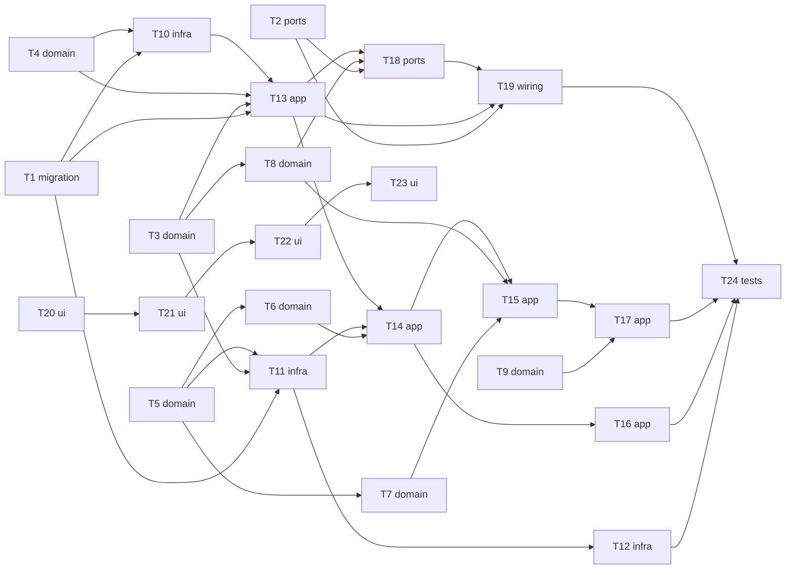

# Epic — remote-boards-collector

> **Spec:** [spec.md](../spec.md) · **Design:** [sad.md](../sad.md) · **Data model:** [data-model.md](../data-model.md) · **API:** [openapi.yaml](../contracts/openapi.yaml) · **Screens:** [screens.md](../screens.md) · **ADRs:** [adr/](../adr/)

## Goal

Ship the collector: every enabled source read on its own allowed schedule, the same role from several boards merged into one posting, postings closed only on a reliable signal, and a broken source never silent — visible on the main-screen marker and the source-health screen (spec §2).

## Scope

- **In:** server module `apps/server/src/modules/collector/` (domain, infra incl. four source adapters, app, ports), the ADR-0007 access guard in `core/`, the drizzle migration `0001`, the web data layer + shared primitives + SCR-01 / SCR-02, end-to-end collection tests.
- **Out (spec §3):** browsing postings (step 3), location eligibility (step 5), LinkedIn / ATS / Polish boards, editing settings in the app, access from other devices, export.

## Task map

Waves (longest dependency path): **0:** T1, T2, T3, T4, T5, T9, T20 · **1:** T6, T7, T8, T10, T11, T21 · **2:** T12, T13, T22 · **3:** T14, T18, T23 · **4:** T15, T16, T19 · **5:** T17 · **6:** T24.

## Tasks

See [tracker.md](./tracker.md) for status. Machine contract: [tasks.json](../tasks.json).

| # | Task | Layer | Blocked by | DoD (short) |
|---|---|---|---|---|
| T1 | [Promote the collector schema: Drizzle schema.ts + generated migration 0001](./t01-collector-schema.md) | migration | — | `0001_*.sql` + snapshot generated by drizzle-kit and committed |
| T2 | [Enforce loopback-only, same-origin access in core and map Fastify 415](./t02-core-access-guard.md) | ports | — | access integration tests pass (403 host, 403 cross-site, 415, allowed same-origin) |
| T3 | [Model the source registry, due-ness and rolling-window rate limits](./t03-domain-source-schedule.md) | domain | — | unit tests for due-ness, next-due and every window pass with a fake clock |
| T4 | [Define the settings schema, built-in defaults and per-source state](./t04-domain-settings.md) | domain | — | unit tests for parse, defaults and source state pass |
| T5 | [Define the adapter contract and normalize listings (plain text, location as stated, category filter)](./t05-domain-listing-normalize.md) | domain | — | unit tests for plain text, location and category filter pass |
| T6 | [Implement the match key and the merge decision](./t06-domain-merge.md) | domain | T5 | merge unit tests pass for every AC-04 / AC-05 example and the tie-break |
| T7 | [Implement listing closures per source verdict and the 30% hold-back](./t07-domain-closures.md) | domain | T5 | closure and hold-back unit tests pass for every source shape |
| T8 | [Implement the source health flags, overdue and the marker rule](./t08-domain-health-flags.md) | domain | T3 | health-flag unit tests pass at and around every threshold |
| T9 | [Implement the retention clock and the once-a-day clean-up rule](./t09-domain-retention.md) | domain | — | retention and clean-up-due unit tests pass |
| T10 | [Read, create and fall back on the settings file, persisting the last valid copy](./t10-infra-settings-file.md) | infra | T1, T4 | settings integration tests pass for missing, unreadable (with and without a valid copy) and valid files |
| T11 | [Build the ledgered HTTP client and the Jobicy adapter](./t11-infra-http-and-jobicy.md) | infra | T1, T3, T5 | http integration tests pass against the fake server |
| T12 | [Verify spec §8 Q1/Q3, then build the Remotive, Himalayas and We Work Remotely adapters](./t12-infra-remaining-adapters.md) | infra | T11 | Remotive and Himalayas adapter tests pass on recorded fixtures |
| T13 | [Run the one-minute scheduler, start-up recovery and run opening](./t13-app-scheduler-and-run-start.md) | app | T1, T3, T4, T10 | run-start integration tests pass for recovery, catch-up, one-run and due filtering |
| T14 | [Ingest each due source and merge its listings in one transaction](./t14-app-ingest-and-merge.md) | app | T6, T11, T13 | ingest integration tests pass for new, merged, failed, partial and interrupted cases |
| T15 | [Finalize a run: apply closures, hold-back, flags and per-source counts](./t15-app-finalize.md) | app | T7, T8, T14 | finalize integration tests pass for closures, hold-back, flags and counts |
| T16 | [Fill the last 30 days for a never-read source within its leftover budget](./t16-app-first-fill.md) | app | T14 | first-fill integration tests pass for complete, continuing and refused-page cases |
| T17 | [Run the daily clean-up through the MarkedPostings port](./t17-app-daily-cleanup.md) | app | T9, T15 | clean-up integration tests pass with the marks fake |
| T18 | [Serve getCollectorProblems and getSourceHealth](./t18-ports-health-routes.md) | ports | T2, T8, T13 | both routes return contract-valid bodies in tests |
| T19 | [Serve collectNow and wire the collector plugin, scheduler and built SPA](./t19-ports-collect-now-and-wiring.md) | wiring | T2, T13, T18 | collectNow route tests pass for 202 / 200 / 409 |
| T20 | [Set up query + router, the shared primitives and SCR-01 with the problem marker](./t20-ui-foundation-and-main-screen.md) | ui | — | SCR-01 state tests pass |
| T21 | [Build SourceCard in every per-source state](./t21-ui-source-card.md) | ui | T20 | SourceCard tests pass for all eight states |
| T22 | [Build the SCR-02 page states and settings / interrupted-run banners](./t22-ui-source-health-page.md) | ui | T21 | SCR-02 page-state tests pass |
| T23 | [Build CollectNowAction and RunProgress with 2 s polling](./t23-ui-collect-now-and-progress.md) | ui | T22 | collect-now and progress tests pass, polling stops when the run ends |
| T24 | [Prove limits, interruption and start-up end to end against a fake source server](./t24-tests-collection-integration.md) | tests | T12, T16, T17, T19 | end-to-end tests pass in CI without network access |

## Risks / Hard rules

- **Never above a source's published limit** — every read is ledgered before it is sent (spec §6 Source request rate, ADR-0003). T3, T11, T13, T14, T16, T24.
- **A failed or partial fetch never closes a posting** (CONTEXT invariant, AC-08). T7, T15.
- **Owner marks survive merge, close, reopen and clean-up** — the collector never stores marks; it asks the `MarkedPostings` port (ADR-0006). T6, T17.
- **Untrusted source content stays plain text** — never rendered as markup (sad §8). T5, T21.
- **Loopback only, same-origin only** (ADR-0007). T2.
- **The app answers ≤ 5 s during catch-up / first fill** (spec §6). T14, T19.
- **Spec §8 Q1/Q3** — verify before building T12's adapters (deferred to T12 on 2026-10-02).
- **Layout note:** `infra/` queries are split per aggregate under `infra/repo/` (state, sources, runs, postings, health) instead of one `repo.ts` (sad §5 tree) — still the only place SQL lives; keeps lanes parallel.
- **Size note:** 24 tasks for an M feature (guide 8–20): the `web-frontend` surface adds four `ui` tasks (size-matrix: surface count scales breadth).
