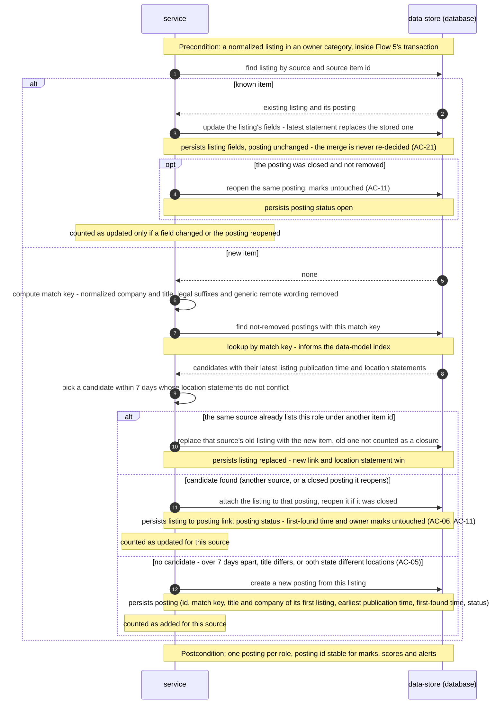

<!-- Self-contained task: inlined slices carry provenance signatures; the source always wins.
To the executing agent: work from what is inlined here. If a slice is insufficient, ambiguous, or
contradicts the code, open the named file and follow it. Do not invent the missing part. -->

# T6 — Implement the match key and the merge decision

## Place in the sequence

- **Blocked by:** T5 — Define the adapter contract and normalize listings (plain text, location as stated, category filter) · **Blocks:** T14 — Ingest each due source and merge its listings in one transaction · **Wave:** 1 (after T5).
- **Lane:** own lane.

## Why (user story)

> **As an** owner
> **I want** a role that several sources advertise to appear as one posting that names and links every source
> **So that** I review it, mark it and apply to it once
>
> — `spec.md §4, US-02, verbatim` · full text: [spec.md](../spec.md)

> **As an** owner
> **I want** postings that are really closed to be hidden, and old untouched ones to be cleared away
> **So that** I only spend time on roles I can still apply to, without losing my own marks
>
> — `spec.md §4, US-03, verbatim` · full text: [spec.md](../spec.md)

Turns listings from several boards into one posting per role, with a stable posting id.

## Inlined context

> **Chosen:** Option 1. A domain function computes a match key (company and title normalized per AC-04: case, punctuation, generic "remote" wording, legal suffixes) and attaches a new listing to an existing, not-removed posting with the same key whose latest listing publication time is within 7 days of the new listing's — unless both state a location restriction and the statements differ (AC-05), and reopening it if closed (AC-11) — or creates a new posting. Listing identity is (source, source item id), so a re-seen item updates its own row; when the same source re-posts the role as a new item, the new item replaces that source's old one. The posting shows the title and company of its first listing and the earliest publication time (spec AC-04 note, clarified 2026-10-02). Option 2 keeps the stable id but makes per-listing state awkward — closure per source (AC-07, AC-09), the per-source item lookup on every fetch, and per-source counts in source health would all query inside JSON. (Merging at read time was not considered: AC-21 forbids re-deciding merges.)
>
> — `adr/0005-store-postings-and-listings-separately-and-merge-at-collection-time.md §Decision outcome, Chosen, verbatim` · full text: [0005-store-postings-and-listings-separately-and-merge-at-collection-time.md](../adr/0005-store-postings-and-listings-separately-and-merge-at-collection-time.md)

— `sad.md §6, Flow 6 sequence, verbatim` · full text: [sad.md](../sad.md)

> - **For `tasks` / domain tests:** when two not-removed postings both qualify as merge candidates (Flow 6), the tie-break rule is not drawn - fix it in the merge domain tests.
>
> — `sad.md §6 Notes, merge tie-break, verbatim` · full text: [sad.md](../sad.md)

> **Hard rule:**
>
> | Risk / debt | Severity | Mitigation | Owner |
> |---|---|---|---|
> | A wrong merge is permanent — there is no un-merge in v1 (ADR-0005) | Medium | Merge only on exact equality of the normalized key within 7 days; unit tests built from AC-04 / AC-05 examples; add un-merge if spot checks find false merges | Tech Lead |
>
> — `sad.md §11, permanent wrong merge, verbatim` · full text: [sad.md](../sad.md)

**Fallback:** insufficient or contradicted by the code → read the named file in full
([spec.md](../spec.md) · [sad.md](../sad.md) · [data-model.md](../data-model.md) ·
[openapi.yaml](../contracts/openapi.yaml) · [screens.md](../screens.md) · [adr/](../adr/)) and follow it. Do not guess.

## Data delta

No DB changes.

## API contract

Internal — no API surface.

## Acceptance criteria

### AC-04 — happy

> **Given** a posting from one source is already in the collection
> **When** another source — or the same source re-posting it as a new item — offers a listing from the same company with the same role title, with publication times no more than 7 days apart
> **Then** the owner sees one posting that names and links both sources (or keeps the one source once)
>
> > Matching: titles are compared ignoring letter case, punctuation and generic "remote" wording; company names the same way and also ignoring legal suffixes (Inc, Ltd, LLC, GmbH, Sp. z o.o. and similar). Generic "remote" wording is exactly: remote, fully remote, 100% remote, remote-first, work from home, WFH, anywhere — standalone, in parentheses, or after a dash or comma; region names (Worldwide, EU, US, Poland, LATAM and the like) are never removed, so "Remote – EU" and "Remote – US" stay different. The 7 days compare the new listing's publication time with the latest publication time among the posting's listings, as the sources state them. A merged posting shows the title and company of its first listing and the earliest publication time; every listing keeps its own. When the same source re-posts the role as a new item, the new item replaces the old one at that source (its link and location restriction win) and the old item is not counted as a closure.
>
> — `spec.md §5, AC-04, verbatim` · full text: [spec.md](../spec.md)

### AC-05 — domain invariant

> **Given** the same company advertises two roles whose titles differ in anything beyond letter case, punctuation and generic "remote" wording — for example different regions or teams — or whose listings both state a location restriction and the two statements differ (an unknown restriction never blocks a merge)
> **When** both listings are collected
> **Then** they stay two separate postings, each with its own location restriction and link
>
> — `spec.md §5, AC-05, verbatim` · full text: [spec.md](../spec.md)

### AC-06 — cross-context

> **Given** the owner has marked a posting as skipped
> **When** a listing from another source is merged into that posting
> **Then** the posting stays marked skipped and its first-found time does not change — it is not treated as a newly found posting
>
> — `spec.md §5, AC-06, verbatim` · full text: [spec.md](../spec.md)

### AC-11 — happy

> **Given** a closed posting has not been removed yet
> **When** one of its sources offers the same item again, or any source offers a listing that AC-04 would merge into it (publication time within 7 days of the latest publication time among the posting's listings)
> **Then** the same posting reopens with the owner's earlier marks, instead of a new unmarked copy appearing
>
> — `spec.md §5, AC-11, verbatim` · full text: [spec.md](../spec.md)

## Checklist

- [ ] `matchKey(company, title)` — case, punctuation, the exact generic-remote word list, legal suffixes; region names kept — `domain/merge.ts`
- [ ] `decideMerge(listing, knownListing?, candidates)` → `update-known | replace-same-source | attach | create`, with `reopen` when the target posting is closed — `domain/merge.ts`
- [ ] Same-source re-post is checked before the cross-source merge (Flow 6) — `domain/merge.ts`
- [ ] Tie-break (decided here, sad §6 Notes): when two not-removed postings qualify, take the one with the most recent latest-listing publication time, then the oldest posting id — `domain/merge.ts`
- [ ] Posting display fields: title + company of the first listing, earliest publication time — `domain/merge.ts`
- [ ] Unit tests from every AC-04 / AC-05 example — `domain/merge.test.ts`

## Edge cases

| Case | Behaviour |
|---|---|
| "Remote – EU" vs "Remote – US" | Two postings |
| "Acme Sp. z o.o." vs "ACME" | Same company |
| Publication times 8 days apart | New posting |
| Both state different location restrictions | Two postings |
| One states a restriction, the other is unknown | Merged |
| Same source, new item id, same role | Replaces the old item; not a closure |
| Matches a closed, not-removed posting | Same posting reopens, marks kept |
| Two candidates qualify | Tie-break above |

## Definition of Done

- [ ] merge unit tests pass for every AC-04 / AC-05 example and the tie-break
- [ ] every Hard Rule inlined above still holds
- [ ] lint + vet clean (`pnpm lint`, `tsc`)
