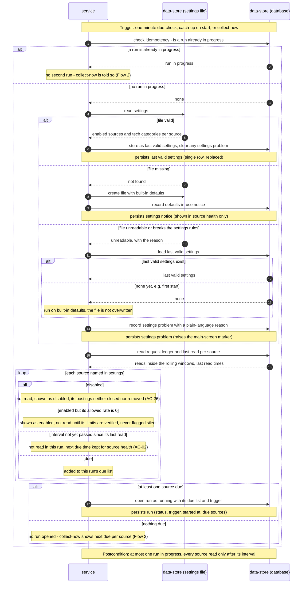

<!-- Self-contained task: inlined slices carry provenance signatures; the source always wins.
To the executing agent: work from what is inlined here. If a slice is insufficient, ambiguous, or
contradicts the code, open the named file and follow it. Do not invent the missing part. -->

# T10 — Read, create and fall back on the settings file, persisting the last valid copy

## Place in the sequence

- **Blocked by:** T1 — Promote the collector schema: Drizzle schema.ts + generated migration 0001, T4 — Define the settings schema, built-in defaults and per-source state · **Blocks:** T13 — Run the one-minute scheduler, start-up recovery and run opening · **Wave:** 1 (after T1, T4).
- **Lane:** own lane.

## Why (user story)

> **As an** owner
> **I want** to choose, in a settings file on my machine, which sources are enabled and which of their job categories count as tech
> **So that** the collection holds only roles I could want and I can adjust when a board changes its categories
>
> > **Visitor:** no user story — a visitor has no goal this feature serves; the role exists only to be kept out, covered by AC-17 and §6.1.
>
> — `spec.md §4, US-08, verbatim` · full text: [spec.md](../spec.md)

Turns the owner's local settings file into the settings every run uses, whatever state the file is in.

## Inlined context

— `sad.md §6, Flow 4 sequence (settings part), verbatim` · full text: [sad.md](../sad.md)

> **Settings file.** `apps/server/data/settings.json` (beside the database, gitignored): enabled flag per source and tech categories per source. Re-read at the start of every run (no file watcher), validated against a schema; a valid copy is stored in the database as the last valid settings, so an unreadable file — even after a restart — keeps collection on the last valid copy (AC-27). A missing file is created with built-in defaults (every source except We Work Remotely enabled).
>
> — `sad.md §5, Settings file, verbatim` · full text: [sad.md](../sad.md)

**Fallback:** insufficient or contradicted by the code → read the named file in full
([spec.md](../spec.md) · [sad.md](../sad.md) · [data-model.md](../data-model.md) ·
[openapi.yaml](../contracts/openapi.yaml) · [screens.md](../screens.md) · [adr/](../adr/)) and follow it. Do not guess.

## Data delta

**`collector_state`**

| Column | Type | Constraints | Notes |
|---|---|---|---|
| `id` | integer | PK | Always `1` — written by the app, not enforced by a `CHECK` (convention above). |
| `last_valid_settings` | text | | JSON copy of the last valid settings file; collection falls back to it (AC-27). |
| `last_valid_settings_at` | integer | | |
| `settings_notice` | text | | `defaults_in_use` — source health only, no marker. |
| `settings_problem` | text | | Plain-language reason the file is unreadable; raises the main-screen marker. Upserted on each due-check while the file stays broken (Flow 4). |
| `settings_problem_at` | integer | | |
| `last_cleanup_on` | text | | `YYYY-MM-DD` in the owner's time zone — idempotency of the daily clean-up (Flow 9). |

— `data-model.md §Entities, table collector_state, verbatim` · full text: [data-model.md](../data-model.md)

## API contract

Internal — no API surface.

## Acceptance criteria

### AC-27 — error

> **Given** the owner's settings file is missing, or cannot be read
> **When** the app starts or a collection run starts
> **Then** a missing file is created with built-in defaults (every source except We Work Remotely enabled, a default tech category list per source) and source health says defaults are in use; an unreadable file leaves collection running on the last valid settings and source health names the problem in plain words; a file that can be read but names an unknown source or otherwise breaks the settings rules counts as unreadable as a whole; an unreadable file with no last valid settings yet (e.g. on the first start) runs on the built-in defaults and is not overwritten; a source the owner enables while its allowed rate is 0 (We Work Remotely until §8 Q1) shows as "enabled, not read until its limits are verified" and is never flagged as silent; a valid edit takes effect from the next run without restarting the app
>
> — `spec.md §5, AC-27, verbatim` · full text: [spec.md](../spec.md)

## Checklist

- [ ] Settings path beside the database file (`apps/server/data/settings.json`), gitignored — `infra/settings.ts`
- [ ] `loadSettings()` → valid / missing (create with defaults, record `defaults_in_use`) / unreadable (last valid copy or defaults, record problem, never overwrite) — `infra/settings.ts`
- [ ] `collector_state` single row (id 1): upsert last valid settings, notice, problem — `infra/repo/state.ts`
- [ ] Integration tests with a temp dir + temp DB — `apps/server/test/collector-settings.integration.test.ts`

## Edge cases

| Case | Behaviour |
|---|---|
| File missing | Created with defaults; notice `defaults_in_use`, no marker |
| File unreadable, last valid copy exists | Runs on the copy; problem recorded |
| File unreadable on first start | Runs on built-in defaults; file not overwritten |
| Valid edit | Takes effect on the next run, problem cleared |

## Definition of Done

- [ ] settings integration tests pass for missing, unreadable (with and without a valid copy) and valid files
- [ ] every Hard Rule inlined above still holds
- [ ] lint + vet clean (`pnpm lint`, `tsc`)
