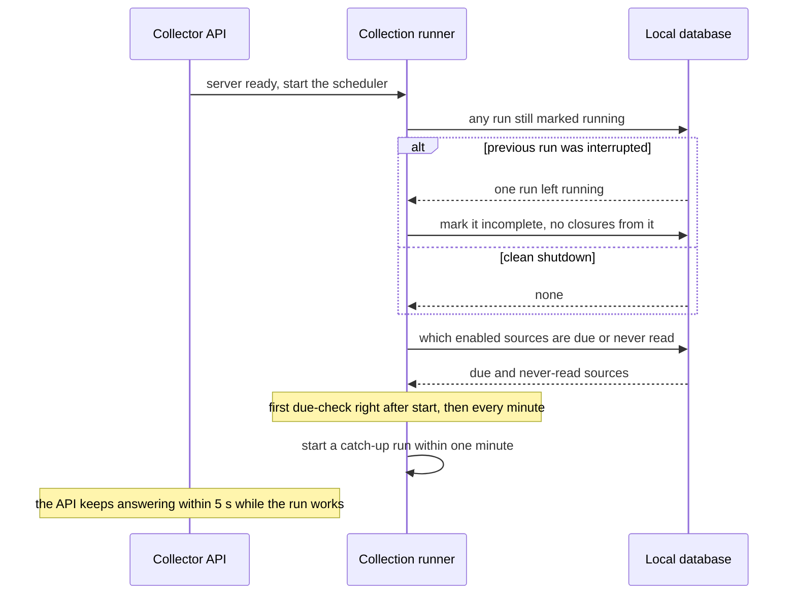
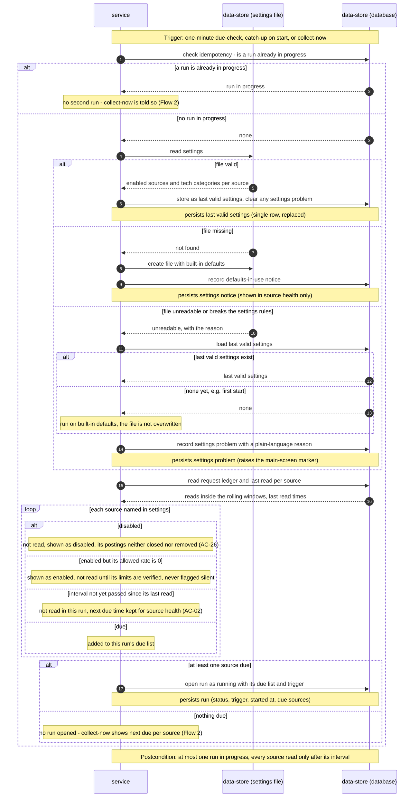

<!-- Self-contained task: inlined slices carry provenance signatures; the source always wins.
To the executing agent: work from what is inlined here. If a slice is insufficient, ambiguous, or
contradicts the code, open the named file and follow it. Do not invent the missing part. -->

# T13 — Run the one-minute scheduler, start-up recovery and run opening

## Place in the sequence

- **Blocked by:** T1 — Promote the collector schema: Drizzle schema.ts + generated migration 0001, T3 — Model the source registry, due-ness and rolling-window rate limits, T4 — Define the settings schema, built-in defaults and per-source state, T10 — Read, create and fall back on the settings file, persisting the last valid copy · **Blocks:** T14 — Ingest each due source and merge its listings in one transaction, T18 — Serve getCollectorProblems and getSourceHealth, T19 — Serve collectNow and wire the collector plugin, scheduler and built SPA · **Wave:** 2 (after T1, T3, T4, T10).
- **Lane:** shares `apps/server/src/modules/collector/infra/repo/sources.ts` with T11; shares `apps/server/src/modules/collector/infra/repo/runs.ts` with T14; shares `apps/server/src/modules/collector/infra/repo/runs.ts` with T15; shares `apps/server/src/modules/collector/infra/repo/sources.ts` with T16 — serialized.

## Why (user story)

> **As an** owner
> **I want** new remote tech postings collected from every enabled source on that source's own schedule
> **So that** I never have to open the boards to see what is new
>
> — `spec.md §4, US-01, verbatim` · full text: [spec.md](../spec.md)

> **As an** owner
> **I want** to start a collection myself
> **So that** I don't wait for the schedule after fixing a problem or before a job-hunting session
>
> — `spec.md §4, US-05, verbatim` · full text: [spec.md](../spec.md)

> **As an** owner
> **I want** collection to catch up as soon as the app starts again, and the very first start to fill the last 30 days
> **So that** a night with the laptop closed doesn't leave me looking at yesterday's list
>
> — `spec.md §4, US-06, verbatim` · full text: [spec.md](../spec.md)

> **As an** owner
> **I want** to choose, in a settings file on my machine, which sources are enabled and which of their job categories count as tech
> **So that** the collection holds only roles I could want and I can adjust when a board changes its categories
>
> > **Visitor:** no user story — a visitor has no goal this feature serves; the role exists only to be kept out, covered by AC-17 and §6.1.
>
> — `spec.md §4, US-08, verbatim` · full text: [spec.md](../spec.md)

Starts every collection run — scheduled, catch-up or collect-now — through one due-check.

## Inlined context

— `sad.md §6, Flow 3 sequence, verbatim` · full text: [sad.md](../sad.md)

— `sad.md §6, Flow 4 sequence, verbatim` · full text: [sad.md](../sad.md)

> The collector follows the repo's feature-module layering (project ADR `docs/adr/0002-feature-modules-mirror-roadmap.md`): `domain` holds pure rules with no I/O — match key and merge, closure decisions (AC-07/08/09/14), due-ness and rate windows, health flags (AC-13/14/25), retention (AC-10); `app` holds the use cases that orchestrate a run; `infra` holds the Drizzle schema and queries, the source adapters (one file per source, per the map) and the settings-file reader; `ports` holds the Fastify routes for source health and collect-now. The scheduler is an `app`-layer loop started by the module's plugin and stopped on server close. Rules stay in `domain` so every AC that is a rule (merging, closing, flags, limits) is unit-testable with a fake clock and recorded source fixtures, without network or database.
>
> — `sad.md §5, building block, verbatim` · full text: [sad.md](../sad.md)

**Fallback:** insufficient or contradicted by the code → read the named file in full
([spec.md](../spec.md) · [sad.md](../sad.md) · [data-model.md](../data-model.md) ·
[openapi.yaml](../contracts/openapi.yaml) · [screens.md](../screens.md) · [adr/](../adr/)) and follow it. Do not guess.

## Data delta

**`collector_runs`**

| Column | Type | Constraints | Notes |
|---|---|---|---|
| `id` | text | PK, UUIDv7 | Time-ordered, so id order = start order. |
| `trigger` | text | NOT NULL | `schedule` · `catch_up` · `collect_now`. |
| `status` | text | NOT NULL | `running` · `finished` · `incomplete` (AC-20). |
| `started_at` | integer | NOT NULL | |
| `finished_at` | integer | | |

— `data-model.md §Entities, table collector_runs, verbatim` · full text: [data-model.md](../data-model.md)

**`collector_app_sessions`**

| Column | Type | Constraints | Notes |
|---|---|---|---|
| `id` | text | PK, UUIDv7 | One row per server start. |
| `started_at` | integer | NOT NULL | |
| `last_seen_at` | integer | NOT NULL | Heartbeat written by the one-minute due-check. Overdue (AC-13) counts only time inside sessions, so a sleeping laptop is never "overdue". |

— `data-model.md §Entities, table collector_app_sessions, verbatim` · full text: [data-model.md](../data-model.md)

**`collector_source_disabled_periods`**

| Column | Type | Constraints | Notes |
|---|---|---|---|
| `id` | text | PK, UUIDv7 | |
| `source_id` | text | NOT NULL, FK → `collector_sources(id)` ON DELETE CASCADE | |
| `disabled_from` | integer | NOT NULL | When a settings read first saw the source disabled (Flow 4). |
| `disabled_until` | integer | | NULL while still disabled. |

— `data-model.md §Entities, table collector_source_disabled_periods, verbatim` · full text: [data-model.md](../data-model.md)

## API contract

Internal — no API surface.

## Acceptance criteria

### AC-02 — domain invariant

> **Given** a source's interval (§6) has not yet passed since its last read
> **When** any collection run starts — scheduled, catch-up or collect-now
> **Then** that source is not read again in this run, and its source health shows when it is next due
>
> — `spec.md §5, AC-02, verbatim` · full text: [spec.md](../spec.md)

### AC-16 — domain invariant

> **Given** a collection run is already in progress
> **When** the owner asks to collect now
> **Then** no second run starts and the owner is told a run is already in progress
>
> — `spec.md §5, AC-16, verbatim` · full text: [spec.md](../spec.md)

### AC-18 — happy

> **Given** an enabled source's own last successful read is older than its interval
> **When** the app starts
> **Then** a catch-up run for every such source begins within one minute of the start
>
> — `spec.md §5, AC-18, verbatim` · full text: [spec.md](../spec.md)

### AC-20 — error

> **Given** a collection run was interrupted — the laptop slept or the app stopped mid-run
> **When** the app starts again
> **Then** the interrupted run is recorded as incomplete, nothing is closed on its basis, and new runs are not blocked by it; listings it already collected are kept, every read it made counts toward that source's allowed rate, a source whose fetch finished before the interruption counts that read as its own last success, and a source whose fetch did not finish does not
>
> — `spec.md §5, AC-20, verbatim` · full text: [spec.md](../spec.md)

### AC-26 — happy

> **Given** a source is disabled in the owner's settings file
> **When** any collection run starts — scheduled, catch-up or collect-now
> **Then** that source is not read, its existing postings are neither closed nor removed because of it (the AC-10 clock is paused while all of a posting's sources are disabled), its listings no longer count toward closing (AC-07), and source health shows it as disabled
>
> — `spec.md §5, AC-26, verbatim` · full text: [spec.md](../spec.md)

### AC-27 — error

> **Given** the owner's settings file is missing, or cannot be read
> **When** the app starts or a collection run starts
> **Then** a missing file is created with built-in defaults (every source except We Work Remotely enabled, a default tech category list per source) and source health says defaults are in use; an unreadable file leaves collection running on the last valid settings and source health names the problem in plain words; a file that can be read but names an unknown source or otherwise breaks the settings rules counts as unreadable as a whole; an unreadable file with no last valid settings yet (e.g. on the first start) runs on the built-in defaults and is not overwritten; a source the owner enables while its allowed rate is 0 (We Work Remotely until §8 Q1) shows as "enabled, not read until its limits are verified" and is never flagged as silent; a valid edit takes effect from the next run without restarting the app
>
> — `spec.md §5, AC-27, verbatim` · full text: [spec.md](../spec.md)

## Checklist

- [ ] Upsert the four source rows from the registry at start — `infra/repo/sources.ts`
- [ ] `startUp()`: mark any `running` run `incomplete`; open an app session — `app/startup.ts`, `infra/repo/runs.ts`
- [ ] Scheduler: first due-check right after start, then every 60 s; heartbeat `last_seen_at`; stop on server close — `app/scheduler.ts`
- [ ] `openRun(trigger)`: run in progress → `already_running`; read settings (T10); open/close disabled periods on state changes; due list via T3; insert run + `pending` run-source rows in one transaction; unique-index conflict → `already_running` — `app/open-run.ts`
- [ ] Tests with injected clock + temp DB — `apps/server/test/collector-run-start.integration.test.ts`

## Edge cases

| Case | Behaviour |
|---|---|
| Previous run left `running` | Marked `incomplete`; nothing closed from it |
| Two triggers at the same instant | One run; the other gets `already_running` |
| No source due | No run opened; next due per source returned |
| Source disabled since last check | Disabled period opened; not read |
| Settings unreadable | Run on last valid settings (T10) |

## Definition of Done

- [ ] run-start integration tests pass for recovery, catch-up, one-run and due filtering
- [ ] scheduler stops cleanly on server close (test)
- [ ] every Hard Rule inlined above still holds
- [ ] lint + vet clean (`pnpm lint`, `tsc`)
