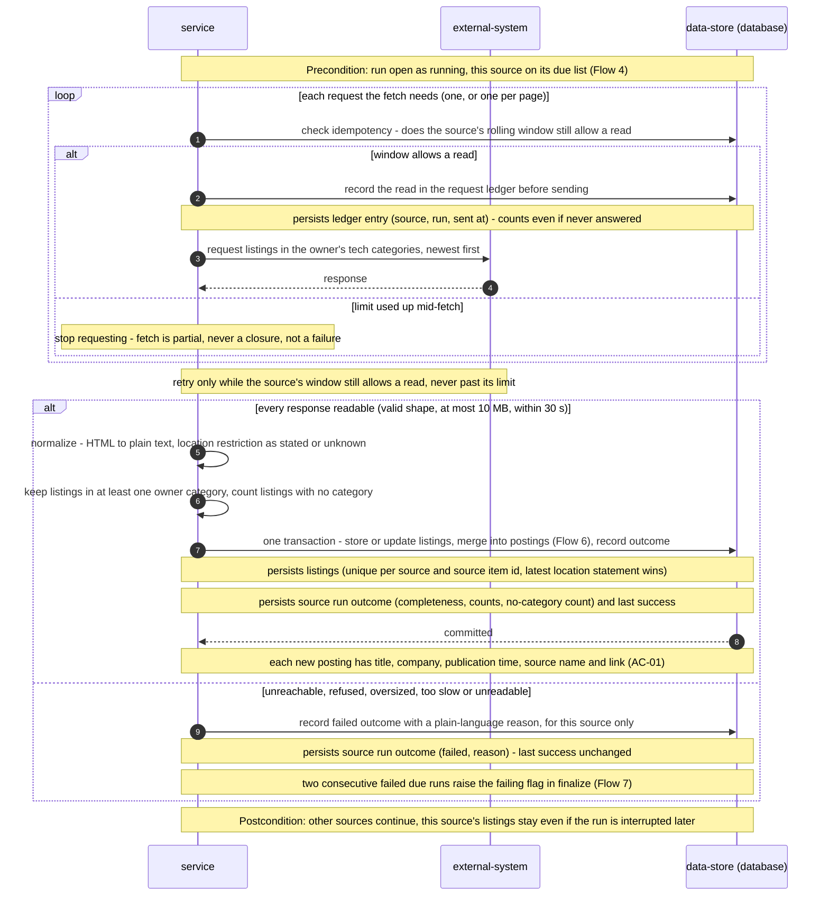

<!-- Self-contained task: inlined slices carry provenance signatures; the source always wins.
To the executing agent: work from what is inlined here. If a slice is insufficient, ambiguous, or
contradicts the code, open the named file and follow it. Do not invent the missing part. -->

# T14 — Ingest each due source and merge its listings in one transaction

## Place in the sequence

- **Blocked by:** T6 — Implement the match key and the merge decision, T11 — Build the ledgered HTTP client and the Jobicy adapter, T13 — Run the one-minute scheduler, start-up recovery and run opening · **Blocks:** T15 — Finalize a run: apply closures, hold-back, flags and per-source counts, T16 — Fill the last 30 days for a never-read source within its leftover budget · **Wave:** 3 (after T6, T11, T13).
- **Lane:** shares `apps/server/src/modules/collector/infra/repo/runs.ts` with T13; shares `apps/server/src/modules/collector/infra/repo/postings.ts` with T15; shares `apps/server/src/modules/collector/infra/repo/postings.ts` with T17 — serialized.

## Why (user story)

> **As an** owner
> **I want** new remote tech postings collected from every enabled source on that source's own schedule
> **So that** I never have to open the boards to see what is new
>
> — `spec.md §4, US-01, verbatim` · full text: [spec.md](../spec.md)

> **As an** owner
> **I want** a role that several sources advertise to appear as one posting that names and links every source
> **So that** I review it, mark it and apply to it once
>
> — `spec.md §4, US-02, verbatim` · full text: [spec.md](../spec.md)

> **As an** owner
> **I want** postings that are really closed to be hidden, and old untouched ones to be cleared away
> **So that** I only spend time on roles I can still apply to, without losing my own marks
>
> — `spec.md §4, US-03, verbatim` · full text: [spec.md](../spec.md)

> **As an** owner
> **I want** each source's location restriction kept exactly as the source stated it, with "unknown" when it states nothing
> **So that** the later remote filter never mistakes a missing restriction for "work from anywhere"
>
> — `spec.md §4, US-07, verbatim` · full text: [spec.md](../spec.md)

> **As an** owner
> **I want** to choose, in a settings file on my machine, which sources are enabled and which of their job categories count as tech
> **So that** the collection holds only roles I could want and I can adjust when a board changes its categories
>
> > **Visitor:** no user story — a visitor has no goal this feature serves; the role exists only to be kept out, covered by AC-17 and §6.1.
>
> — `spec.md §4, US-08, verbatim` · full text: [spec.md](../spec.md)

Turns each due source's fetch into stored listings and merged postings.

## Inlined context

— `sad.md §6, Flow 5 sequence, verbatim` · full text: [sad.md](../sad.md)

> **Run phases.** A collection run has two phases. *Ingest* — per due source, in turn: record the read in the ledger, fetch, then in one transaction store or update its listings, merge them into postings, record the source's outcome and, when the fetch finished, its last success; this is kept even if the run is later interrupted (AC-20). *Finalize* — after every due source is done: apply the listing closures each source's verdict allows (ADR-0004), hold back a source's closures when they exceed 30% of its open postings (AC-14), close postings whose every listing is closed (AC-07, AC-09), compute health flags (AC-13, AC-25) and mark the run finished. An interrupted run never reaches finalize, so nothing is closed on its basis.
>
> — `sad.md §6, Run phases, verbatim` · full text: [sad.md](../sad.md)

> **Hard rule:**
>
> | Concept | Convention | Where defined |
> |---|---|---|
> | Responsiveness during collection | Normalization (HTML-to-text, match keys) runs in chunks that yield to the event loop; each source's ingest is one short transaction — keeps the app answering ≤ 5 s during catch-up and the first fill (spec §6) | here |
>
> — `sad.md §8, Responsiveness during collection, verbatim` · full text: [sad.md](../sad.md)

**Fallback:** insufficient or contradicted by the code → read the named file in full
([spec.md](../spec.md) · [sad.md](../sad.md) · [data-model.md](../data-model.md) ·
[openapi.yaml](../contracts/openapi.yaml) · [screens.md](../screens.md) · [adr/](../adr/)) and follow it. Do not guess.

## Data delta

**`collector_postings`**

| Column | Type | Constraints | Notes |
|---|---|---|---|
| `id` | text | PK, UUIDv7 | Stable across merge, close and reopen — marks, scores and alerts key on it (ADR-0005, ADR-0006). |
| `match_key` | text | NOT NULL | Normalized company + title, legal suffixes and generic "remote" wording removed (AC-04). |
| `title` · `company` | text | NOT NULL | From the posting's first listing (AC-04 note). |
| `published_at` | integer | | Earliest publication time among its listings; NULL if none states one. |
| `first_found_at` | integer | NOT NULL | Never changes on merge (AC-06). |
| `status` | text | NOT NULL | `open` · `closed`. Held-back closures keep it `open` (AC-14). |
| `closed_at` | integer | | AC-10 clock for closed postings. |
| `last_offered_at` | integer | NOT NULL | Last time an enabled source offered it; AC-10 clock for open postings. |

— `data-model.md §Entities, table collector_postings, verbatim` · full text: [data-model.md](../data-model.md)

**`collector_listings`**

| Column | Type | Constraints | Notes |
|---|---|---|---|
| `id` | text | PK, UUIDv7 | |
| `posting_id` | text | NOT NULL, FK → `collector_postings(id)` ON DELETE CASCADE | Retention removes a posting with its listings. Set once when the listing is attached — a merge is never re-decided (AC-21); a same-source re-post replaces the old listing row with the new item on the same posting (Flow 6). |
| `source_id` | text | NOT NULL, FK → `collector_sources(id)` | |
| `source_item_id` | text | NOT NULL, UNIQUE with `source_id` | The source's own item id. |
| `url` | text | NOT NULL | Link back to the source — attribution required by source terms. |
| `title` · `company` · `description` | text | NOT NULL | Plain text; HTML converted at ingest (sad.md §8, spec §6.1). |
| `location_restriction` | text | | Exactly as the source states it; NULL = unknown, never "anywhere" (AC-21, AC-22). Latest statement replaces the stored one, no history. |
| `categories` | text | NOT NULL | JSON array of the source's categories; AC-24 "matched nothing in 7 days" for sources without a published list. |
| `published_at` | integer | | As the source states it, in UTC; NULL counted separately in freshness. |
| `expires_at` | integer | | Direct close signal (Himalayas `expiryDate`, ADR-0004). |
| `first_collected_at` | integer | NOT NULL | Freshness = `first_collected_at − published_at` (spec §6). |
| `is_first_fill` | integer | NOT NULL | Boolean (Drizzle `mode: "boolean"`); excluded from the freshness sample (AC-19). |
| `last_seen_at` | integer | NOT NULL | |
| `last_seen_run_id` | text | NOT NULL | No FK on purpose: runs are pruned after 60 days, listings live longer. Absent from a complete fetch = `last_seen_run_id` ≠ this run (ADR-0004). |
| `status` | text | NOT NULL | `open` · `closed`. |
| `closed_at` | integer | | |

— `data-model.md §Entities, table collector_listings, verbatim` · full text: [data-model.md](../data-model.md)

**`collector_run_sources`**

| Column | Type | Constraints | Notes |
|---|---|---|---|
| `outcome` | text | NOT NULL | `pending` · `complete` · `capped` · `partial` · `failed` (ADR-0004). `pending` left by an interrupted run. |
| `failure_reason` | text | | Plain-language reason (AC-03). |
| `items_returned` | integer | | Items in the response, not only new ones — zero twice in a row = silent (AC-13). |
| `new_listings` | integer | NOT NULL | AC-25 denominator. |
| `unknown_location_new` | integer | NOT NULL | AC-25 numerator. |
| `no_category` | integer | NOT NULL | Listings not collected for having no category (AC-23). |
| `fetch_finished_at` | integer | | Set when the fetch finished; with `outcome` decides last success after an interruption (AC-20). |

— `data-model.md §Entities, table collector_run_sources, abridged` · full text: [data-model.md](../data-model.md)

## API contract

Internal — no API surface.

## Acceptance criteria

### AC-01 — happy

> **Given** an enabled source is due and offers a new listing in one of the owner's tech categories
> **When** the collection run reads that source
> **Then** a new posting appears in the owner's collection with its title, company, publication time, the source's name and a link back to the source
>
> — `spec.md §5, AC-01, verbatim` · full text: [spec.md](../spec.md)

### AC-03 — error

> **Given** one enabled source cannot be reached, refuses the request, or returns something that cannot be read
> **When** the collection run reads it
> **Then** the other sources are still collected, no posting from the failing source is closed, and that source's health shows the failure with a plain-language reason
>
> — `spec.md §5, AC-03, verbatim` · full text: [spec.md](../spec.md)

### AC-04 — happy

> **Given** a posting from one source is already in the collection
> **When** another source — or the same source re-posting it as a new item — offers a listing from the same company with the same role title, with publication times no more than 7 days apart
> **Then** the owner sees one posting that names and links both sources (or keeps the one source once)
>
> > Matching: titles are compared ignoring letter case, punctuation and generic "remote" wording; company names the same way and also ignoring legal suffixes (Inc, Ltd, LLC, GmbH, Sp. z o.o. and similar). Generic "remote" wording is exactly: remote, fully remote, 100% remote, remote-first, work from home, WFH, anywhere — standalone, in parentheses, or after a dash or comma; region names (Worldwide, EU, US, Poland, LATAM and the like) are never removed, so "Remote – EU" and "Remote – US" stay different. The 7 days compare the new listing's publication time with the latest publication time among the posting's listings, as the sources state them. A merged posting shows the title and company of its first listing and the earliest publication time; every listing keeps its own. When the same source re-posts the role as a new item, the new item replaces the old one at that source (its link and location restriction win) and the old item is not counted as a closure.
>
> — `spec.md §5, AC-04, verbatim` · full text: [spec.md](../spec.md)

### AC-05 — domain invariant

> **Given** the same company advertises two roles whose titles differ in anything beyond letter case, punctuation and generic "remote" wording — for example different regions or teams — or whose listings both state a location restriction and the two statements differ (an unknown restriction never blocks a merge)
> **When** both listings are collected
> **Then** they stay two separate postings, each with its own location restriction and link
>
> — `spec.md §5, AC-05, verbatim` · full text: [spec.md](../spec.md)

### AC-06 — cross-context

> **Given** the owner has marked a posting as skipped
> **When** a listing from another source is merged into that posting
> **Then** the posting stays marked skipped and its first-found time does not change — it is not treated as a newly found posting
>
> — `spec.md §5, AC-06, verbatim` · full text: [spec.md](../spec.md)

### AC-11 — happy

> **Given** a closed posting has not been removed yet
> **When** one of its sources offers the same item again, or any source offers a listing that AC-04 would merge into it (publication time within 7 days of the latest publication time among the posting's listings)
> **Then** the same posting reopens with the owner's earlier marks, instead of a new unmarked copy appearing
>
> — `spec.md §5, AC-11, verbatim` · full text: [spec.md](../spec.md)

### AC-21 — happy

> **Given** a source states where candidates may work from — as countries, regions, time zones or free text
> **When** its listing is collected
> **Then** the posting keeps that statement exactly as the source gave it, named after the source; when the source later changes the listing, the latest statement replaces the stored one (no history is kept), and earlier merges are not re-decided
>
> — `spec.md §5, AC-21, verbatim` · full text: [spec.md](../spec.md)

### AC-22 — domain invariant

> **Given** a source states nothing about where candidates may work from
> **When** its listing is collected
> **Then** the posting's location restriction is recorded as unknown, never as "anywhere"
>
> — `spec.md §5, AC-22, verbatim` · full text: [spec.md](../spec.md)

### AC-23 — happy

> **Given** the owner's tech category list, kept in their settings file, does not include a source's category
> **When** that source offers a listing in it
> **Then** the listing is not collected — a listing in several categories is collected if at least one is on the list; a listing with no category is not collected and is counted in source health; postings already collected under a category the owner later removes stay and age out as usual
>
> — `spec.md §5, AC-23, verbatim` · full text: [spec.md](../spec.md)

## Checklist

- [ ] `ingestSource(run, source)`: fetch via T11/T12 inside the window budget; partial when the limit runs out — `app/ingest.ts`
- [ ] Normalize (T5) in chunks that yield to the event loop — `app/ingest.ts`
- [ ] One transaction: upsert listings, apply T6 decisions (lookups by source item id and match key), update `last_seen_at` / `last_seen_run_id` / `last_offered_at`, record outcome + counts + last success — `infra/repo/postings.ts`, `infra/repo/runs.ts`
- [ ] Failed fetch: record `failed` + reason for this source only — `app/ingest.ts`
- [ ] Integration tests with fixtures + temp DB — `apps/server/test/collector-ingest.integration.test.ts`

## Edge cases

| Case | Behaviour |
|---|---|
| One source fails | Others still collected; nothing closed from it |
| Same role on Jobicy and Remotive | One posting, both links |
| Location changes at the source | Latest statement replaces the stored one; merge not re-decided |
| Run interrupted after source 1 committed | Source 1's listings kept |
| Limit used up after page 2 | `partial`; pages 1–2 stored |

## Definition of Done

- [ ] ingest integration tests pass for new, merged, failed, partial and interrupted cases
- [ ] every Hard Rule inlined above still holds
- [ ] lint + vet clean (`pnpm lint`, `tsc`)
