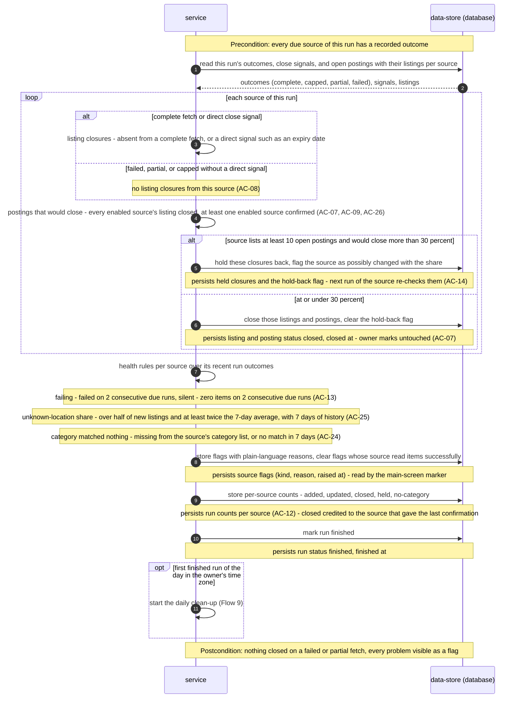

<!-- Self-contained task: inlined slices carry provenance signatures; the source always wins.
To the executing agent: work from what is inlined here. If a slice is insufficient, ambiguous, or
contradicts the code, open the named file and follow it. Do not invent the missing part. -->

# T15 — Finalize a run: apply closures, hold-back, flags and per-source counts

## Place in the sequence

- **Blocked by:** T7 — Implement listing closures per source verdict and the 30% hold-back, T8 — Implement the source health flags, overdue and the marker rule, T14 — Ingest each due source and merge its listings in one transaction · **Blocks:** T17 — Run the daily clean-up through the MarkedPostings port · **Wave:** 4 (after T7, T8, T14).
- **Lane:** shares `apps/server/src/modules/collector/infra/repo/sources.ts` with T11; shares `apps/server/src/modules/collector/infra/repo/runs.ts` with T13; shares `apps/server/src/modules/collector/infra/repo/postings.ts` with T14; shares `apps/server/src/modules/collector/infra/repo/sources.ts` with T16; shares `apps/server/src/modules/collector/infra/repo/postings.ts` with T17 — serialized.

## Why (user story)

> **As an** owner
> **I want** postings that are really closed to be hidden, and old untouched ones to be cleared away
> **So that** I only spend time on roles I can still apply to, without losing my own marks
>
> — `spec.md §4, US-03, verbatim` · full text: [spec.md](../spec.md)

> **As an** owner
> **I want** to see each source's health and have problems flagged in plain words
> **So that** a broken source never silently shrinks what I see
>
> — `spec.md §4, US-04, verbatim` · full text: [spec.md](../spec.md)

> **As an** owner
> **I want** to choose, in a settings file on my machine, which sources are enabled and which of their job categories count as tech
> **So that** the collection holds only roles I could want and I can adjust when a board changes its categories
>
> > **Visitor:** no user story — a visitor has no goal this feature serves; the role exists only to be kept out, covered by AC-17 and §6.1.
>
> — `spec.md §4, US-08, verbatim` · full text: [spec.md](../spec.md)

Turns a finished run into closures, flags and the counts source health shows.

## Inlined context

— `sad.md §6, Flow 7 sequence, verbatim` · full text: [sad.md](../sad.md)

**Fallback:** insufficient or contradicted by the code → read the named file in full
([spec.md](../spec.md) · [sad.md](../sad.md) · [data-model.md](../data-model.md) ·
[openapi.yaml](../contracts/openapi.yaml) · [screens.md](../screens.md) · [adr/](../adr/)) and follow it. Do not guess.

## Data delta

**`collector_source_flags`**

| Column | Type | Constraints | Notes |
|---|---|---|---|
| `source_id` | text | PK (1/2), FK → `collector_sources(id)` ON DELETE CASCADE | |
| `kind` | text | PK (2/2) | `failing` · `silent` · `held_back` · `unknown_location` · `category_unmatched`. Overdue is computed when source health is read and is not stored (Flow 7 decision). |
| `reason` | text | NOT NULL | Plain-language reason, names the number for `held_back` / `unknown_location` (AC-14, AC-25). |
| `raised_at` | integer | NOT NULL | |

— `data-model.md §Entities, table collector_source_flags, verbatim` · full text: [data-model.md](../data-model.md)

**`collector_run_sources`**

| Column | Type | Constraints | Notes |
|---|---|---|---|
| `added` · `updated` · `closed` · `held` | integer | NOT NULL | AC-12 counts per posting outcome, credited per the AC-12 note. |

— `data-model.md §Entities, table collector_run_sources, abridged` · full text: [data-model.md](../data-model.md)

**`collector_postings`**

| Column | Type | Constraints | Notes |
|---|---|---|---|
| `status` | text | NOT NULL | `open` · `closed`. Held-back closures keep it `open` (AC-14). |
| `closed_at` | integer | | AC-10 clock for closed postings. |

— `data-model.md §Entities, table collector_postings, abridged` · full text: [data-model.md](../data-model.md)

## API contract

Internal — no API surface.

## Acceptance criteria

### AC-07 — happy

> **Given** every enabled source listing a posting has confirmed it is no longer open — a disabled source's listing does not count, and at least one enabled source must have confirmed
> **When** the collection run records that
> **Then** the posting is marked closed, hidden from the owner's open postings, and any applied or skipped mark on it is kept
>
> — `spec.md §5, AC-07, verbatim` · full text: [spec.md](../spec.md)

### AC-08 — domain invariant

> **Given** a listing is missing from a source's fetch that failed, was cut short, or only covers that source's most recent items
> **When** the collection run finishes
> **Then** the posting stays open — a failed or partial fetch never closes a posting
>
> — `spec.md §5, AC-08, verbatim` · full text: [spec.md](../spec.md)

### AC-09 — domain invariant

> **Given** a posting is listed by two sources and only one of them confirms it closed
> **When** the collection run records that
> **Then** the posting stays open and keeps the still-open source's link
>
> — `spec.md §5, AC-09, verbatim` · full text: [spec.md](../spec.md)

### AC-12 — happy

> **Given** at least one collection run has finished
> **When** the owner opens source health
> **Then** they see for each source when it last succeeded, how many postings its last run added, updated and closed, and when it is next due
>
> > "Updated" — an updated posting (CONTEXT): known postings whose title, text, location restriction or link changed at this source, that gained a listing from another source, or that reopened.
> > Counts are per posting outcome, credited to the source that caused it: *added* — a new posting created from this source's listing; *updated* — an existing posting changed through this source, including this source's listing merging into it or reopening it; *closed* — postings that actually closed in this run where this source gave the last needed confirmation. Closures held back by AC-14 are shown separately as *held*, not as closed.
>
> — `spec.md §5, AC-12, verbatim` · full text: [spec.md](../spec.md)

### AC-13 — error

> **Given** a source has failed on two consecutive due runs, returned zero items (not merely zero new ones) on two consecutive due runs, or has not been read for more than twice its interval while the app was running
> **When** the owner opens the app
> **Then** that source is flagged with a plain-language reason in source health, the app's main screen shows that a source has a problem, and the flag clears by itself after the source's next successful read that returns items
>
> > Main-screen marker — shown while any flag that can cost the owner postings is up: failing / silent / overdue (AC-13, clears after the next successful read that returns items), closures held back (AC-14, clears when the next run of that source is at or under 30%), unusual unknown-location share (AC-25, clears when that source's next run is back under the threshold), unreadable settings file (AC-27, clears after the next valid read). Shown only in source health, without the marker: a category that matched nothing (AC-24) and defaults in use (AC-27). There is no in-app control to accept held closures in v1.
>
> — `spec.md §5, AC-13, verbatim` · full text: [spec.md](../spec.md)

### AC-14 — domain invariant

> **Given** a source lists at least 10 open postings, and a single run of it would actually close (after AC-09) more than 30% of them
> **When** the collection run finishes
> **Then** those closures are held back (the postings stay open), and the source is flagged as possibly changed so the owner can check it; the next run of that source re-checks them by itself — at or under 30% they close, otherwise they stay held and the flag stays
>
> — `spec.md §5, AC-14, verbatim` · full text: [spec.md](../spec.md)

### AC-24 — error

> **Given** the owner's tech category list names a category that is missing from the source's published category list — or, for a source that publishes none, that matched no listing in the last 7 days
> **When** the source is collected
> **Then** source health tells the owner that this category matched nothing at the source, so they can update the list
>
> — `spec.md §5, AC-24, verbatim` · full text: [spec.md](../spec.md)

### AC-25 — domain invariant

> **Given** the source has at least 7 days of collected history, and in a single run more than half of its new listings have an unknown location restriction, and that share is at least twice the source's average share over the previous 7 days
> **When** the collection run finishes
> **Then** the listings are collected as usual and the source is flagged as possibly changed, with the unusual share named in the reason
>
> — `spec.md §5, AC-25, verbatim` · full text: [spec.md](../spec.md)

## Checklist

- [ ] `finalizeRun(run)`: read outcomes + open postings per source; T7 closures + hold-back; write listing/posting status — `app/finalize.ts`, `infra/repo/postings.ts`
- [ ] T8 flags over recent outcomes; upsert / clear `collector_source_flags` — `infra/repo/sources.ts`
- [ ] Per-source counts; run `finished`; trigger the daily clean-up when due (T17 hook) — `infra/repo/runs.ts`
- [ ] Integration tests — `apps/server/test/collector-finalize.integration.test.ts`

## Edge cases

| Case | Behaviour |
|---|---|
| Run interrupted | Never finalized |
| Held closures | Postings stay open; counted as `held` |
| Source fixed after 2 failures | `failing` cleared on this run |
| Closure confirmed by two sources | Credited to the last confirming source |

## Definition of Done

- [ ] finalize integration tests pass for closures, hold-back, flags and counts
- [ ] every Hard Rule inlined above still holds
- [ ] lint + vet clean (`pnpm lint`, `tsc`)
