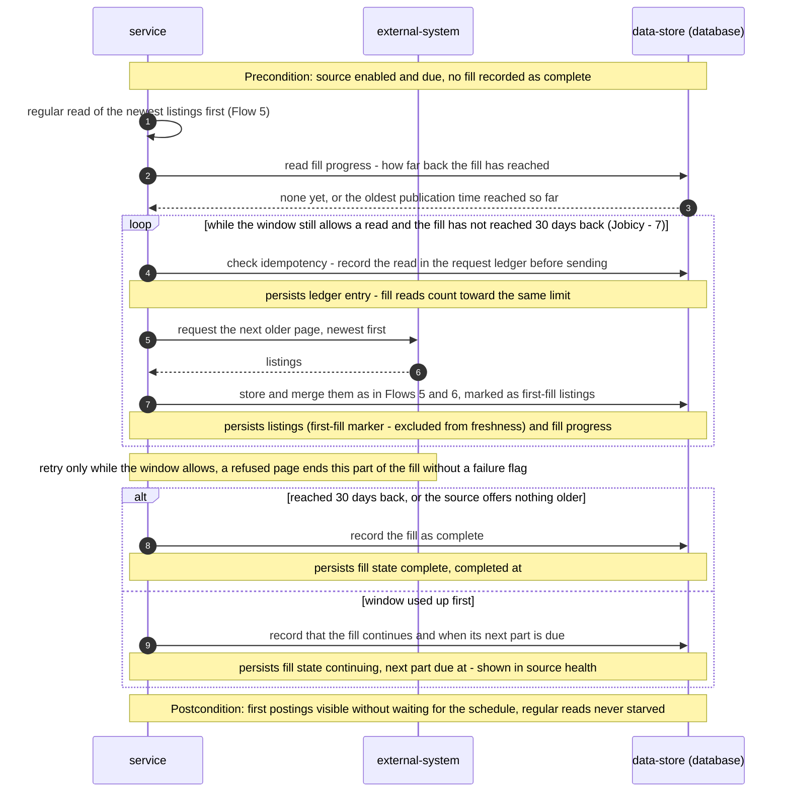

<!-- Self-contained task: inlined slices carry provenance signatures; the source always wins.
To the executing agent: work from what is inlined here. If a slice is insufficient, ambiguous, or
contradicts the code, open the named file and follow it. Do not invent the missing part. -->

# T16 — Fill the last 30 days for a never-read source within its leftover budget

## Place in the sequence

- **Blocked by:** T14 — Ingest each due source and merge its listings in one transaction · **Blocks:** T24 — Prove limits, interruption and start-up end to end against a fake source server · **Wave:** 4 (after T14).
- **Lane:** shares `apps/server/src/modules/collector/infra/repo/sources.ts` with T11; shares `apps/server/src/modules/collector/infra/repo/sources.ts` with T13; shares `apps/server/src/modules/collector/infra/repo/sources.ts` with T15 — serialized.

## Why (user story)

> **As an** owner
> **I want** collection to catch up as soon as the app starts again, and the very first start to fill the last 30 days
> **So that** a night with the laptop closed doesn't leave me looking at yesterday's list
>
> — `spec.md §4, US-06, verbatim` · full text: [spec.md](../spec.md)

Gives the owner a month of postings on the first start without breaking any rate limit.

## Inlined context

— `sad.md §6, Flow 8 sequence, verbatim` · full text: [sad.md](../sad.md)

> **Hard rule:**
>
> | Aspect | Target | Measurement |
> |---|---|---|
> | Collection run duration | ≤ 5 min p95 for a regular run; first fill ≤ 30 min for hourly-allowed sources; slower sources show their first postings within 24 h and their fill continues over later runs inside their allowed rate, as far back as AC-19 allows | run start/finish times recorded per run; first-fill completion time per source |
>
> — `spec.md §6, Collection run duration, verbatim` · full text: [spec.md](../spec.md)

> | Risk / debt | Severity | Mitigation | Owner |
> |---|---|---|---|
> | Himalayas' first 30-day fill cannot complete within 24 h at ≤ 80 listings a day; spec §6 "within 24 h for slower sources, whose fill continues over later runs" is now spec'd as "first postings within 24 h, the fill continues inside the allowed rate" (spec AC-19, §6, clarified 2026-10-02) — regular reads come first, so the full 30 days may never be reached | Medium | Newest-first reads, so recent postings come first; spec §8 Q3 may raise Himalayas' rate | Volodymyr Kozlov |
>
> — `sad.md §11, Himalayas fill risk, verbatim` · full text: [sad.md](../sad.md)

**Fallback:** insufficient or contradicted by the code → read the named file in full
([spec.md](../spec.md) · [sad.md](../sad.md) · [data-model.md](../data-model.md) ·
[openapi.yaml](../contracts/openapi.yaml) · [screens.md](../screens.md) · [adr/](../adr/)) and follow it. Do not guess.

## Data delta

**`collector_sources`**

| Column | Type | Constraints | Notes |
|---|---|---|---|
| `fill_status` | text | NOT NULL | `pending` · `continuing` · `complete` (AC-19, Flow 8). |
| `fill_reached_at` | integer | | Oldest publication time the first fill has reached. |
| `fill_next_part_due_at` | integer | | Shown in source health while the fill continues. |
| `fill_completed_at` | integer | | |

— `data-model.md §Entities, table collector_sources, abridged` · full text: [data-model.md](../data-model.md)

## API contract

Internal — no API surface.

## Acceptance criteria

### AC-19 — happy

> **Given** an enabled source has never been read — on the app's first start, or when a source is enabled for the first time later
> **When** that source is first collected
> **Then** it collects, newest first, as much of the last 30 days as the source offers (Jobicy offers only 7) and its allowed rate leaves after the regular reads — regular reads always come first — and the owner sees its first postings without waiting for the schedule
>
> — `spec.md §5, AC-19, verbatim` · full text: [spec.md](../spec.md)

## Checklist

- [ ] `continueFill(run, source)` after the regular read: older pages while `windowAllows` and not 30 days back — `app/first-fill.ts`
- [ ] Mark fill listings `is_first_fill`; never derive closures from fill pages — `app/first-fill.ts`
- [ ] Persist fill progress per page; `complete` or `continuing` + next part due — `infra/repo/sources.ts`
- [ ] Integration tests — `apps/server/test/collector-first-fill.integration.test.ts`

## Edge cases

| Case | Behaviour |
|---|---|
| Jobicy | Stops at 7 days |
| Himalayas at 20 per request, 4 a day | Fill continues over days |
| Fill page refused | Fill part ends, no failing flag |
| Source enabled for the first time later | Same fill |

## Definition of Done

- [ ] first-fill integration tests pass for complete, continuing and refused-page cases
- [ ] every Hard Rule inlined above still holds
- [ ] lint + vet clean (`pnpm lint`, `tsc`)
