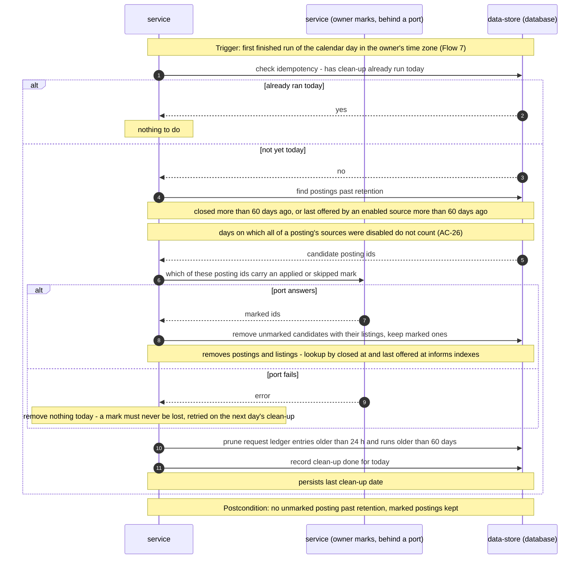

<!-- Self-contained task: inlined slices carry provenance signatures; the source always wins.
To the executing agent: work from what is inlined here. If a slice is insufficient, ambiguous, or
contradicts the code, open the named file and follow it. Do not invent the missing part. -->

# T17 — Run the daily clean-up through the MarkedPostings port

## Place in the sequence

- **Blocked by:** T9 — Implement the retention clock and the once-a-day clean-up rule, T15 — Finalize a run: apply closures, hold-back, flags and per-source counts · **Blocks:** T24 — Prove limits, interruption and start-up end to end against a fake source server · **Wave:** 5 (after T9, T15).
- **Lane:** shares `apps/server/src/modules/collector/infra/repo/postings.ts` with T14; shares `apps/server/src/modules/collector/infra/repo/postings.ts` with T15 — serialized.

## Why (user story)

> **As an** owner
> **I want** postings that are really closed to be hidden, and old untouched ones to be cleared away
> **So that** I only spend time on roles I can still apply to, without losing my own marks
>
> — `spec.md §4, US-03, verbatim` · full text: [spec.md](../spec.md)

> **As an** owner
> **I want** to choose, in a settings file on my machine, which sources are enabled and which of their job categories count as tech
> **So that** the collection holds only roles I could want and I can adjust when a board changes its categories
>
> > **Visitor:** no user story — a visitor has no goal this feature serves; the role exists only to be kept out, covered by AC-17 and §6.1.
>
> — `spec.md §4, US-08, verbatim` · full text: [spec.md](../spec.md)

Keeps the collection to roles the owner can still apply to without losing their marks.

## Inlined context

— `sad.md §6, Flow 9 sequence, verbatim` · full text: [sad.md](../sad.md)

> **Chosen:** Option 1. Option 2 breaks the retention bound — spec §6 requires unmarked postings to be removed, and the database would grow without limit. The collector keeps posting ids stable through merge, close and reopen (ADR-0005), consults the port before removing anything, and never reads or writes marks itself. In step 6 the tracking module provides the implementation through its `app` exports and its marks table references `posting` with delete restricted, so the database also refuses to remove a marked posting.
>
> — `adr/0006-keep-owner-marks-behind-a-port-the-collector-consults-before-removal.md §Decision outcome, Chosen, verbatim` · full text: [0006-keep-owner-marks-behind-a-port-the-collector-consults-before-removal.md](../adr/0006-keep-owner-marks-behind-a-port-the-collector-consults-before-removal.md)

> **Owner marks stay outside the collector.** Applied/skipped marks arrive with roadmap step 6 (tracking module). The collector never stores or reads mark columns itself; it asks a `MarkedPostings` port ("which of these posting ids carry a mark?") before retention deletes anything (AC-10) and keeps the posting id stable across merge, close and reopen (AC-06, AC-07, AC-11). Until step 6 ships, the port's default answers "none" and tests use a fake that carries marks — [ADR-0006](adr/0006-keep-owner-marks-behind-a-port-the-collector-consults-before-removal.md).
>
> — `sad.md §5, owner marks, verbatim` · full text: [sad.md](../sad.md)

**Fallback:** insufficient or contradicted by the code → read the named file in full
([spec.md](../spec.md) · [sad.md](../sad.md) · [data-model.md](../data-model.md) ·
[openapi.yaml](../contracts/openapi.yaml) · [screens.md](../screens.md) · [adr/](../adr/)) and follow it. Do not guess.

## Data delta

**`collector_postings`**

| Column | Type | Constraints | Notes |
|---|---|---|---|
| `closed_at` | integer | | AC-10 clock for closed postings. |
| `last_offered_at` | integer | NOT NULL | Last time an enabled source offered it; AC-10 clock for open postings. |

— `data-model.md §Entities, table collector_postings, abridged` · full text: [data-model.md](../data-model.md)

**`collector_state`**

| Column | Type | Constraints | Notes |
|---|---|---|---|
| `last_cleanup_on` | text | | `YYYY-MM-DD` in the owner's time zone — idempotency of the daily clean-up (Flow 9). |

— `data-model.md §Entities, table collector_state, abridged` · full text: [data-model.md](../data-model.md)

## API contract

Internal — no API surface.

## Acceptance criteria

### AC-10 — happy

> **Given** more than 60 days have passed since a posting closed, or since any enabled source last offered it — days on which all of its sources were disabled do not count
> **When** clean-up runs (once a day, after the day's first collection run that finished without being interrupted — even if a source in it failed; the day is the calendar day in the owner's machine time zone)
> **Then** the posting is removed if the owner never marked it, and kept if the owner marked it applied or skipped
>
> — `spec.md §5, AC-10, verbatim` · full text: [spec.md](../spec.md)

### AC-26 — happy

> **Given** a source is disabled in the owner's settings file
> **When** any collection run starts — scheduled, catch-up or collect-now
> **Then** that source is not read, its existing postings are neither closed nor removed because of it (the AC-10 clock is paused while all of a posting's sources are disabled), its listings no longer count toward closing (AC-07), and source health shows it as disabled
>
> — `spec.md §5, AC-26, verbatim` · full text: [spec.md](../spec.md)

## Checklist

- [ ] `MarkedPostings` port with a default that answers none + a test fake — `app/marked-postings.ts`
- [ ] `dailyCleanup(now)`: idempotency by `last_cleanup_on`; candidates via T9; ask the port; delete unmarked (cascade); prune ledger > 24 h, runs > 60 days, sessions > 60 days — `app/cleanup.ts`, `infra/repo/postings.ts`
- [ ] Port failure → remove nothing, log, retry next day — `app/cleanup.ts`
- [ ] Integration tests — `apps/server/test/collector-cleanup.integration.test.ts`

## Edge cases

| Case | Behaviour |
|---|---|
| Posting marked skipped, closed 90 days | Kept |
| Port throws | Nothing removed today |
| Second finished run the same day | No clean-up |
| All sources disabled 20 of the last 70 days | Counted age 50 → kept |

## Definition of Done

- [ ] clean-up integration tests pass with the marks fake
- [ ] every Hard Rule inlined above still holds
- [ ] lint + vet clean (`pnpm lint`, `tsc`)
