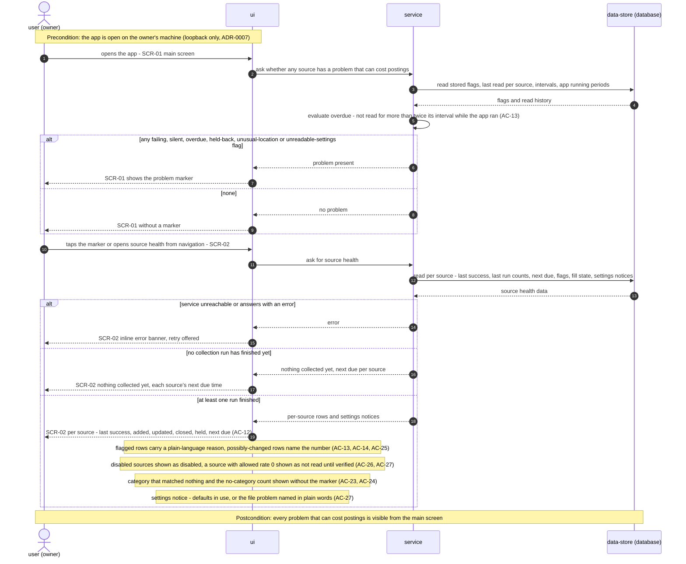

<!-- Self-contained task: inlined slices carry provenance signatures; the source always wins.
To the executing agent: work from what is inlined here. If a slice is insufficient, ambiguous, or
contradicts the code, open the named file and follow it. Do not invent the missing part. -->

# T18 — Serve getCollectorProblems and getSourceHealth

## Place in the sequence

- **Blocked by:** T2 — Enforce loopback-only, same-origin access in core and map Fastify 415, T8 — Implement the source health flags, overdue and the marker rule, T13 — Run the one-minute scheduler, start-up recovery and run opening · **Blocks:** T19 — Serve collectNow and wire the collector plugin, scheduler and built SPA · **Wave:** 3 (after T2, T8, T13).
- **Lane:** shares `apps/server/src/modules/collector/ports/routes.ts` with T19 — serialized.

## Why (user story)

> **As an** owner
> **I want** to see each source's health and have problems flagged in plain words
> **So that** a broken source never silently shrinks what I see
>
> — `spec.md §4, US-04, verbatim` · full text: [spec.md](../spec.md)

> **As an** owner
> **I want** to choose, in a settings file on my machine, which sources are enabled and which of their job categories count as tech
> **So that** the collection holds only roles I could want and I can adjust when a board changes its categories
>
> > **Visitor:** no user story — a visitor has no goal this feature serves; the role exists only to be kept out, covered by AC-17 and §6.1.
>
> — `spec.md §4, US-08, verbatim` · full text: [spec.md](../spec.md)

Gives the web app everything SCR-01 and SCR-02 show.

## Inlined context

— `sad.md §6, Flow 10 sequence, verbatim` · full text: [sad.md](../sad.md)

> | schema_path | origin | confidence |
> |---|---|---|
> | getCollectorProblems.problems[].kind = overdue | computed: `collector_sources.last_read_at` + interval × 2 over `collector_app_sessions` (sad.md §6 Flows 7, 10) | medium |
> | getSourceHealth.sources[].state | settings in force (file or `collector_state.last_valid_settings`) + allowed rate in the adapter registry (code, not a column) | medium |
> | getSourceHealth.sources[].next_due_at | computed: `collector_sources.last_read_at` + the source's interval (adapter registry), null when disabled or not_verified | medium |
> | getSourceHealth.sources[].freshness.p90_minutes / sample_size | computed: `collector_listings.first_collected_at − published_at`, excluding `is_first_fill` and listings published outside `collector_app_sessions` (spec §6) | medium |
>
> — `contracts/api-sync-report.md §A, computed fields, abridged` · full text: [api-sync-report.md](../contracts/api-sync-report.md)

**Fallback:** insufficient or contradicted by the code → read the named file in full
([spec.md](../spec.md) · [sad.md](../sad.md) · [data-model.md](../data-model.md) ·
[openapi.yaml](../contracts/openapi.yaml) · [screens.md](../screens.md) · [adr/](../adr/)) and follow it. Do not guess.

## Data delta

read-only: `collector_sources`, `collector_source_flags`, `collector_runs`, `collector_run_sources`, `collector_request_ledger`, `collector_listings`, `collector_state`, `collector_app_sessions` — no schema change. — `data-model.md §Entities, abridged` · full text: [data-model.md](../data-model.md)

## API contract

- `GET /api/v1/collector/problems` → `200 ProblemSummary` `{has_problem, problems[{source_id|null, kind}]}`; `403 FORBIDDEN_HOST`; `500 INTERNAL`.
- `GET /api/v1/collector/source-health` → `200 SourceHealth` `{any_run_finished, settings, current_run, last_run, sources[SourceHealthRow]}`; `403`, `500`.
- `SourceHealthRow`: `source_id, state, last_success_at, next_due_at, last_outcome, flags[], fill, reads{last_60_min,last_24_h}, freshness{p90_minutes,sample_size,without_publication_time}`; times ISO 8601 UTC.

— `contracts/openapi.yaml, operationId getCollectorProblems + getSourceHealth, abridged` · full text: [openapi.yaml](../contracts/openapi.yaml)

## Acceptance criteria

### AC-12 — happy

> **Given** at least one collection run has finished
> **When** the owner opens source health
> **Then** they see for each source when it last succeeded, how many postings its last run added, updated and closed, and when it is next due
>
> > "Updated" — an updated posting (CONTEXT): known postings whose title, text, location restriction or link changed at this source, that gained a listing from another source, or that reopened.
> > Counts are per posting outcome, credited to the source that caused it: *added* — a new posting created from this source's listing; *updated* — an existing posting changed through this source, including this source's listing merging into it or reopening it; *closed* — postings that actually closed in this run where this source gave the last needed confirmation. Closures held back by AC-14 are shown separately as *held*, not as closed.
>
> — `spec.md §5, AC-12, verbatim` · full text: [spec.md](../spec.md)

### AC-13 — error

> **Given** a source has failed on two consecutive due runs, returned zero items (not merely zero new ones) on two consecutive due runs, or has not been read for more than twice its interval while the app was running
> **When** the owner opens the app
> **Then** that source is flagged with a plain-language reason in source health, the app's main screen shows that a source has a problem, and the flag clears by itself after the source's next successful read that returns items
>
> > Main-screen marker — shown while any flag that can cost the owner postings is up: failing / silent / overdue (AC-13, clears after the next successful read that returns items), closures held back (AC-14, clears when the next run of that source is at or under 30%), unusual unknown-location share (AC-25, clears when that source's next run is back under the threshold), unreadable settings file (AC-27, clears after the next valid read). Shown only in source health, without the marker: a category that matched nothing (AC-24) and defaults in use (AC-27). There is no in-app control to accept held closures in v1.
>
> — `spec.md §5, AC-13, verbatim` · full text: [spec.md](../spec.md)

### AC-27 — error

> **Given** the owner's settings file is missing, or cannot be read
> **When** the app starts or a collection run starts
> **Then** a missing file is created with built-in defaults (every source except We Work Remotely enabled, a default tech category list per source) and source health says defaults are in use; an unreadable file leaves collection running on the last valid settings and source health names the problem in plain words; a file that can be read but names an unknown source or otherwise breaks the settings rules counts as unreadable as a whole; an unreadable file with no last valid settings yet (e.g. on the first start) runs on the built-in defaults and is not overwritten; a source the owner enables while its allowed rate is 0 (We Work Remotely until §8 Q1) shows as "enabled, not read until its limits are verified" and is never flagged as silent; a valid edit takes effect from the next run without restarting the app
>
> — `spec.md §5, AC-27, verbatim` · full text: [spec.md](../spec.md)

## Checklist

- [ ] Read queries — `infra/repo/health.ts`
- [ ] `getProblems()` / `getSourceHealth()` composing T8 overdue + marker rule, next due (T3), freshness p90 — `app/source-health.ts`
- [ ] Fastify routes with response schemas from the contract — `ports/routes.ts`
- [ ] Route tests validating bodies against `contracts/openapi.yaml` — `apps/server/test/collector-health-routes.integration.test.ts`

## Edge cases

| Case | Behaviour |
|---|---|
| No run finished yet | `any_run_finished: false`, next due per source |
| Settings unreadable | `settings_unreadable` in problems; `settings.problem` set |
| category_unmatched only | `has_problem: false`; flag on the source row |
| Run in progress | `current_run` filled |

## Definition of Done

- [ ] both routes return contract-valid bodies in tests
- [ ] overdue and marker rules covered
- [ ] every Hard Rule inlined above still holds
- [ ] lint + vet clean (`pnpm lint`, `tsc`)
