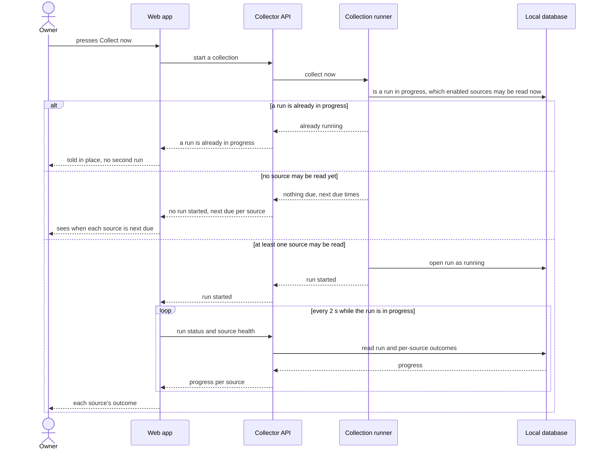

<!-- Self-contained task: inlined slices carry provenance signatures; the source always wins.
To the executing agent: work from what is inlined here. If a slice is insufficient, ambiguous, or
contradicts the code, open the named file and follow it. Do not invent the missing part. -->

# T19 — Serve collectNow and wire the collector plugin, scheduler and built SPA

## Place in the sequence

- **Blocked by:** T2 — Enforce loopback-only, same-origin access in core and map Fastify 415, T13 — Run the one-minute scheduler, start-up recovery and run opening, T18 — Serve getCollectorProblems and getSourceHealth · **Blocks:** T24 — Prove limits, interruption and start-up end to end against a fake source server · **Wave:** 4 (after T2, T13, T18).
- **Lane:** shares `apps/server/src/app.ts` with T2; shares `apps/server/src/modules/collector/ports/routes.ts` with T18 — serialized.

## Why (user story)

> **As an** owner
> **I want** to start a collection myself
> **So that** I don't wait for the schedule after fixing a problem or before a job-hunting session
>
> — `spec.md §4, US-05, verbatim` · full text: [spec.md](../spec.md)

Lets the owner start a collection and makes the collector part of the running app.

## Inlined context

— `sad.md §6, Flow 2 sequence, verbatim` · full text: [sad.md](../sad.md)

> One Node.js process on the owner's laptop, listening only on `127.0.0.1:3000` (ADR-0007). It runs the Fastify API, the in-process collection runner (ADR-0001, ADR-0003) and — in normal use (`pnpm build` then `pnpm start`) — also serves the built SPA from `apps/web/dist` through `@fastify/static`, with any non-`/api` path falling back to `index.html` so client-side routes work: one origin, one process, no CORS. In development the Vite dev server (`localhost:5173`) serves the web app and proxies `/api` to the server, as the scaffold already does — with `changeOrigin: true` set on that proxy in `apps/web/vite.config.ts`, so forwarded requests carry `Host: 127.0.0.1:3000` and pass the Host check (ADR-0007). No replicas, no always-on host — collection happens only while the app runs (spec §3).
>
> — `sad.md §7, deployment paragraph, verbatim` · full text: [sad.md](../sad.md)

> **Hard rule:**
>
> | Aspect | Target | Measurement |
> |---|---|---|
> | App start with a catch-up due | the app responds to the owner ≤ 5 s after start, even while catch-up or the first fill runs | start-up smoke test in CI |
>
> — `spec.md §6, App start with a catch-up due, verbatim` · full text: [spec.md](../spec.md)

**Fallback:** insufficient or contradicted by the code → read the named file in full
([spec.md](../spec.md) · [sad.md](../sad.md) · [data-model.md](../data-model.md) ·
[openapi.yaml](../contracts/openapi.yaml) · [screens.md](../screens.md) · [adr/](../adr/)) and follow it. Do not guess.

## Data delta

No DB changes.

## API contract

- `POST /api/v1/collector/runs` body `{}` → `202 CollectNowResult` `{started: true, run, next_due}` · `200` `{started: false, run: null, next_due}` · `409 COLLECTOR_RUN_IN_PROGRESS` · `400`/`403`/`415`/`500` (T2).

— `contracts/openapi.yaml, operationId collectNow, abridged` · full text: [openapi.yaml](../contracts/openapi.yaml)

## Acceptance criteria

### AC-15 — happy

> **Given** no collection run is in progress
> **When** the owner asks to collect now
> **Then** a run starts for every enabled source whose interval has passed since its last read, the owner sees it in progress, and then sees each source's outcome; if no enabled source may be read yet, no run starts and the owner sees when each source is next due
>
> — `spec.md §5, AC-15, verbatim` · full text: [spec.md](../spec.md)

### AC-16 — domain invariant

> **Given** a collection run is already in progress
> **When** the owner asks to collect now
> **Then** no second run starts and the owner is told a run is already in progress
>
> — `spec.md §5, AC-16, verbatim` · full text: [spec.md](../spec.md)

## Checklist

- [ ] `POST /runs` → `openRun('collect_now')` (T13), start ingest in the background, map outcomes to 202 / 200 / 409 — `ports/routes.ts`
- [ ] Collector plugin: register routes, start the scheduler on ready, stop it on close — `modules/collector/index.ts`
- [ ] Register the plugin; serve `apps/web/dist` via `@fastify/static` with SPA fallback for non-`/api` paths in start mode — `apps/server/src/app.ts`, `apps/server/package.json`
- [ ] Start-up smoke: app answers ≤ 5 s with a fake source serving 30 days — `apps/server/test/app.smoke.test.ts`

## Edge cases

| Case | Behaviour |
|---|---|
| Press while a run is in progress | 409, no second run |
| Press when nothing is due | 200 `started: false` + next due |
| Unknown path in start mode | `index.html` (client-side routes) |
| Server closing mid-run | Scheduler stops; run left `running` → incomplete at next start |

## Definition of Done

- [ ] collectNow route tests pass for 202 / 200 / 409
- [ ] smoke test answers within 5 s during catch-up
- [ ] every Hard Rule inlined above still holds
- [ ] lint + vet clean (`pnpm lint`, `tsc`)
