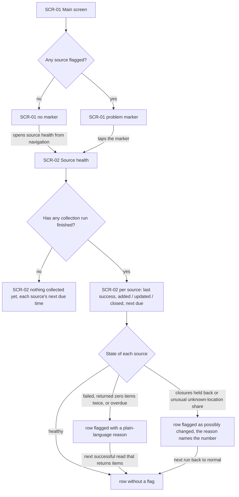
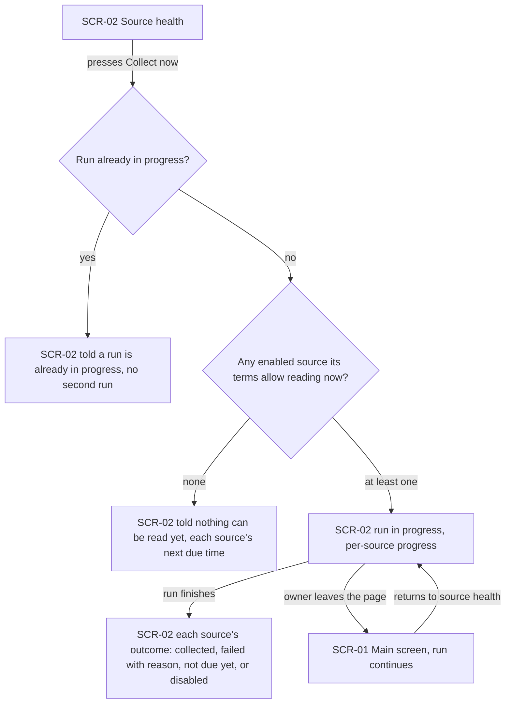
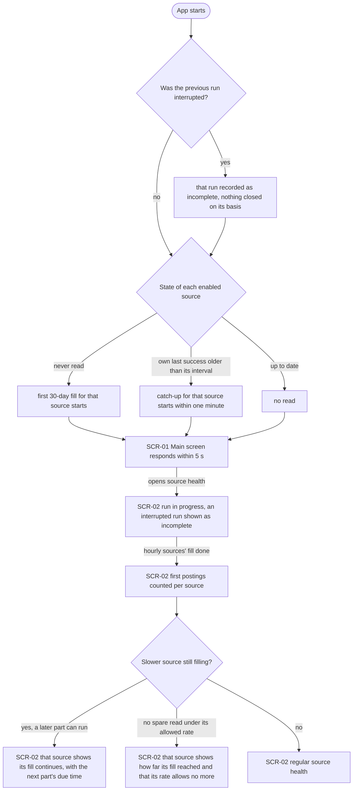
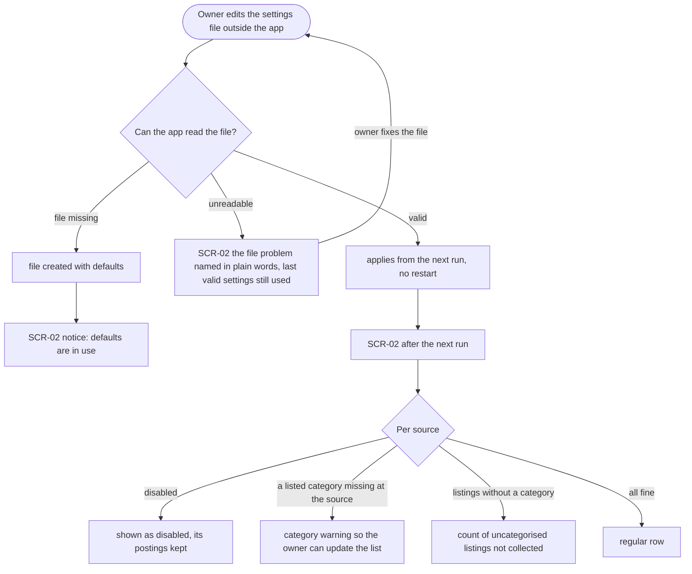

# UX flows — remote-boards-collector

> User flows for every UI-touching §4 user story, produced by `ux-flows` (after `clarify`, before
> `design`) and read by `design` (evidence for the target-surface + UI-architecture decisions),
> `sequences` (UI-driven flows align on SCR ids), `screens` (details every inventory row) and
> `plan-tests` (the e2e-through-UI paths). **Always markdown + mermaid `flowchart`**, whatever the
> design tool — this artifact is flow-altitude, not visual design.

## Platform decisions

- **Posture:** mobile-first — per `docs/design-system.md`. In v1 the app opens only on the owner's own machine (spec AC-17), so in practice these screens are used in a laptop browser; they still start from the narrow layout and gain columns as width grows, so nothing is reworked when phone access arrives.
- **Navigation:** two places — the main screen (SCR-01) and source health (SCR-02), a page of its own reachable from the main navigation and from the problem marker on SCR-01. No other screens.
- **Collect now:** an in-page action on SCR-02 — no confirmation step; a second press while a run is in progress is answered in place (AC-16).
- **Run progress:** shown in place on SCR-02 and kept current while the page is open; the run continues when the owner leaves the page. *Design input:* how SCR-02 stays current (asking again vs being told) is `design`'s call.
- **Settings:** edited only in the local settings file, outside the app (spec §3); SCR-02 is where the owner sees what the app made of the file.

## Screen inventory

| ID | Screen | Purpose | Entry | Exit |
|---|---|---|---|---|
| SCR-01 | Main screen | The app's home (the shell until roadmap step 3 adds postings); carries the problem marker when any source is flagged (AC-13) | Opening the app | SCR-02 via the problem marker or the main navigation |
| SCR-02 | Source health | Per-source state: last success, last run's added / updated / closed, next due, flags with plain-language reasons, disabled sources, settings notices; collect now and the run in progress | SCR-01 (marker or navigation) | SCR-01 via navigation |

## Flows

### Flow: US-04 — Know when a source misbehaves

The owner opens the app on the main screen. If no source is flagged, nothing extra shows and they can open source health from the navigation. If any source is flagged, the main screen shows a problem marker, and tapping it opens source health. If no collection run has finished yet, source health says nothing has been collected and shows each source's next due time. Otherwise each source shows when it last succeeded, what its last run added, updated and closed, and when it is next due. A source then shows in one of three states: healthy (no flag); flagged with a plain-language reason when it failed, returned zero items on two due runs, or is overdue; or flagged as possibly changed when its closures were held back or its unknown-location share jumped, with the number in the reason. Both kinds of flag clear by themselves once the source is back to normal, and the marker on the main screen goes away with the last flag.

### Flow: US-05 — Collect now on demand

From source health the owner presses Collect now. If a run is already in progress, no second run starts and they are told so in place. If no enabled source is allowed to be read yet, no run starts and they see when each source is next due. *(Confirmed and written into spec AC-15.)* Otherwise a run starts for the sources that are allowed now and the page shows it in progress, source by source. When it finishes, each source shows its outcome: collected, failed with a reason, skipped as not due yet, or disabled. If the owner leaves the page mid-run, the run carries on. Coming back to source health shows it still in progress or already finished.

### Flow: US-06 — Catch up after a pause

When the app starts, it first checks whether the previous run was cut short (the laptop slept or the app stopped). If so, that run is recorded as incomplete and nothing is closed on its basis. Then each enabled source goes one of three ways: never read before → its first 30-day fill starts; its own last success is older than its interval → a catch-up for it starts within a minute; up to date → nothing. Either way the main screen responds within 5 seconds and never waits for collection. In source health the owner sees the run in progress and any interrupted run marked as incomplete. Once the hourly sources' fill is done, their first postings show as counts. A slower source whose 30 days don't fit its allowed rate shows that its fill continues, and when the next part is due; if its regular schedule leaves no spare read at all, it shows how far the fill reached and that its rate allows no more (review 2026-10-02). When the fill is complete, source health looks as usual.

### Flow: US-08 — Choose what gets collected (settings feedback loop)

Settings live in a file the owner edits outside the app, and source health shows what the app made of it. If the file is missing, the app creates it with defaults, and source health says defaults are in use. If the file can't be read, source health names the problem in plain words and collection keeps going on the last valid settings. Once the owner fixes the file, the loop starts again. A valid edit takes effect from the next run without a restart. After that run, each source shows one of four states: disabled, with its postings kept; a warning for a listed category the source no longer has; a count of listings skipped for having no category; or a regular row.

## Out of scope (no owner-facing flow)

- **US-01, US-02, US-03, US-07** — collecting, merging, closing and keeping location statements happen without the owner on screen. Their only visible trace is source health's counts (Flow US-04). Browsing postings comes in roadmap step 3.
- **Visitor (AC-17)** — a visitor cannot connect to the app at all, so there is no screen to draw.

## AC coverage

| AC | Shown by | Notes |
|---|---|---|
| AC-01 | Flow US-04 → H (added count) | Postings themselves are browsed from roadmap step 3 |
| AC-02 | Flow US-05 → E, G ("not due yet"); Flow US-04 → H (next due) | |
| AC-03 | Flow US-04 → K | Failure reason in plain words; other sources still collected (US-05 → G) |
| AC-04 | N/A: backend merge | Visible only in the "updated" count (US-04 → H) |
| AC-05 | N/A: backend merge rule | |
| AC-06 | N/A: backend, marks come from step 6 | |
| AC-07 | N/A: backend | Visible as the "closed" count (US-04 → H) |
| AC-08 | N/A: backend invariant | |
| AC-09 | N/A: backend invariant | |
| AC-10 | N/A: daily clean-up, no owner action | |
| AC-11 | N/A: backend | Counts as "updated" (US-04 → H) |
| AC-12 | Flow US-04 → H | |
| AC-13 | Flow US-04 → D, K, K→J | Marker on SCR-01, reason on SCR-02, clears by itself |
| AC-14 | Flow US-04 → L | |
| AC-15 | Flow US-05 → F, G, E | E = nothing may be read yet (added to AC-15 by ux-flows) |
| AC-16 | Flow US-05 → C | |
| AC-17 | N/A: visitor cannot connect | No screen exists for a visitor |
| AC-18 | Flow US-06 → D | |
| AC-19 | Flow US-06 → C, I, K | Slower sources fill over later runs (spec §6) |
| AC-20 | Flow US-06 → Q, H | |
| AC-21 | N/A: backend data rule | |
| AC-22 | N/A: backend data rule | |
| AC-23 | Flow US-08 → G3 | |
| AC-24 | Flow US-08 → G2 | |
| AC-25 | Flow US-04 → L | |
| AC-26 | Flow US-08 → G1; Flow US-05 → G | |
| AC-27 | Flow US-08 → C/N, D, E | |
