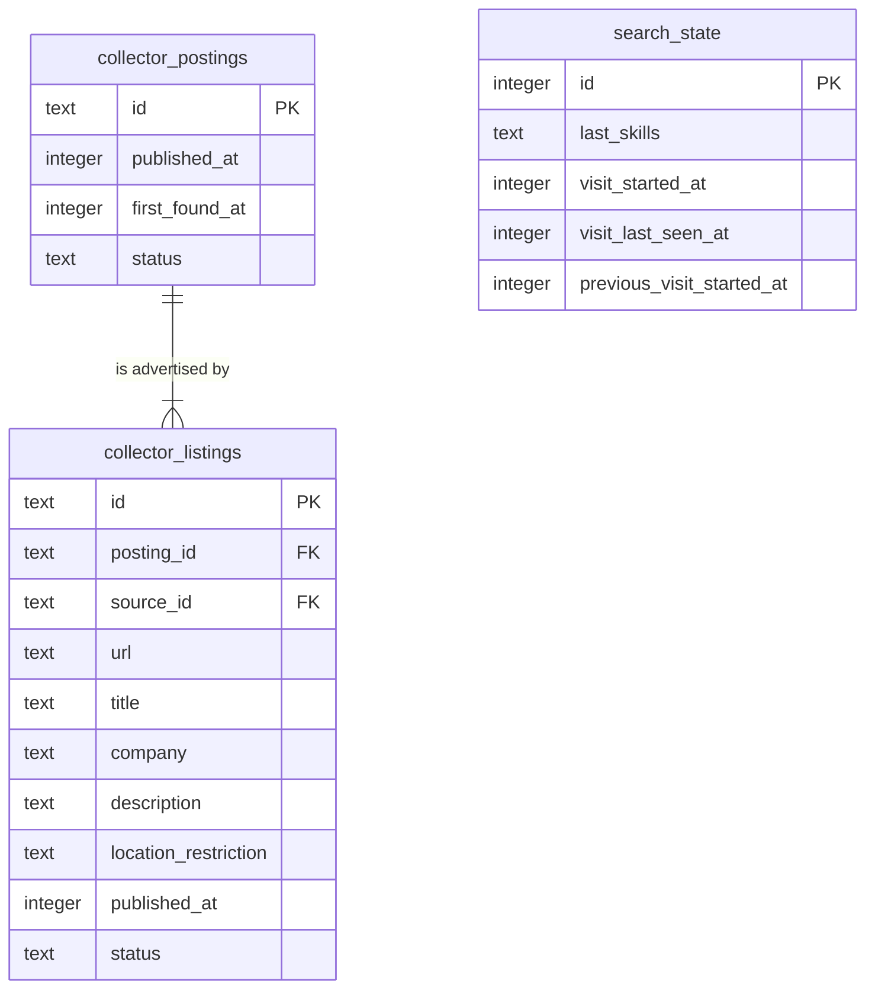

# Data model — search-postings

Derived from spec §5 (AC-13, AC-14), sad.md §5 ("State kept by search", "Snapshots") and the persist notes of sad.md §6 flows 1–5. Conventions follow project ADR `docs/adr/0003-sqlite-with-drizzle.md` and the pattern the collector set (`docs/features/remote-boards-collector/data-model.md`). Nothing new is decided here:

- SQLite through Drizzle. The table lives in `apps/server/src/modules/search/infra/schema.ts`. It matches the existing `drizzle.config.ts` glob `./src/modules/*/infra/schema.ts`, so no config change is needed.
- Names are snake_case with the module prefix `search_`.
- A singleton state row uses `id integer PK` and is always `1`, the same as `collector_state`. The row is upserted lazily with `onConflictDoNothing`, so there is no seed migration.
- Times are integer UTC epoch milliseconds. A list value is stored as JSON text, the same as `collector_listings.categories`.
- There are no `CHECK` constraints, no DB `DEFAULT`s, no triggers and no blanket audit columns. Rules live in `search/domain`.

**Scope.** The feature adds one table: `search_state`. Snapshots are in memory only and never persisted (ADR-0003). Postings and listings are read through the collector's `app` export, and **their schema is unchanged**: no new column and no new index (see [Indexes](#indexes)).

## ER diagram

`search_state` has no FK. It references no posting. The collector tables appear above (trimmed to the columns search reads) only to show the read side. They are owned and migrated by the collector.

## Entities

### Module state (search-owned)

#### `search_state`

| Column | Type | Constraints | Notes |
|---|---|---|---|
| `id` | integer | PK | Always `1`. The app writes it; no `CHECK` enforces it (convention above). |
| `last_skills` | text | | JSON array of the last skills that **passed** the AC-05 check, in the owner's spelling, deduped. Saved before the collection is read, so a failed read still remembers them (flow 3). `NULL` means none, and the next opening shows an empty field (AC-13). The domain bounds it to ≤ 20 skills × ≤ 50 chars, not the DB. |
| `visit_started_at` | integer | | Start of the current visit (AC-14). `NULL` until the first visit. |
| `visit_last_seen_at` | integer | | Heartbeat written when the main screen opens and on each waiting-count poll (flows 1, 2). A gap of more than 30 min starts a new visit. |
| `previous_visit_started_at` | integer | | A posting is new when `collector_postings.first_found_at` is later than this value. `NULL` on the very first visit, which marks nothing new (AC-14). |

**Aggregate root:** root (singleton).
**Access patterns:** read and written by PK only (flows 1, 2, 3). No secondary index.

### Read from the collector (not owned, unchanged)

| Search need | Collector column(s) | Rule |
|---|---|---|
| Open postings only (AC-04) | `collector_postings.status` | `= 'open'` |
| Matching text (AC-02, AC-06) | open `collector_listings.title`, `.description` | Closed listings never match |
| Effective time (AC-03) | `collector_postings.published_at`, `.first_found_at` | `min(published_at, first_found_at)`; no publication time → `first_found_at`, shown as "publication time unknown" |
| New mark (AC-14), waiting count (AC-16) | `collector_postings.first_found_at` | `> search_state.previous_visit_started_at` / `> snapshot loaded-at` |
| Card (AC-07, AC-08, AC-09) | posting `title`, `company`; each listing's `source_id`, `status`, `url`, `location_restriction` | Link only for an open listing whose `url` is `http:`/`https:`. `NULL` restriction → "unknown" |
| Tie order (AC-03) | `collector_postings.id` | UUIDv7, descending |

## Indexes

No new index. Each read in the sequences was checked against the existing indexes with `EXPLAIN QUERY PLAN` on 40,000 seeded postings, about 27k of them open with 3 KB descriptions:

| Query (flow) | Plan | p95 | Verdict |
|---|---|---|---|
| Stream open postings + listings (flows 1, 3, 5 refresh) | `SCAN collector_postings` → `collector_listings_posting_idx` | 270 ms | Full read **by design** (ADR-0002: every search scans). An index on low-selectivity `status` would not help. |
| Waiting count, `first_found_at > loaded-at` (flow 2, every 60 s) | `SCAN collector_postings` → `collector_listings_posting_idx` (covering) | 3.9 ms | Candidate `collector_postings(first_found_at)` **discarded**: 4 ms per poll needs no index, and the index would add a write on every posting insert. Add it if the waiting poll ever shows in `durationMs`. |
| Next page, 50 postings by id (flows 2, 5) | PK + `collector_listings_posting_idx` | 0.9 ms | Covered |
| `search_state` by id (flows 1–3) | PK | — | Covered |

## Test fixtures

Not in migrations. They go in `apps/server/test/helpers/` beside `temp-db.ts`:

- `seedOpenPostings(db, n, overrides)` — `n` open postings, each with ≥ 1 listing of realistic description length. Company `Example Co`, URLs `https://jobs.example.test/<id>`. Used by the QG-2 10,000-posting integration test and the QG-3 paging test.
- A posting with a merged second listing closed at its source (AC-08), and one with `javascript:` in `url` and markup in its title (AC-09, QG-4). Both are built with the collector's `buildPosting` / `buildListing` once those exist, or with plain inserts.
- `setSearchState(db, partial)` — upserts the singleton row to set up visit scenarios (AC-13, AC-14) under a fake clock.
- The fixed AC-02 example list is a **unit-test table** in `search/domain/match.test.ts`, not DB data.
