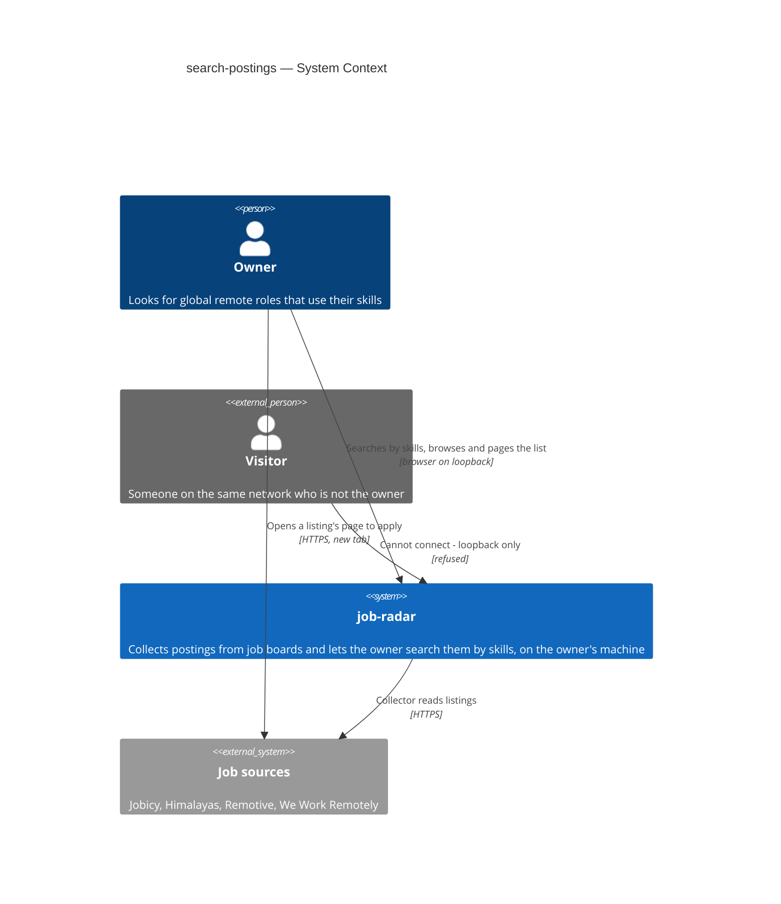
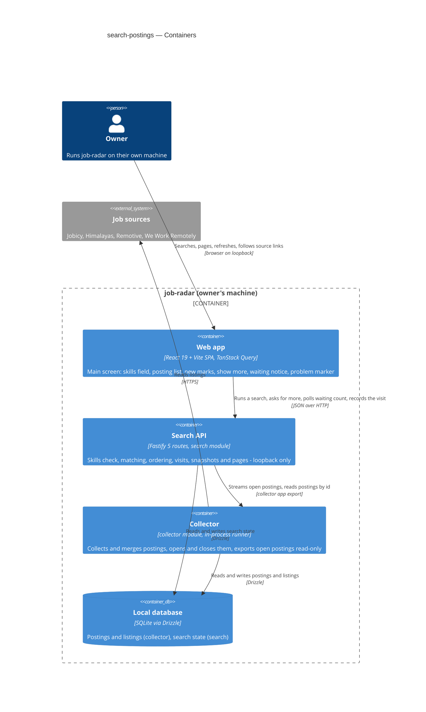
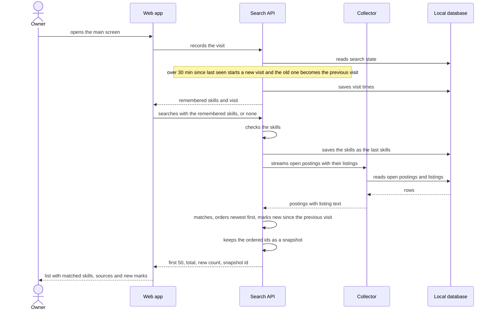
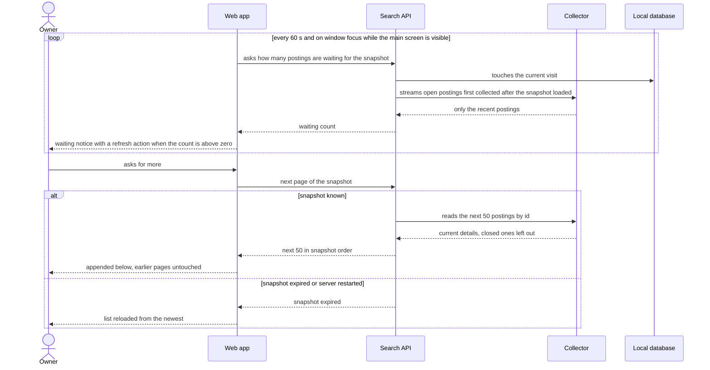

# Software Architecture Document — search-postings

<!-- 12 Arc42 sections. Empty section → <!-- N/A: <one-line reason> -->. -->
<!-- C4 Context (L1) lives inline in §3. C4 Container (L2) lives inline in §5. -->
<!-- Numbers in §10 come VERBATIM from spec.md §6 NFR — no inventing, no rounding. -->

## 1. Introduction and goals

**Intent.** Search-postings turns job-radar's main screen into the owner's list of open remote postings, so the owner reviews new roles in job-radar instead of opening the job boards by hand. The owner enters skills; job-radar lists every open posting whose title or description mentions at least one of them, newest first, shows which skills matched (and whether in the title), and names and links every source that lists it. With no skills the list is the whole open collection — the owner's feed. The last skills are remembered, postings collected since the owner's previous visit are marked new (late arrivals included, in their publication-time place), and results come 50 at a time without repeats or gaps while collection keeps running. It reads what the remote-boards-collector (roadmap step 2) collects and is the list that roadmap steps 4–7 will rank, filter and mark.

**Top-3 quality goals (1-liners; full scenarios in §10):**

1. **Match correctness and currency** — no open posting that mentions one of the owner's skills is missing from the list: the AC-02 matching rule holds on every example, and every posting from a finished collection run is searchable.
2. **Responsiveness at collection scale** — the first 50 postings, and every next 50, appear within 1 s p95 with 10,000 open postings and up to 20 skills.
3. **A list the owner can trust while collection runs** — no repeats or gaps across pages, nothing slipped in or reordered under the owner, and every posting new since the previous visit marked, even when its source delivered it late.

**Stakeholders.**

| Role | Interest | Sign-off owner? |
|---|---|---|
| Owner | Searches by skills, browses the feed, opens sources to apply (US-01 – US-07) | No |
| Visitor | None — must not reach the app at all (AC-17) | No |
| Tech Lead | SAD approval | Yes |
| Security Lead | Review scoped to AC-09: how untrusted listing text, matched skills and source links are shown (spec §6.1) | Yes |

<!-- Decision overrides (¶4) — populated by the critic resolution loop, empty otherwise. -->

- Decision override: size stays S although the feature adds a new module, new routes and a migration — rationale: the `search/` module and its routes are the roadmap's planned step-3 shape (project ADR-0002), and the migration is one single-row `search_state` table; effort remains about one week. Re-run `/sdd:classify-size search-postings` if implementation grows past that.

## 2. Constraints

**Technical.**
- TypeScript `^7.0.2` on Node.js 22+ (`.nvmrc`), pnpm workspaces — `apps/server` + `apps/web` (project ADR `docs/adr/0001-typescript-monorepo-react-fastify.md`).
- Server: Fastify `^5.12`, one process on `127.0.0.1:3000` that also serves the built SPA (collector ADR-0001, ADR-0007).
- Web: React `^19.3` + Vite `^8.3` single-page app, TanStack Query `^5.104`, React Router `^8.4`, Tailwind v4 with the semantic tokens in `apps/web/src/styles/tokens.css`.
- Datastore: one SQLite file through `better-sqlite3` `^13` + Drizzle ORM `^0.45`, migrations by `drizzle-kit` `^0.31`, forward-only with a file backup before each migrate (project ADR `docs/adr/0003-sqlite-with-drizzle.md`). Calls are synchronous on the server's single event loop.
- Postings, listings and their open/closed state belong to the collector module (`collector_postings`, `collector_listings`; collector ADR-0005). This feature reads them; it never writes them.
- Layering per project ADR `docs/adr/0002-feature-modules-mirror-roadmap.md`: `modules/<name>/{domain,app,infra,ports}`; a module reaches another only through that module's `app/` exports. The roadmap execution path names a new `search/` module for step 3.

**Organisational.**
- One owner-developer; size S (≈ one week, from `.size`); no deadline is stated in the spec.
- Roadmap wave 3 runs step 3 (`search/`) in parallel with step 11 (Polish board adapters in `collector/infra/sources/`) — the two must touch disjoint folders.

**Conventions.**
- `CLAUDE.md` (layout, layering, errors, IDs, persistence, tests, UI) and `docs/design-system.md` (mobile-first posture, component inventory, interaction conventions).
- Errors: one envelope `{ "error": { "code", "message" } }` shaped only by `core/errors.ts`; `AppError(code, message, status)` for expected failures.
- IDs: UUIDv7 from `core/id.ts`, generated in the app.
- Tests: Vitest — unit tests beside the code, server integration tests in `apps/server/test/` against a temp SQLite file, web tests with Testing Library.

**Regulatory / external.**
- Source terms (Himalayas, Remotive, Jobicy, We Work Remotely, Remote OK): every shown posting names and links its sources; postings are never republished outside the owner's machine (`CLAUDE.md` §Source terms, spec AC-08).
- Data classification internal; the only personal data is the owner's last skills and the start of their previous visit, kept on the owner's machine (spec §6.1). No compliance regime applies.

## 3. Context and scope

The owner runs job-radar on their own laptop; the collector already fills its local database from four remote job boards. This feature adds the owner-facing read side: a skills search and feed on the main screen. The only way out of the app is the owner following a source link to that board's own page, in a new browser tab.

<!-- brownfield: architecture-map.md is stale (reflects 133499e, greenfield-bootstrap); scanned the code directly — Fastify app with `health` + `collector` modules, collector owns the SQLite handle and the postings/listings tables, web SPA with Home (SCR-01, problem marker only) and SourceHealth (SCR-02). -->

**External systems (in / out):**

| Actor or system | Type | Interaction |
|---|---|---|
| Owner | Person | Searches by skills, browses the feed, pages, refreshes, follows source links |
| Visitor | Person (external) | Can reach the machine over the network but cannot connect to the app — loopback only (AC-17, collector ADR-0007) |
| Job sources (Jobicy, Himalayas, Remotive, We Work Remotely) | System (external) | Read by the collector (unchanged); the owner's browser opens a listing's page on its source — the search never calls a source |

**C4 Context (L1):**



## 4. Solution strategy

**Target surfaces:** `[backend-service, web-frontend]` — [ADR-0001](adr/0001-ship-search-as-new-server-module-plus-main-screen-list.md). A new `search` feature module in the existing Fastify server owns the skills rules, matching, ordering, visits and paging; it reads open postings through a new read-only export in `collector/app/` that streams each open posting with its open listings' text plus its closed listings' source and status. The web app's main screen (SCR-01) gains the skills field and the list; no new screen.

**UI architecture (web-frontend):** unchanged from the project — single-page app (project ADR-0001), server data through TanStack Query, React Router for the existing two screens (collector ADR-0002). The list uses TanStack Query's infinite query (pages appended client-side, never refetched while shown — so a posting closed while on screen stays, AC-16); the waiting-postings count is polled every 60 s and on window focus, the cadence the problem marker already uses. Screens reuse `docs/design-system.md` (Badge for matched skills, InlineBanner, SkeletonRow, Button); screen-level states belong to `screens.md`. Inline only — no new UI-architecture choice crosses the gate.

**Top strategic choices (the seeds for ADRs):**

1. **A new `search` module that reads postings through the collector's `app` layer** — matching, ordering, visits and paging are search's rules, kept in `search/domain` and unit-testable without a database; the SQL over postings and listings stays in the collector, behind one read-only export that streams open postings with their open listings' text plus their closed listings' source and status. Follows project ADR-0002 and keeps step 11's collector work in a separate folder — [ADR-0001](adr/0001-ship-search-as-new-server-module-plus-main-screen-list.md).
2. **Match skills by scanning open-posting text in the app** — AC-02's rule (exact text with symbols, any letter case, no letter or digit next to it) is one pure matcher in `search/domain`: skills are escaped and compiled into one case-insensitive Unicode pattern with boundary look-arounds, so owner input is never interpreted as a pattern (spec §6.1). SQLite's word index would split `C#` and `.NET` and cannot serve skills shorter than three characters, so every search scans the open postings' titles and descriptions once (QG-1, QG-2) — [ADR-0002](adr/0002-match-skills-by-scanning-open-posting-text-in-the-app.md).
3. **Page from an in-memory snapshot of the ordered result** — a search computes the whole ordered id list once and keeps it in the server's memory under a snapshot id with the moment it was loaded; "show more" slices the next 50. A posting's publication time can move earlier when a merge adds a listing, so a cursor over live data could repeat or skip it; the snapshot cannot (QG-3), and each next page costs no rescan (QG-2) — [ADR-0003](adr/0003-page-results-from-an-in-memory-snapshot-of-ordered-ids.md).

Each tactical decision in later sections traces to one of these seeds. Tactical decisions that *contradict* a strategic choice are red flags — surface them in §11.

## 5. Building block view

The search module follows the repo's feature-module layering (project ADR-0002). `domain` holds every rule that an acceptance criterion states, pure and clock-injected: skills parsing and the input check (AC-05), the matcher and in-title flags (AC-02, AC-06), the effective publication time and tie order (AC-03), the visit rule and the new mark (AC-14), and the safe-link check (AC-09). `app` runs a search, serves pages from snapshots, counts waiting postings and records visits. `infra` holds the module's one state table. `ports` holds the Fastify routes. The collector gains only a read export; its schema does not change.

**Internal decomposition:**

```
apps/server/src/
├── app.ts                 opens the one SQLite handle and passes it to both modules (was opened by the collector)
├── modules/collector/app/
│   └── open-postings.ts   NEW read-only export: streams open postings with their open listings' text plus closed listings' source + status,
│                          optionally only those first collected after a moment; reads postings by id
└── modules/search/
    ├── domain/            skills.ts (parse, dedupe, AC-05 check) · match.ts (AC-02 matcher, in-title flags)
    │                      order.ts (effective time, tie by id) · visit.ts (30-min rule, new mark) · links.ts (http/https only)
    ├── app/               search.ts (run search → snapshot + first page) · pages.ts (next page from a snapshot)
    │                      waiting.ts (count postings collected after the snapshot loaded) · visits.ts (open / heartbeat)
    │                      snapshots.ts (in-memory store, size cap + idle expiry)
    ├── infra/             schema.ts (search_state — one row) · repo.ts (the only SQL in the module)
    ├── ports/             routes.ts — search, next page, waiting count, visit
    └── index.ts           Fastify plugin

apps/web/src/
├── api/search.ts          typed client for the search routes
├── features/search/       queries.ts (infinite list, waiting poll) · SkillsField · PostingCard · NewCount · WaitingNotice
└── routes/Home.tsx        SCR-01: problem marker (unchanged) + skills field + list
```

**State kept by search.** One `search_state` row: the last skills that passed the check, saved before the collection is read so a failed read still remembers them (none = empty field next time, AC-13, ux-flows US-05), the current visit's start and last-seen time, and the previous visit's start (AC-14). Kept on the server, not in browser storage, so the dev (`:5173`) and built (`:3000`) origins share it and "new" is decided against the same clock that stamped "first collected". Exact columns belong to `data-model`.

**Snapshots.** Held in the search module's memory only: snapshot id (UUIDv7), skills, loaded-at moment, the previous-visit start used for new marks, the ordered posting ids, and the new count. A next page reads the current details of the next 50 ids (a posting closed since loading is left out); an unknown or expired snapshot answers with a dedicated error code and the web reloads from the newest (§11).

**C4 Container (L2):**



## 6. Runtime view

**Critical flow 1: the owner opens the main screen (US-05, US-06, US-01/US-04, US-07 first page)**



**Critical flow 2: show more while a collection run adds postings (US-07, AC-16)**



The `sequences` stage completes coverage — error branches for the skills check (AC-05), an unreadable collection (AC-12) and an empty collection (AC-11).

## 7. Deployment view

Reuses the existing deployment unchanged: one Node.js process on `127.0.0.1:3000` serving the API and the built SPA, the Vite dev server proxying `/api` in development (collector SAD §7). The search module is one more Fastify plugin registered in `app.ts`; the only persistent addition is the `search_state` table, created by a forward-only migration with the usual backup.

**Monitoring:**
- Logs: pino child logger `module=search`; one line per search with `durationMs`, `openPostings`, `matched` and `skillCount` — never the skills' text or any posting text.
- Alerts: none — personal tool; the NFR integration test is the guard (§10 QG-2).

**Scaling thresholds:**
- The scan is sized for the NFR's 10,000 open postings. Above that, or if a logged search passes 1 s, apply the §11 mitigation (in-memory text cache, then a substring pre-filter).
- Snapshots: at most 20 kept, the oldest evicted first, each expiring after 2 h idle — a 10,000-posting snapshot is ~10,000 ids (≈ 0.5 MB).

## 8. Crosscutting concepts

| Concept | Convention | Where defined |
|---|---|---|
| Logging | Fastify's pino logger, child field `module=search`; no skills text, no listing text in logs | `apps/server/src/main.ts` + §7 |
| Access control | Unchanged: loopback bind, Host check, state-changing requests only same-origin with a JSON body, no CORS (AC-17). Search, next page, waiting count and visit all change state (snapshot, last skills, visit heartbeat), so all four are sent as JSON POSTs | collector [ADR-0007](../remote-boards-collector/adr/0007-allow-only-loopback-same-origin-requests-without-accounts.md), `core/access.ts` |
| Error handling | Envelope `{ "error": { "code", "message" } }` via `AppError`; a failed skills check names the skill (or count) and the rule (AC-05); an unreadable collection is a plain-language error the web shows with a retry, keeping the skills and the last list (AC-12); an unknown snapshot has its own code so the web reloads from the newest | `core/errors.ts` + here; codes fixed by `api` |
| ID strategy | UUIDv7 from `core/id.ts` for snapshot ids; ties in order break on posting id (descending), stable on every load (AC-03) | `core/id.ts` |
| Owner input | Skills split on commas, trimmed, empties dropped, deduped ignoring letter case (first spelling kept); refused when a skill has no letter or digit, is over 50 characters, or there are over 20 skills (AC-05). Each skill is escaped before it joins the match pattern — never a pattern, SQL or command (spec §6.1) | `search/domain/skills.ts` |
| Matching rule | Case-insensitive Unicode match of the skill's exact text in any open listing's title or description, with no letter or digit directly before it and no letter, digit, `#` or `+` directly after it — so `C` does not match `C#` or `C++` (AC-02 example). In-title when any open listing's title matches (AC-06). Closed listings never match | `search/domain/match.ts`; §11 row on the AC-02 wording |
| Ordering | Effective time = the posting's publication time, capped at its first-collected time; no publication time → first-collected time, shown as "publication time unknown"; newest first, ties by posting id (AC-03) | `search/domain/order.ts` |
| Visits and new marks | A visit starts when the main screen is opened more than 30 minutes after it was last seen open; every waiting-count poll (only while the tab is visible) refreshes "last seen". A posting is new when first collected after the previous visit's start; nothing is new on the first visit; reopened or updated postings are not new (AC-14) | `search/domain/visit.ts` |
| Untrusted source content | Titles, companies, locations and descriptions are already plain text from collector ingest; the web renders them as React text only (no `dangerouslySetInnerHTML`); matched skills are shown as Badge chips, not highlighted inside source text; descriptions are not sent to the web at all. A link is sent only when its protocol is `http:` or `https:` — otherwise the source is named without a link; links open in a new tab with `rel="noopener noreferrer"` (AC-07, AC-08, AC-09) | collector SAD §8 + `search/domain/links.ts` |
| Database handle | One `better-sqlite3` connection opened in `app.ts` and passed to both modules — no second connection, so no `SQLITE_BUSY` between search writes and collector transactions | `apps/server/src/app.ts` |
| Time | UTC epoch milliseconds; the clock is injected into search's use cases, so visits, new marks and ordering are tested with a fake clock | here |
| UI data access | TanStack Query: infinite query for the list (pages never refetched while shown), waiting count every 60 s and on window focus, no background polling | collector [ADR-0002](../remote-boards-collector/adr/0002-fetch-ui-data-with-tanstack-query-and-poll-run-progress.md) |
| UI styling | Semantic tokens only, mobile-first from 360 px, 44×44 px targets | `docs/design-system.md` |
| Internationalisation | N/A — single language (English) UI | — |
| Events | N/A — search calls the collector's `app` export in-process; no event bus | project ADR-0002 |

## 9. Architecture decisions

| # | Title | Status | Section |
|---|---|---|---|
| 0001 | Ship search as a new server module plus the main-screen list | Accepted | §4 |
| 0002 | Match skills by scanning open-posting text in the app | Accepted | §4 |
| 0003 | Page results from an in-memory snapshot of ordered ids | Accepted | §4 |

ADR files live under `docs/features/search-postings/adr/NNNN-<title>.md`.

## 10. Quality requirements

**QG-1. Match correctness and currency**
- **When:** the fixed AC-02 example list is matched, each example placed once in a title and once in a description; and, separately, a collection run finishes and the owner then searches.
- **Then:** 100% of the fixed matching examples (AC-02) pass, each in title and in description; 100% of postings from collection runs that finished before the search started are present in its results.
- **How verify:** unit test over the example list against `search/domain/match.ts` (including `C`/`C#`, `.NET`/`ASP.NET`, `Go`/`Google`/`MongoDB`, `Java`/`JavaScript`, `Node.js`/`Node`, a phrase, and pattern-like input `C++`, `.*`, `(`, `%`); integration test: finish a run against fake sources, search, assert every posting the run added is present.

**QG-2. Responsiveness at collection scale**
- **When:** the owner presses search (or opens the main screen), and then asks for more, with 10,000 open postings in the collection and up to 20 skills.
- **Then:** ≤ 1 s p95 from the owner pressing search (or opening the main screen) to the first 50 postings shown; ≤ 1 s p95 from asking for more to the next 50 shown, same collection.
- **How verify:** integration test against a temporary database seeded with 10,000 postings of realistic description length; p95 over 50 searches; same test, measured per page.

**QG-3. A list the owner can trust while collection runs**
- **When:** the owner has the first 50 of 130 results on screen and a collection run adds, merges (moving a posting's publication time earlier), reopens and closes postings; then the owner asks for more twice.
- **Then:** the pages together hold the snapshot's postings in snapshot order with no posting twice and none skipped except those closed since loading; postings collected after loading are not inserted but counted as waiting; postings on screen stay until refresh (AC-15, AC-16). On a later visit every posting first collected after the previous visit started is marked new, a late arrival in its publication-time place (AC-14).
- **How verify:** integration test with a fake clock and fake sources: load, run a mutating collection, page twice, assert ids, order and the waiting count; integration test for AC-14 with a posting published two days earlier and first collected after the previous visit started.

**QG-4. Safe display of untrusted source content**
- **When:** a listing's title or description carries markup or script, or its link is `javascript:` or another non-web address.
- **Then:** the text shows as plain text everywhere, including next to matched skills; the source is named but its link is not clickable (AC-09).
- **How verify:** unit test of `search/domain/links.ts`; web component test rendering a hostile posting and asserting no element or link was created from it; security review scoped to AC-09 (spec §6.1).

**QG-5. Phone layout**
- **When:** the main screen with a full page of postings is shown at 360 px width.
- **Then:** the list is usable at 360 px width with no horizontal scrolling; every action is a target of at least 44×44 px.
- **How verify:** component test at phone width; design-system touch rule.

## 11. Risks and technical debt

| Risk / debt | Severity | Mitigation | Owner |
|---|---|---|---|
| Scan time grows with the open collection; the collector expects 20–40k listings within its 60-day retention, so open postings may outgrow the NFR's 10,000 (ADR-0002) | Medium | QG-2 test at 10,000 guards every build; `durationMs` logged per search; if p95 passes 1 s, cache open-posting text in memory keyed by the last finished run, then add a substring pre-filter | Volodymyr Kozlov |
| The scan runs synchronously on the event loop the collection runner shares | Low | Bounded by QG-2 (≤ 1 s); the collector's responsiveness test keeps running; move the scan to a worker thread only if both start to fail | Tech Lead |
| Spec AC-02's rule text ("no letter or digit before or after") contradicts its own example ("C" does not match "C#"); this design blocks a match on `#` or `+` directly after a skill (§8) | Medium | Patch AC-02's wording in `spec.md` to the §8 rule before `/sdd:tasks`; the example list in QG-1 encodes it either way | Volodymyr Kozlov — before `tasks` |
| Spec AC-15 / AC-16 say no posting after the last one shown is skipped; this design leaves out a posting closed after the list loaded (closed postings are never shown, spec §3) — ADR-0003, §10 QG-3 | Low | Patch AC-16's wording in `spec.md` ("…none that belonged after the last one shown is skipped, except postings the collector closed since the list was loaded") before `/sdd:tasks` | Volodymyr Kozlov — before `tasks` |
| Snapshots live only in memory: a server restart, a 2 h idle or the 20-snapshot cap drops one, and "show more" then reloads the list from the newest (ADR-0003) | Low | A dedicated error code; the web reloads and says so; acceptable for one owner on loopback | Volodymyr Kozlov |
| A visit is judged by heartbeats from a visible tab; leaving the tab hidden over 30 minutes starts a new visit on return, which resets what counts as new | Low | Matches AC-14's "without it open"; revisit if the late-arrivals KPI (spec §7) spot check shows misses | Volodymyr Kozlov |
| Short skills match unrelated words ("Go" in "go-to-market", "R" in "R&D") | Low | Accepted by spec AC-02 note; matched skills are shown so the owner can switch to a longer spelling | Volodymyr Kozlov |
| `docs/architecture-map.md` is stale (reflects `133499e`, greenfield-bootstrap; misses the collector and this module) | Low | Re-run `/sdd:survey` after this feature ships | Volodymyr Kozlov |

**Accepted debt (acceptable in v1, plan to fix later):**
- Snapshots are not persisted (ADR-0003).
- No text cache or index — every search scans (ADR-0002).
- Matched skills are not highlighted inside titles or descriptions.

## 12. Glossary

| Term | Meaning |
|---|---|
| Owner | The one person who runs job-radar on their own machine; the only human role in v1 (CONTEXT). |
| Visitor | Anyone who can reach the owner's machine over a network but is not the owner; cannot connect to the app (CONTEXT). |
| Posting | One open role at one company as the owner sees it; may be advertised on several sources (CONTEXT). |
| Listing | One source's copy of a posting, with that source's link, text and publication time (CONTEXT). |
| Source | An external job board or feed job-radar reads postings from (CONTEXT). |
| Skill | A word or short phrase the owner enters to narrow the open postings they see; NOT a source's job category, NOT a match score (CONTEXT). |
| Closed posting | A posting every enabled source listing it has confirmed as no longer open; hidden from the list except while on screen (CONTEXT, AC-16). |
| Collection run | One pass that reads every enabled source that is due (CONTEXT). |
| Location restriction | What a source states about where a candidate may work from, kept exactly as stated; "unknown" when stated nothing (CONTEXT). |
| Visit | A stretch of time with the main screen open; a new one starts when the owner opens the main screen more than 30 minutes after it was last seen open (spec AC-14). *Not yet in CONTEXT — glossary follow-up.* |
| New posting | A posting first collected after the previous visit started; NOT a reopened or updated posting (spec AC-14). *Not yet in CONTEXT.* |
| Effective publication time | The time a posting is ordered by: its publication time capped at its first-collected time, or the first-collected time when no publication time is stated (AC-03). |
| Snapshot | The ordered list of posting ids a search produced, kept in server memory with its load moment so later pages neither repeat nor skip (ADR-0003). |
| Waiting postings | Matching postings first collected after the list on screen was loaded; counted, never inserted, until the owner refreshes (AC-16). |
