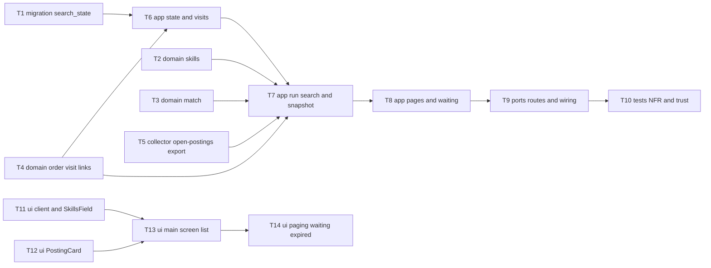

# Epic — search-postings

> **Spec:** [spec.md](../spec.md) · **Design:** [sad.md](../sad.md) · **Data model:** [data-model.md](../data-model.md) · **API:** [openapi.yaml](../contracts/openapi.yaml) · **Screens:** [screens.md](../screens.md) · **ADRs:** [adr/](../adr/)

## Goal

The owner reviews new remote postings in job-radar instead of opening the job boards by hand (spec §2). The main screen shows a skills search over every open posting, newest first, with the matched skills and every source named and linked. With no skills it shows the whole open collection. Postings collected since the previous visit are marked new, and results come 50 at a time without repeats while collection keeps running.

## Scope

- **In:** new server module `modules/search/` (domain, app, infra, ports); one read-only export in `modules/collector/app/` (new files only); the shared DB handle in `app.ts`; the `search_state` migration; web `api/search.ts`, `features/search/`, `routes/Home.tsx`, additive `Badge` / `InlineBanner` props, plus the design-system inventory.
- **Out:** spec §3. That means ranking or a match score, the remote filter, applied/skipped marks, saved searches, synonyms or operators, filters by source/company/date/location, and showing closed postings. No collector schema change and no new index.

## Task map

Two lanes start at once: the server (T1–T10) and the web (T11–T14). The web is built against the contract, so it does not wait for the server.

**Waves:** 1 = T1, T2, T3, T4, T5, T11, T12 · 2 = T6, T13 · 3 = T7, T14 · 4 = T8 · 5 = T9 · 6 = T10.
**Serialized lanes:** T1 runs alone because it is the migration. T13 then T14 share `routes/Home.tsx` and `SearchList.tsx`.

## Tasks

See [tracker.md](./tracker.md) for status. Machine contract: [tasks.json](../tasks.json).

| # | Task | Layer | Blocked by | DoD (short) |
|---|---|---|---|---|
| T1 | [Promote the search_state schema + migration 0003](./t01-search-state-schema.md) | migration | — | generated 0003 equals the staged SQL |
| T2 | [Parse and check the owner's skills](./t02-domain-skills.md) | domain | — | AC-05 rule table passes |
| T3 | [Match skills with exact-text boundaries + in-title flags](./t03-domain-match.md) | domain | — | 100% of AC-02 examples, title + description |
| T4 | [Effective-time order, visit/new rule, safe-link check](./t04-domain-order-visit-links.md) | domain | — | AC-03 / AC-09 / AC-14 unit tables with a fake clock |
| T5 | [Collector read-only open-postings export](./t05-collector-open-postings-export.md) | infra | — | AC-04 closed out / reopened in; AC-08 shape |
| T6 | [Keep search state and record visits](./t06-app-state-and-visits.md) | app | T1, T4 | skills round-trip; 10/31-min visit rule |
| T7 | [Run a search + in-memory snapshot](./t07-app-run-search-snapshot.md) | app | T2–T6 | AC-01/04/10/11/12 integration tests |
| T8 | [Next pages + waiting count](./t08-app-pages-and-waiting.md) | app | T7 | 50/100/130; no repeats under mutation |
| T9 | [Four routes + one shared DB handle](./t09-ports-routes-and-wiring.md) | ports | T8 | responses valid per contract; 400/403/410/415/503 |
| T10 | [NFR + trust integration tests](./t10-tests-nfr-and-trust.md) | tests | T9 | ≤ 1 s p95 at 10k; currency; late arrival |
| T11 | [Search API client, queries, SkillsField](./t11-ui-api-client-and-skills-field.md) | ui | — | prefill, submit, pending, error a11y |
| T12 | [PostingCard + Badge `new`](./t12-ui-posting-card.md) | ui | — | AC-06–AC-09 component tests; no HTML injection |
| T13 | [Compose SCR-01 list states](./t13-ui-main-screen-list.md) | ui | T11, T12 | every SCR-01 list state tested |
| T14 | [Show more, waiting notice, expired reload](./t14-ui-paging-waiting-expired.md) | ui | T13 | paging/waiting/expired tested; inventory registered |

## Risks / Hard rules

- **Module boundary:** search reaches postings only through `collector/app/` exports. It never writes collector tables. Collector edits are limited to new files, plus the handle change in `index.ts` (T9). Roadmap step 11 works in `collector/infra/sources/` in parallel (sad §2, ADR-0001).
- **Owner input is literal:** skills are escaped and never become a pattern, SQL or command (spec §6.1).
- **Untrusted text:** React text only, no `dangerouslySetInnerHTML`. A link is sent only for `http:` / `https:` URLs, and it opens with `rel="noopener noreferrer"` (AC-09). Security review is scoped to T12 and T7's `present.ts`.
- **Logs:** never include skills text or posting text (sad §7).
- **Spec drift, open in sad §11:** AC-02's wording contradicts its `C`/`C#` example, and AC-16 lacks the "closed since loaded" exception. T3 and T8 follow the sad §8 / §11 behaviour. Patch `spec.md` before review.
- **Perf:** each search scans every open posting (ADR-0002). T10 guards the ≤ 1 s p95 limit at 10,000 postings.
