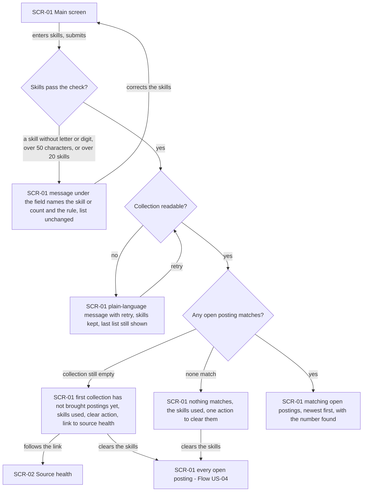
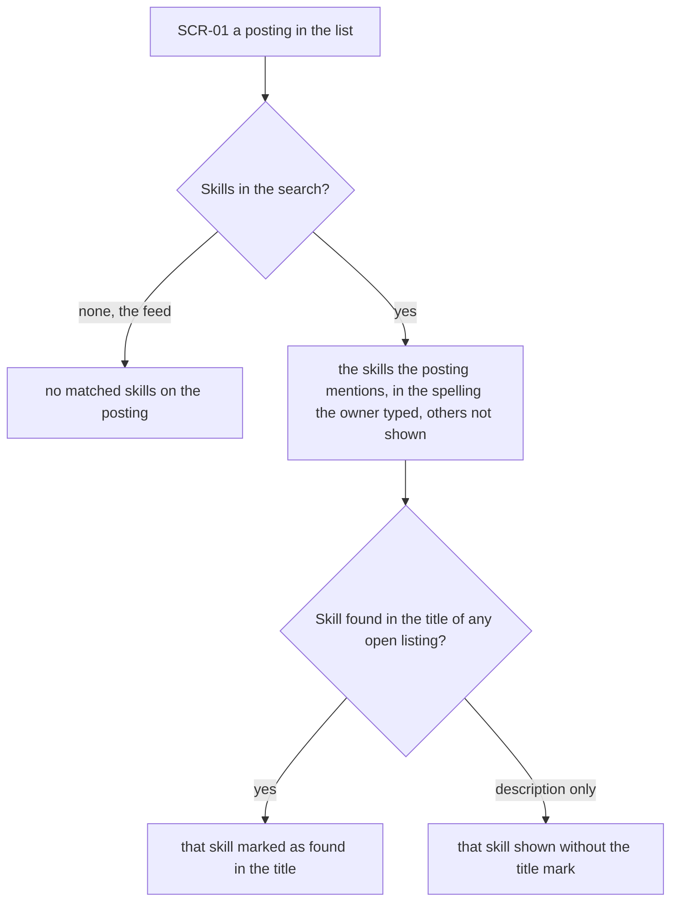
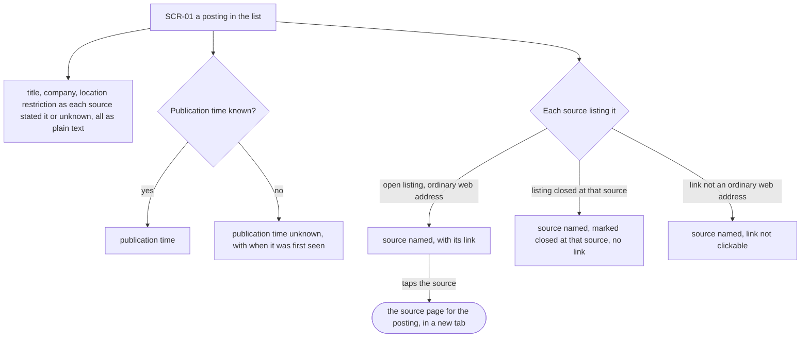
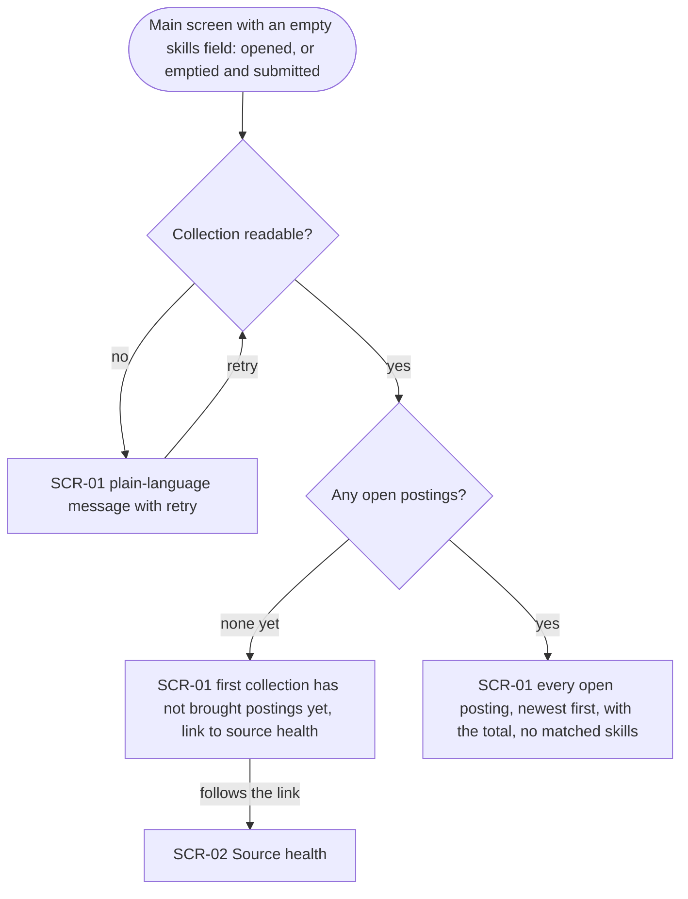
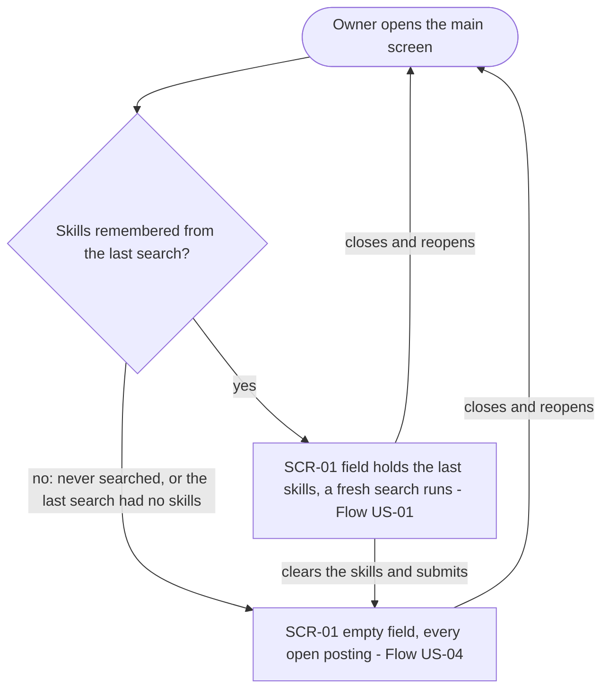
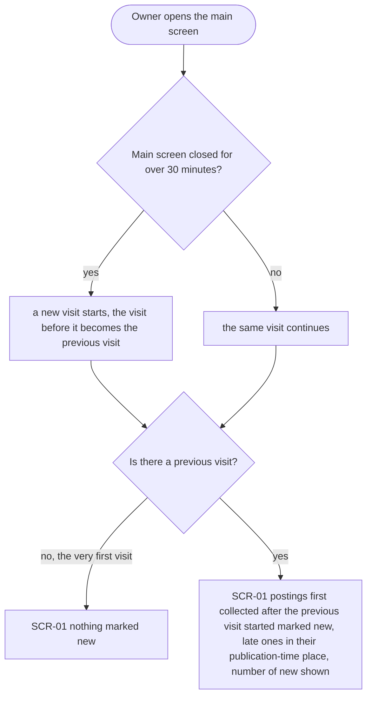
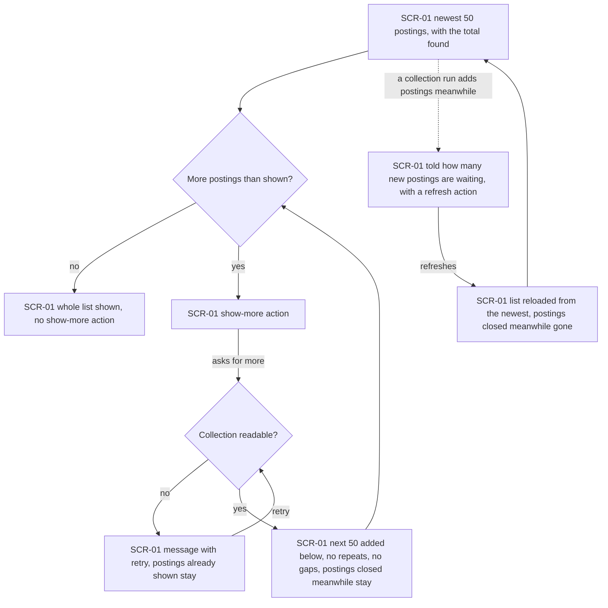

# UX flows — search-postings

> User flows for every UI-touching §4 user story, produced by `ux-flows` (after `clarify`, before
> `design`) and read by `design` (evidence for the target-surface + UI-architecture decisions),
> `sequences` (UI-driven flows align on SCR ids), `screens` (details every inventory row) and
> `plan-tests` (the e2e-through-UI paths). **Always markdown + mermaid `flowchart`**, whatever the
> design tool — this artifact is flow-altitude, not visual design.

## Platform decisions

- **Posture:** mobile-first — per `docs/design-system.md`. In v1 the app opens only on the owner's own machine (spec AC-17), so in practice it runs in a laptop browser; the list still starts from the 360 px layout (spec §6 phone layout) and gains columns as width grows.
- **Navigation:** no new screen — the search and the list live on the main screen (SCR-01), above which the problem marker stays (collector AC-13). Source health (SCR-02) is reached as before, plus from the empty-collection message (AC-11). SCR ids match the remote-boards-collector inventory.
- **Search trigger:** the search runs when the owner submits the skills field, not as they type; the skills check (AC-05) runs on submit.
- **Paging:** an explicit show-more action below the list (spec: "more on request"), no endless scroll.
- **Source links:** open the source's own page outside the app, in a new browser tab, so the list and its position stay.
- **New postings waiting:** shown in place on SCR-01 with a refresh action; the list never changes by itself (AC-16). *Design input:* how SCR-01 learns that a run added postings (asking again vs being told) is `design`'s call.
- **Remembered state:** the last skills and the previous visit's start live on the owner's machine (spec §6.1). *Design input:* where they are kept is `design`'s call.

## Screen inventory

| ID | Screen | Purpose | Entry | Exit |
|---|---|---|---|---|
| SCR-01 | Main screen | Skills field + the list of open postings (feed when no skills): matched skills, sources, new marks, paging, waiting-postings notice; still carries the problem marker | Opening the app | SCR-02 via navigation, the problem marker or the empty-collection message; a source's page via a listing link |
| SCR-02 | Source health | Unchanged from remote-boards-collector — here only the target of the empty-collection message | SCR-01 | SCR-01 via navigation |

## Flows

### Flow: US-01 — Search postings by my skills

On the main screen the owner types skills separated by commas and submits. If a skill has no letter or digit, is longer than 50 characters, or there are more than 20 skills, the search doesn't run: a message under the field names the skill (or the count) and the rule it breaks, and the list on screen stays as it was. Once they correct the skills, they submit again. If the skills pass but job-radar can't read its collection, a plain-language message with a retry shows next to the list, the skills stay in the field, and the last list stays visible. Retry tries again. If the read works, there are three outcomes. If the collection is still empty, the message says the first collection hasn't brought postings yet, shows the skills used and a clear action, and links to source health. If postings exist but none match, the owner sees that nothing matches, the skills they used, and one action to clear them. Clearing leads to the full feed (Flow US-04). Otherwise the matching open postings show newest first, with the number found. Closed postings never appear and reopened ones do.

### Flow: US-02 — See which skills matched

Each posting in the list is shown one of two ways. In the feed (no skills entered) it shows no matched skills. After a skills search it shows the skills it mentions, spelled the way the owner typed them, and leaves out the searched skills it doesn't mention. Each matched skill is marked as found in the title when the title of any of the posting's open listings has it. A skill found only in a description shows without that mark.

### Flow: US-03 — Reach every source to apply

Every posting shows its title, company and each source's location restriction exactly as stated ("unknown" when a source stated nothing). All source text shows as plain text and never acts as markup, including where matched skills are marked. It shows the publication time, or "publication time unknown" with when job-radar first saw the posting. Every source that lists it is named, in one of three ways. An open listing with an ordinary web address is linked, and tapping it opens that source's page for the posting in a new tab. A listing the source has closed is named and marked "closed at <source>", with no link. A listing whose link isn't an ordinary web address is named, but the link isn't clickable. A posting always has at least one linked open source; once none is left, it's closed and leaves the list.

### Flow: US-04 — Browse everything without typing

With an empty skills field, either because the owner opened the main screen without remembered skills or emptied the field and submitted, job-radar lists every open posting. If the collection can't be read, a plain-language message with retry shows. If there are no postings yet, the screen says the first collection hasn't brought any yet and links to source health. Otherwise the owner sees every open posting newest first, with the total number of open postings and no matched skills on any of them.

### Flow: US-05 — Come back to my last search

When the owner opens the main screen, job-radar checks for remembered skills: the skills of the last search that passed the skills check (even one that then failed to read the collection, AC-12). If there are some, the field holds them and a fresh search runs straight away (Flow US-01), so the list reflects the collection now, not when they left. If the owner never searched, or last searched with an empty field, the field is empty and the full feed shows (Flow US-04). Clearing the skills and submitting forgets them, so the next opening starts empty.

### Flow: US-06 — Notice what is new since my last visit

When the owner opens the main screen after it has been closed for over 30 minutes, a new visit starts. Otherwise they're still in the same visit. Searching, paging and refreshing never start a new one. On the owner's very first visit there's nothing to compare against, so nothing is marked new. On any later visit, every posting first collected after the previous visit started is marked new. That includes one a slower source delivered late, which keeps its publication-time place in the list rather than jumping to the top. The screen shows how many of the listed postings are new. A posting that was only reopened or updated isn't new.

### Flow: US-07 — Page through long lists reliably

A search, or the feed, first shows the newest 50 postings and the total found. If there are more, a show-more action sits below the list. Each request adds the next 50 in the same order one long list would have, with no repeats or gaps, even while collection runs. When everything is shown, the action goes away. If the collection can't be read while loading more, a message with retry shows and the postings already on screen stay (AC-12 applied to paging). If a collection run adds postings while the list is open, they aren't slipped into it. Instead the owner is told how many new postings are waiting and can refresh. A posting the collector closes while on screen stays until that refresh. Refreshing reloads from the newest 50, without the postings closed in the meantime.

## Out of scope (no owner-facing flow)

- **Visitor (AC-17)** — a visitor cannot connect to the app at all, so there is no screen to draw.

## AC coverage

| AC | Shown by | Notes |
|---|---|---|
| AC-01 | Flow US-01 → K | |
| AC-02 | Flow US-01 → F; Flow US-02 → D | Matching rule itself is backend; the owner sees its result as matched skills |
| AC-03 | Flow US-01 → K (newest first); Flow US-03 → T2 | Tie and future-time rules are backend ordering |
| AC-04 | Flow US-01 → F, K | Only postings open at search time |
| AC-05 | Flow US-01 → B → C | |
| AC-06 | Flow US-02 → D, E, F, G | |
| AC-07 | Flow US-03 → B, T1/T2, L → X | |
| AC-08 | Flow US-03 → N | |
| AC-09 | Flow US-03 → B (plain text), U | |
| AC-10 | Flow US-04 → F; Flow US-02 → C | |
| AC-11 | Flow US-01 → G, I; Flow US-04 → D | G/D → SCR-02 |
| AC-12 | Flow US-01 → E; Flow US-04 → E; Flow US-07 → E | US-07 → E applies AC-12 to show-more |
| AC-13 | Flow US-05 → C, D | |
| AC-14 | Flow US-06 → D/C, E, F, G | |
| AC-15 | Flow US-07 → A, C, F | |
| AC-16 | Flow US-07 → F, W, R | |
| AC-17 | N/A: visitor cannot connect | No screen exists for a visitor |
