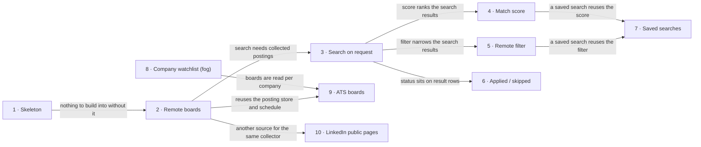

# Roadmap — job-radar

> **A decomposition, not a promise.** The overall idea broken into incremental steps: what each
> step is, where it comes from, how big it is — or that nobody has looked at it yet — and in which
> order, and parallel lanes, we walk them. **No dates** (except shipped history), **no scores** —
> order is the prioritization. The *solution* for any step lives in its `docs/features/<slug>/`
> spec, not here.

## Destination

The owner, based in Poland, enters their skills and a remote mode and within seconds gets a fresh, scored list of global remote postings gathered from stable public sources — each with a "why it fits" note and a link to apply by hand.

## Steps

| # | Step | Source | Size | Status |
|---|---|---|:---:|---|
| 1 | Project skeleton — an empty project that builds, runs and has a working test suite | idea-brief.md §7 Recommendation | S | idea |
| 2 | Collect postings from remote job boards on a per-source schedule (Jobicy hourly for freshness, Himalayas, Remotive; We Work Remotely once its terms are verified), keeping publication time and candidate-location restrictions, merging the same role across boards, closing only on reliable signals, and showing source health | idea-brief.md §7 Recommendation, [`spec`](features/remote-boards-collector/spec.md) | M | spec'd |
| 3 | Search on request — the owner enters skills and gets a list of postings with links, newest first | idea-brief.md §2 Problem | S | idea |
| 4 | Match score with a short "why it fits" note; the owner can upload a CV instead of typing skills | idea-brief.md §2 Problem | M | idea |
| 5 | Remote filter in two modes — "can work from my country" and "company in country X" | idea-brief.md §2 Problem | M | idea |
| 6 | Mark each posting "applied" or "skipped" so it doesn't come back | idea-brief.md §5 Out of scope | XS | idea |
| 7 | Saved searches that notify the owner about new matches | idea-brief.md §8 Open questions | S | idea |
| 8 | Company watchlist for public ATS boards → see [Not yet specified](#not-yet-specified) | idea-brief.md §7 Recommendation | fog | idea |
| 9 | Collect postings from Greenhouse, Lever and Ashby boards of the watched companies | idea-brief.md §7 Recommendation | S | idea |
| 10 | Collect postings from LinkedIn's public guest job pages — no login, no account, low request volume, remote filter; an optional source whose failure never breaks collection | idea-brief.md §7 Recommendation | S | idea |

## Not yet specified

| Area | What we'd have to learn | Blocks | How it gets sharpened |
|---|---|:---:|---|
| Company watchlist | Greenhouse, Lever and Ashby expose public per-company boards, but none lets you list postings across companies and no directory of board names exists. Unknown: how to discover board names (careers-page URLs, search-engine queries, community lists), which companies belong on the list, how many, and how the list is kept current. | 9 | A week of logging where the owner's relevant postings come from (D2), then a recon pass on discovery methods (D3) |

## Out of scope

- Automatic CV sending — every portal has its own form; v1 ends at a link and a manual apply.
- Crawling "the whole internet" — a fixed set of known sources, not an open-ended crawl.
- Live web search on each request — slow, incomplete, and misses postings that aren't indexed yet.
- CV and cover-letter tailoring — not the pain the owner named.
- A product for other job seekers — gets its own roadmap once the personal version proves its value.

## Open decisions

| # | Question | Type | Owner | Blocks |
|---|---|:---:|:---:|:---:|
| D2 | Which sources actually carry the owner's relevant postings? Answered by logging them for one week. | task | human | 8 |
| D3 | Which discovery method yields company board names reliably enough to maintain a watchlist? | prototype | agent | 8 |

## Decisions so far

- Collect in the background, filter on request → [`idea-brief.md §7 Recommendation`](idea-brief.md)
- Apply manually in v1, no auto-send → [`idea-brief.md §5 Out of scope`](idea-brief.md)
- D1 closed: "among the first" means within hours, not a day — Jobicy (hourly) is the freshness source, the 24-hour-delayed feeds add coverage; step 2 re-sized S→M (merging, closing, source health and catch-up are part of a trustworthy collector) → [`remote-boards-collector spec §1`](features/remote-boards-collector/spec.md)
- The multi-user product is out of this roadmap → [`idea-brief.md §3 Users`](idea-brief.md)
- LinkedIn joins as public guest pages only (no login, so the owner's account is never exposed); automated access still breaches its User Agreement §8.2, so it stays low-volume and optional, and the risk that remains is an IP block or markup change, not a lost account → [`LinkedIn User Agreement §8.2`](https://www.linkedin.com/legal/user-agreement), [`ai-job-search linkedin-search`](https://github.com/MadsLorentzen/ai-job-search/tree/main/.agents/skills/linkedin-search)
- Remote job boards first; ATS boards wait for the company watchlist → [`Himalayas jobs API`](https://himalayas.app/api), [`Greenhouse Job Board API`](https://developers.greenhouse.io/job-board.html)

## Dependency graph

## Execution path

| Wave | Steps | Zone per step (why parallel-safe) | Unlocks |
|:---:|---|---|---|
| 1 | 1 | project root (new) | 2 |
| 2 | 2 | `collector/` (new) | 3 |
| 3 | 3 ∥ 10 | 3: `search/` (new) · 10: a LinkedIn adapter in `collector/infra/` — disjoint modules | 4, 5, 6 |
| 4 | 4 ∥ 5 ∥ 6 | 4: `matching/` (new) · 5: `remote-filter/` (new) · 6: `tracking/` (new) — disjoint modules | 7 |
| 5 | 7 | `alerts/` (new) | — |

Step 9 enters a wave once the Company watchlist area is reconnoitred and step 8 trades `fog` for a size.

## Shipped

| Step | Shipped | Link |
|---|---|---|
| — | — | — |
